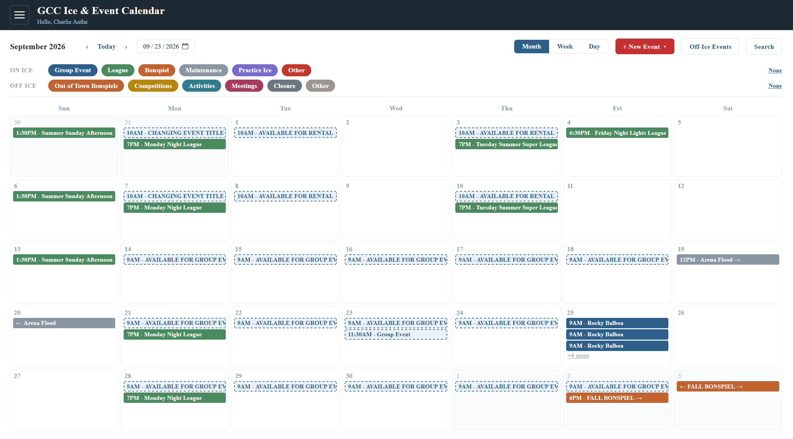
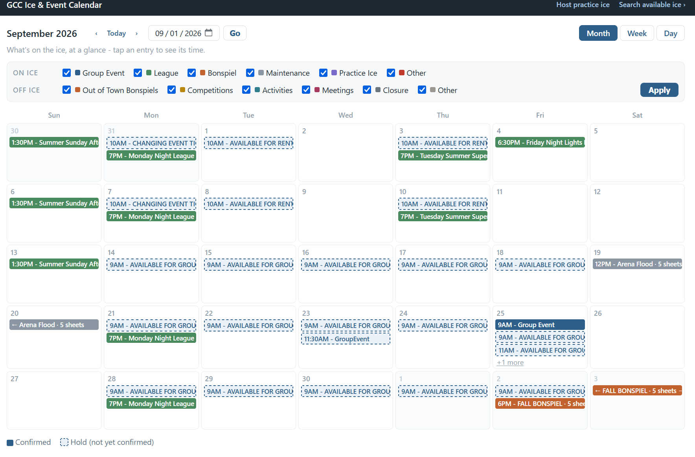

# Sheet Scheduler



Curling sheet scheduling and availability management built on Microsoft 365 and Exchange Online. Perfect for curling clubs that already use Microsoft 365 and Exchange Online as the foundational architecture aspects are already present.

Goal: If you want to provide a publicly viewable calendar of all activities occurring at your curling club, including on and off ice activities, this app is designed to help you manage a "single source of truth" for what's happening on the ice. Developed because at a volunteer club we had confusion as to what events were happening with different volunteers organizing different events.

While designed for a curling club, the concept can be applied equally well to other sporting clubs where resource management is a challenge (tennis courts, basketball courts, etc.). Terminology within the app is planned to be adjustable in a later update (i.e. - ability to replace 'sheet' with 'court', etc.)

The design is based around minimizing additional expense by utilizing your existing Microsoft 365 subscription as much as possible. The only hard licensing requirements are:

- Exchange Online
  
  - Resource Mailboxes (no licensing cost in EXO)

- One Microsoft 365 Business Standard licensed user account
  
  - It is recommended to make this a "service" account and not a pre-existing user as the account receives broad permissions
  
  - This is the only additional licensing cost required; if you operate as a 501(c)(3) non-profit you may qualify for free or reduced licensing pricing from Microsoft.

- Azure Web App hosting (or your own web hosting platform)
  
  - Can run on the lowest paid tier (Linux) at a cost of approximately $12/month. Do not use the free tier, it will run out.
  
  - Again, non-profits can qualify for free Azure credits every year to cover this cost.

Each sheet of ice is modeled as an Exchange Online (EXO) resource mailbox, and every booking is a calendar event on that mailbox. There is no adjacent database — Exchange is the system of record, including for booking metadata like renter contact and notes. Outlook is not required and in fact discouraged for calendar management (only to be used as a backup if the app breaks for some reason).

**Status:** As-built and in production use at one club. Licensed under BSD-3-Clause.

---

## Why resource mailboxes

Most scheduling apps start with a database and then fight to keep it in sync with the calendars people actually look at. We skip that problem by making the calendar the database:

- **Outlook and OWA keep working** as a read-only fallback for anyone who prefers them.
- **Recurring bookings** use native calendar recurrence rather than a hand-rolled scheduling engine.
- **No sync layer to drift**, because there is nothing to sync.

Exchange does not enforce the booking rules so the app owns conflict detection and double-booking prevention itself. A short-lived read cache exists for performance but is deliberately never applied to the reads that enforce conflicts.

## Overview

There are only 2 types of users: Staff and Public. *One exception: if you use the practice ice feature, club members can sign in to request a hosting slot — that is the only thing a signed-in non-Staff user can do.* The app does not have a granular permissions model as this is complicated to manage. <u>Staff are effectively admins.</u>

Staff can perform all functions on the calendars: Create, edit, and delete events and all associated details. Public users can only view the publicly accessible webpage and a limited, PII cleansed set of event details.

Staff create events and can designate which sheets are in use for them. There are multiple categories to help visually distinguish types of activities, such as Leagues, Bonspiels, Group Events (rentals), Ice Maintenance, etc. There is a separate category of events for off-ice activities if you wish to publicize them as well, such as Club Meetings, Competition Dates, Out of Town Bonspiels, Planned Closures, etc. The specific names and colors of Categories is adjustable as they are set via Exchange category.

The public calendar shows a simplified view with limited details and no edit capability.

Staff are designated by a security group that you select. Members of that group can be licensed or guest users. Group Ownership can be delegated to a non-admin, so adding and removing Staff does not require an Entra admin once the group exists.

Staff membership is checked at sign-in and then cached for the session, so **adding someone to the group takes effect only after they sign out and back in.**

Any Staff member can approve or decline practice ice requests, but only uses in the designated group will receive email notifications of new practice ice requests. 

## Features

**Staff interface** — Month, Week, and Day calendar views, per-sheet or consolidated. Bookings can span multiple sheets at once and recur. Bookings carry a category (Group Event, League, Bonspiel, Maintenance, Practice Ice, Other) and a state: **Hold** (soft, still blocks others) or **Confirmed**. A separate whole-club "Club Events" resource covers events that occupy the facility rather than individual sheets, checking sheet bookings for closure conflicts.

**Public, no sign-in required**



| Surface                    | Purpose                                                           |
| -------------------------- | ----------------------------------------------------------------- |
| `/public/calendar`         | Full club-wide calendar, Month/Week/Day, with category filters    |
| `/public/search`           | Find windows where at least N sheets are open simultaneously      |
| `/public/practice-ice`     | Times any trained member could volunteer to host practice ice     |
| `/api/public/availability` | Minimized JSON feed, plus a drop-in widget for embedding in a CMS |

**Member practice-ice hosting** — If you wish to give your club members a way to easily volunteer to host practice ice during unused time slots, this feature allows signed-in members to claim an open window to host, which writes a pending hold and emails an approver address. Staff approve or decline (with a reason) from an in-app queue; the volunteer is emailed either way. Requests are automatically added to the calendar for visibility. Set rules for when practice ice sessions can begin/end, as well as minimum times. Requires ALL sheets to be available (e.g. - you cannot offer to host practice ice on unused sheets of a pre-existing event).

**Inbound booking integration** — a webhook ingests bookings from 3rd party booking services (currently Breely). This is deliberately one-way and best-effort as the app has no way to send response data back. Breely (or whatever 3rd party tool) remains authoritative for what a customer was actually promised. But the feature can be expanded to other third party platforms that support webhook automations with additional development. 

**Search**- Search for any event by name, notes, category, or day of week. Limited to 60 day window at a time.

**Staff settings** — Change club operating parameters, set logging levels, and view most recent logging events for debugging.

## Architecture at a glance

```
Staff (Entra ID)  ─┐
Members (Entra ID) ┼─→  Blazor Server app  ─→  Microsoft Graph  ─→  EXO resource mailboxes
Anonymous public  ─┘         │                                        (one per sheet,
Breely webhook    ─┘         └─→ ephemeral read cache                  plus Club Events)
                                 (non-authoritative)
```

Every anonymous route is a plain Minimal API endpoint rather than a Blazor page, each with its own explicit `.AllowAnonymous()`. 

Full detail, including the design decision record and the reasoning behind rejected alternatives, is in [docs/curling-facility-scheduling-architecture.md](docs/curling-facility-scheduling-architecture.md).

## Requirements

- .NET 10 SDK
- A Microsoft 365 tenant where you can create resource mailboxes and register applications
- One resource mailbox per sheet, plus one for club events
- An Entra ID app registration with application-permission Graph access, **scoped to those mailboxes** via an Application Access Policy
  - This is mandatory, otherwise the app can read and write to every mailbox in your tenant

## Getting started

```bash
git clone https://github.com/canthe64/Club_Calendar.git
cd Club_Calendar
dotnet restore
```

Configuration values are all empty in source control by design — see below — so the app needs them supplied locally before it will run. Then:

```bash
dotnet run --project FacilityScheduler.csproj
```

[docs/deployment-guide.md](docs/deployment-guide.md) covers tenant provisioning end to end: creating the mailboxes, the app registration, the permission grants, and the Application Access Policy scoping, including a few gotchas that can trip you up.

## Configuration

Nothing is tenant-specific in code. The same build repoints at a different tenant, or a different facility, without a recompile.

| Section       | Holds                                                                                        |
| ------------- | -------------------------------------------------------------------------------------------- |
| `Facility`    | Tenant domain, sheet mailbox local-parts, club-events mailbox, time zone, display name, logo |
| `Graph`       | Tenant ID, client ID, client secret for application-permission Graph access                  |
| `AzureAd`     | Sign-in configuration for staff and members                                                  |
| `StaffAccess` | The Entra group ID whose members are treated as staff                                        |
| `PracticeIce` | Eligible hours, lead time, booking horizon, approver group, sending mailbox                  |
| `Webhook`     | Shared secret for the Breely endpoint                                                        |
| `AppLog`      | Log directory and retention                                                                  |

**Every secret and tenant-identifying value is intentionally blank in the committed files, and must stay that way.** `appsettings.Development.json` uses `yourclub.onmicrosoft.com` as a placeholder.

For local development, supply real values through .NET user secrets, which live outside the repository:

```bash
dotnet user-secrets set "Facility:TenantDomain" "yourrealtenant.onmicrosoft.com" --project FacilityScheduler.csproj
dotnet user-secrets set "Graph:ClientSecret" "..." --project FacilityScheduler.csproj
```

User secrets override `appsettings.Development.json` at runtime, so you never need to edit a tracked file to run locally. Note that user secrets are stored unencrypted in your user profile — they protect against accidental commits, not against local disk access.

In production, supply the same values through your host's configuration or a secret store. Azure App Service is the primary deployment target; the deployment guide includes a platform-agnostic requirements section for other hosts.

## Tests

```bash
dotnet test
```

`FacilityScheduler.Tests` uses xUnit, Moq, and bUnit. Coverage centers on the logic most likely to break silently: concurrency and per-sheet locking, conflict detection, webhook claim/reschedule/cancel handling, timezone conversion across DST boundaries, anonymous-endpoint input clamping, the practice-ice availability computation, and the staff-vs-member authorization policies.

Services depend on an `IGraphEventGateway` abstraction rather than `GraphServiceClient` directly, which is what makes the suite possible. `FakeGraphEventGateway` reproduces the specific Graph behaviors the code depends on, including PATCH merge semantics and UTC normalization on write.

**A standing limitation worth knowing:** these tests have never run against a real Azure AD or Graph tenant. Permission grants, Application Access Policy scoping, and real sign-in claim shapes have been verified live by hand, and cannot reasonably be covered by tests running against fakes.

## Documentation

| Document                                                                  | Contents                                                 |
| ------------------------------------------------------------------------- | -------------------------------------------------------- |
| [Architecture & design](docs/curling-facility-scheduling-architecture.md) | The system as built, plus the full decision record       |
| [Deployment guide](docs/deployment-guide.md)                              | Tenant provisioning and deployment, start to finish      |
| [API reference](docs/api-reference.md)                                    | Endpoint contracts                                       |
| [Staff user guide](docs/staff-user-guide.md)                              | Day-to-day operation                                     |
| [Public embed instructions](docs/public-embed-instructions.md)            | Adding the availability widget to a website              |
| [Practice ice hosting design](docs/practice-ice-hosting-design.md)        | Rationale and rejected alternatives for the hosting flow |

## Using this for another facility

Nothing in the architecture is curling specific. The resource-mailbox-per-unit model, the state and category mechanism, conflict enforcement, and the public-endpoint pattern all apply unchanged to bowling lanes, tennis courts, studios, or meeting rooms. Sheet count, mailbox naming, tenant, and time zone are genuinely configuration.

What does change per facility is vocabulary and slot-granularity rules, which live in the domain layer (`Domain/BookingCategory.cs`, `Domain/ClubEventCategory.cs`) rather than in the architecture.

## Security notes

- Scope the app registration with an Application Access Policy. This is not optional.
- The Breely webhook authenticates with a static shared secret compared in constant time. Support for stronger authentication methods can be implemented for other 3rd party tools (contributions appreciated).
- The public calendar shows booking titles by design. Staff-typed titles are shown as-is and staff are expected to keep renter PII out of them; externally-originated titles are replaced with their category label, since they are auto-populated from a customer's real name with no chance to redact. Any new booking source needs its own explicit decision here rather than inheriting one of these.
- The public calendar is iframe-embeddable and currently sets no `frame-ancestors` restriction. Deliberate, and documented as worth revisiting.

## License

BSD 3-Clause License. See [LICENSE](LICENSE).
