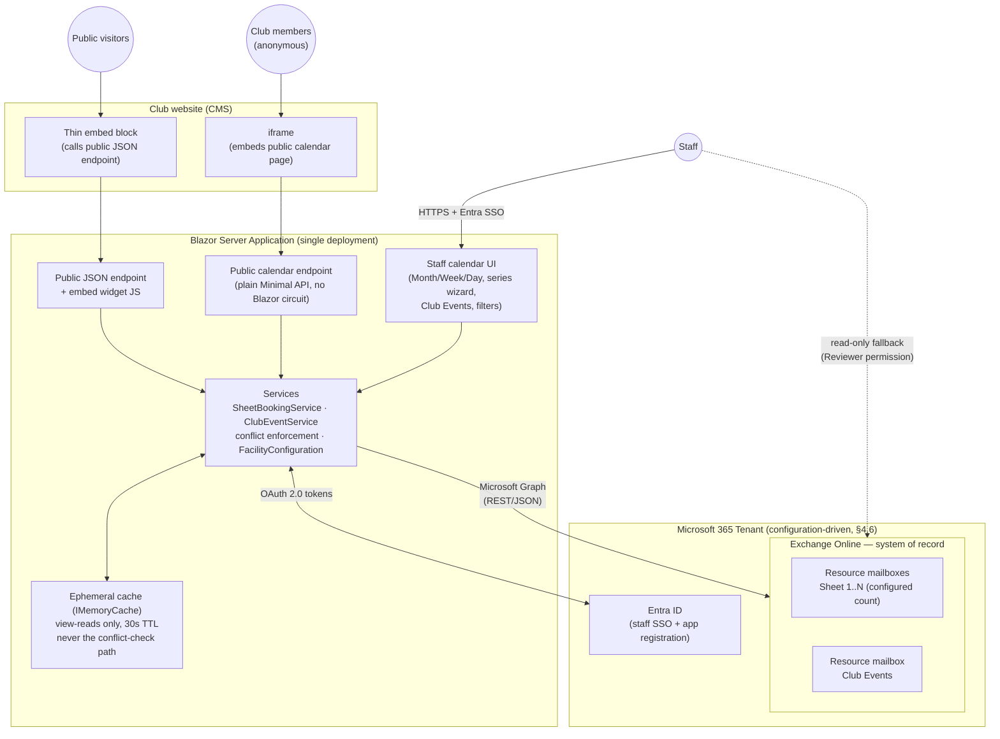

# Facility Scheduling System — Architecture & Design

**Project:** Curling sheet scheduling and availability management on Exchange Online
**Status:** As-built. Phases 0–9 complete; Phase 10 (production hardening) in progress.
**Date:** 2026-07-16 (wholesale rewrite reflecting the actual built system — supersedes the 2026-07-11 pre-build design this document originally described)
**Author:** Design iteration between club operator and Claude
**Stack:** .NET / C#, Blazor Server (.NET 10) — see §9, D14

---

## 1. Executive Summary

A web-based system for managing the scheduling and availability of curling sheets, built on Microsoft Exchange Online (EXO) resource mailboxes as the system of record. Each sheet is modeled as an EXO resource mailbox; every booking is a calendar event on that mailbox. A custom Blazor Server application — not Outlook — is the operational interface for staff: per-sheet/consolidated calendar views (Month/Week/Day), one-off and recurring bookings spanning multiple sheets at once, a separate whole-club "Club Events" resource, and two distinct public-facing surfaces (a minimized JSON availability API for a thin CMS embed, and a full read-only public calendar page members browse directly).

The design still avoids any adjacent authoritative datastore: all booking data, including rich metadata (renter contact, notes), lives on the calendar event itself. The only additional infrastructure is a short-lived, disposable read cache, deliberately scoped to never touch the paths that enforce double-booking prevention.

Every tenant-specific value (the M365 tenant domain, which mailboxes are sheets vs. Club Events, the facility's local time zone) is configuration, not code — the same deployed app can be repointed at a different tenant, or stood up fresh for a different facility, without a recompile (§4.6).

The pattern generalizes to other bookable facilities (bowling lanes, tennis courts, etc.) — nothing in the architecture is curling-specific except the vocabulary and the configured sheet count.

---

## 2. Scope and Requirements

### 2.1 Delivered

| # | Requirement | Status |
|---|-------------|--------|
| R1 | Model each curling sheet as an independently bookable resource with its own calendar | Done — sheet count and mailbox addresses are configuration (§4.6), not a hardcoded "5" |
| R2 | Staff-mediated booking: staff create, modify, and cancel all bookings through a custom web UI | Done |
| R3 | Booking states beyond free/busy: **Hold** (soft, blocks other bookings) and **Confirmed** (hard) | Done — Hold is available only for Rental; every other category is always Confirmed (§4.2) |
| R4 | Booking categories, consistently represented across all sheets | Done — sheet categories: Rental / League / Bonspiel / Maintenance / Other (Event is reserved for Club Events, §4.4) |
| R5 | Rich contextual metadata attached to the booking itself: renter name, contact, notes | Done (Price was cut from scope during build — never used) |
| R6 | Multiple views: per-sheet/all-sheets Month, Week, and Day grids | Done. The originally-scoped derived "≥N sheets available" consolidated view (interval-merge engine) is **backlogged**, not built — deprioritized twice during build in favor of higher-value work, revisit only if raised again |
| R7 | Anonymous public read-only view, embeddable in the club website | Done, as **two** distinct surfaces (§5.4): a minimized JSON availability API + CMS embed widget, and a separate full public month calendar page |
| R8 | Outlook/OWA remains available as a read-only fallback | Done |
| R9 | Recurring bookings supported via native calendar recurrence | Done (§4.5) |
| R10 | Double-booking prevention, enforced by the application | Done (§6.1); the Phase 7 read cache is deliberately scoped to never weaken this (§4.3) |
| R11 | **Club Events**: a whole-club resource for large events, separate from individual sheet reservations | Done (§4.4), including a closure-conflict cross-check added after build (§4.4) |
| R12 | Configuration-driven tenant/mailbox/timezone, no hardcoded tenant values in code | Done (§4.6), added during Phase 10 |

### 2.2 Out of Scope (explicitly deferred or rejected)

- Payments, fees, deposits (Price field was added then removed — never used)
- Membership rules, booking caps, priority tiers, waitlists
- Member/public self-service booking (no member identity object; public calendar is read-only)
- Post-season reporting or cancellation audit history — cancelled bookings are hard-deleted, metadata loss on cancellation is accepted
- Automatic expiration of rental holds
- ICS calendar publishing (evaluated and rejected based on prior operational experience)
- Companion/adjacent authoritative database (all data of record stays on the calendar event)
- The consolidated "≥N sheets available" derived view (R6) — backlogged, not built
- Bulk rental-availability painting tool (a multi-weekday bulk-create wizard) — scoped, then explicitly shelved as overkill for a once-per-season, near-empty-calendar operation; the series wizard covers the real need

### 2.3 Constraints and Environment

| Constraint | Detail |
|---|---|
| Tenant | Configuration-driven (§4.6) — a trial tenant was used through most of the build; the app now deploys against whichever tenant its `Facility`/`Graph` configuration points at, without a recompile. |
| Concurrency | Effectively 1 staff user at a time; 2 by rare coincidence. |
| Source of truth | Exchange Online. The web app holds no authoritative data. |
| Cache | Ephemeral only: short-TTL, non-authoritative, fully rebuildable from EXO at any moment; deliberately never applied to conflict-check reads (§4.3). |
| Public surface | Must never expose booking metadata beyond what staff themselves type into a title (§5.4); server-side minimization is mandatory for the JSON API; the full public calendar shows titles by design (staff are trained not to put renter PII in a title, rather than the app stripping it programmatically). |
| CMS | Public view integrates as a thin embed calling the app's public endpoint — no Graph logic inside the CMS. |
| Deployment | Azure App Service is the primary target; see `docs/deployment-guide.md` for the full deployment process and a platform-agnostic requirements section for other hosts. |

---

## 3. System Architecture

### 3.1 Component Overview

Key structural decisions visible above:

- **One Blazor Server deployment**, not a separate CMS-side service — the CMS integration is a thin embed/iframe with no credentials and no Graph logic.
- **Two public surfaces, not one.** The JSON API + widget is a subordinate feature (per-sheet rental availability only). The public calendar page is the *primary* way club members see what's happening club-wide while unauthenticated — every category, every title, no hour-level detail until a chip is clicked. Both read through the same services, which read through the same cache.
- **Public pages are plain Minimal API endpoints, never Blazor components** sharing the staff app's authenticated circuit (`MapRazorComponents<App>()`). This is a hard architectural rule established the hard way (§8) — not a style preference.
- **The cache is scoped to view-rendering reads only.** Every conflict-check read (the thing standing between two staff members double-booking a sheet) always hits Graph live, never the cache. See §4.3.
- **Outlook is a read path only.** Staff hold Reviewer (read-only) calendar permission on the resource mailboxes.

### 3.2 What Exchange Provides vs. What the App Owns

| Concern | Owner |
|---|---|
| Durable storage of bookings + metadata | Exchange Online |
| Recurrence semantics (series, occurrences, exceptions) | Exchange Online |
| Fallback human-readable calendar UI | Exchange Online (Outlook/OWA) |
| Mailbox permissions, audit logging | Exchange Online |
| **Conflict / double-booking enforcement** | **Application** (direct writes bypass the Resource Booking Attendant) |
| Multi-sheet grouping identity (`BookingGroupId`) | Application (§4.5) |
| State vocabulary and category schema integrity | Application (sole writer discipline; Exchange validates nothing) |
| Recurring series creation, per-occurrence edit/cancel semantics | Application |
| Club Events / closure-conflict cross-check | Application (§4.4) |
| Public data minimization | Application |
| Tenant/mailbox/timezone configuration | Application, externalized to config (§4.6) |

---

## 4. Data Architecture

### 4.1 Anatomy of a Booking (one EXO calendar event)

Every piece of booking data lives on the event object:

- **subject** — human-readable, for the Outlook fallback (`"{Category} - {RenterName}"` or just `{Category}` if blank).
- **start / end (+ timezone)** — the reserved slot, tagged with the facility's configured local time zone (§4.6), never UTC.
- **showAs** — `tentative` = Hold, `busy` = Confirmed. Drives free/busy and the hold-vs-confirmed encoding; conflict enforcement itself is the app's job regardless of `showAs` (§6.1).
- **categories** — one of Rental / League / Bonspiel / Maintenance / Other for sheets (Event is reserved for Club Events, never offered in the sheet-booking picker); Bonspiel / Activities / Closure / Other for Club Events.
- **recurrence** — native Graph recurring series for league blocks etc. (§4.5).
- **Named extended properties** (server-side filterable): `BookedBy`, `BookingGroupId` (§4.5).
- **JSON blob** (one extended property, display-only): renter name, phone, email, notes.
- **iCalUId / EventId** — `EventId` is the Graph REST id (not durable across some mailbox operations); `ICalUId` is the durable identifier.

**Design rule (unchanged from original design):** anything filterable gets its own named extended property; everything else goes in the JSON blob, kept small.

**Read gotcha (confirmed during build):** `singleValueExtendedProperties` are never returned by default — a blanket `$expand` is insufficient; it must be scoped with a `$filter` sub-clause naming the specific property IDs. Every read path that needs metadata uses the filter-scoped form.

### 4.2 State Model

| Business state | `showAs` | Category | Blocks other bookings? |
|---|---|---|---|
| Open / available | *(no event)* | — | No |
| Hold | `tentative` | Rental only | **Yes** (app-enforced) |
| Confirmed | `busy` | Any | Yes |

- **Only Rental can be a Hold** — every other category is always a hard (Confirmed) booking, enforced client-side (the Hold/Confirmed toggle and phone/email fields are hidden entirely for non-Rental categories) and coerced server-side.
- **No category defaults on a new booking, series, or Club Event** — staff must explicitly pick one; Save/Create is disabled with a validation message until they do. This was added after live-testing feedback surfaced confusion from a silently-preselected category. Editing an existing item still loads its real stored category, unaffected.
- **Hold vs. Confirmed also has no default** — a new Rental booking's state is `null` until staff explicitly picks Hold or Confirmed.
- Confirming a rental = update `showAs` `tentative` → `busy` on the existing event.
- Cancellation = hard delete, with one exception: a Rental cancel offers "reopen for rental" (flips back to an unclaimed Hold, renter fields stripped) as an alternative to permanent deletion.
- Time entry is 30-minute increments, extending through midnight (represented internally as minutes-from-midnight, with 1440 meaning "end of this day" rather than colliding with a start-of-day option).

### 4.3 Ephemeral Cache

Two layers, added at different points in the build, deliberately kept separate:

| Layer | Scope | TTL | What it must never touch |
|---|---|---|---|
| Staff-facing view cache (Phase 7) | `SheetBookingService.GetBookingsForAllSheetsAsync`, `ClubEventService.GetEventsAsync` — the "everything in this window, for display" reads used by the calendar pages | 30s | `GetEventsInRangeAsync`/`GetBookingsAsync` (the per-sheet reads every conflict check uses) are **never cached** — a cached snapshot there could mask a just-created booking and allow a double-booking within the TTL window. This is the one invariant this cache design cannot compromise. |
| Public-facing response cache (Phase 8/9) | `PublicAvailabilityService`'s own computed `GetAvailabilityAsync`/`GetMonthViewAsync` responses | 60s | Sits as an outer layer on top of the staff-facing cache above — a cold public cache still benefits from a warm inner cache, and vice versa. |

Invalidation for the staff-facing layer is a full clear (not precise per-window overlap tracking) of that service's own tracked cache keys, on every successful write — simple, and proportionate given this app's actual write volume (1–2 staff). The public-facing layer expires on its own TTL only, since it doesn't sit behind a write path.

**Explicitly rejected:** Graph change-notification webhooks (subscriptions expire and need renewal/reconciliation infrastructure to catch out-of-band edits, of which there are structurally none — sole-writer app + read-only Outlook access).

### 4.4 Club Events

A dedicated resource mailbox, not tied to any physical sheet, for whole-club-scale events (bonspiels, closures, club activities) that would otherwise require booking every sheet simultaneously.

**Why a dedicated mailbox instead of writing the same event to every sheet calendar:** independent per-sheet Graph writes have no transactional guarantee; a single event on a single dedicated calendar is atomic by construction.

**Category taxonomy as built:** Bonspiel / Activities / Closure / Other (the original design's "Tournament" was renamed to "Activities" during build, and "Other" was added). Kept structurally separate from the sheet-level category enum.

**Display:** Club Events render **inline within the day cells** of Month/Week/Day views (not a page-level banner — that was the first cut and corrected immediately after review), sorted chronologically alongside sheet bookings (all-day events sort first). Clicking a Club Event chip anywhere on the staff calendar opens its edit form directly (a bug where the click instead bubbled up to the day cell's own "jump to Day view" handler was found and fixed). A "Show club events" toggle lets staff hide them from the calendar entirely.

**Integration with sheet bookings — narrower than originally designed:**

| Mechanism | Behavior |
|---|---|
| Write-path conflict check | **Narrowed after build** from the original "no cross-check in either direction" (D13): a Club Event flagged `MarksSheetsUnavailable=true` now *is* cross-checked against new sheet bookings/series, since staff live-testing surfaced this as a real gap. Implemented at the `Calendar.razor` page level (not inside either service — `SheetBookingService`/`ClubEventService` stay mutually decoupled, per D13's original build-simplicity intent). Blocking for a single booking's create/edit (same UX as a real sheet conflict); informational-only for the series wizard preview (staff can still choose to skip a flagged date, matching how every other series-preview conflict already works). Club-Event-vs-Club-Event and non-closure-Club-Event-vs-sheet-booking checks remain intentionally absent. |
| Public view | Club Events get a distinct label on the public calendar rather than being folded into generic per-sheet blocks. |
| Provisioning | Add as step 1a: create the Club Events resource mailbox alongside the sheet mailboxes; same security group/access policy scope. |

### 4.5 Recurring Series and Multi-Sheet Bookings

Two related mechanisms added during build, beyond the original design's scope:

**Multi-sheet bookings.** A single conceptual booking (e.g., a rental spanning 3 sheets) is represented as one event per sheet, linked by a shared `BookingGroupId` (a named extended property) — every booking gets one, even single-sheet ones, so downstream code never branches on single-vs-multi. Creation across sheets is all-or-nothing: every requested sheet is conflict-checked before anything is written.

**Recurring series.** Graph has no concept of a recurring series spanning multiple mailboxes, so a multi-sheet recurring booking (e.g., a 5-sheet league) is five independent native Graph recurring series — one per sheet — sharing one `BookingGroupId`. Conflicts during series review are informational only, never auto-skipped; staff explicitly choose which candidate dates to skip.

**A real bug found and fixed via live testing:** `BookingGroupId` does **not** reliably propagate from a recurring series' master event down to its individual occurrences — it only persists on an occurrence once that specific occurrence has been individually edited. An untouched occurrence always reads back `BookingGroupId = Guid.Empty`. Naively grouping chips by `BookingGroupId` in Month/Week view therefore incorrectly merged multiple *unrelated* bookings that happened to share that same empty default, hiding all but one. Fixed by falling back to `(SheetMailbox, EventId)` — always unique per booking — as the grouping key whenever `BookingGroupId == Guid.Empty`. Diagnosed via a differential test: Day view (which doesn't group by `BookingGroupId` at all) showed the data correctly, isolating the bug to the dedup/display layer rather than the fetch.

### 4.6 Configuration Model (Phase 10)

Added during production hardening. Nothing tenant-specific is hardcoded in source:

- **`FacilityOptions`** (bound from a `Facility` config section, same pattern as the pre-existing `GraphOptions`): `TenantDomain`, `SheetMailboxLocalParts` (an explicit array, not a count — a different facility's mailboxes won't necessarily follow a `sheet1..sheetN` naming convention), `ClubEventsMailboxLocalPart`, `TimeZone`, plus `Name` and `LogoPath` (accepted now for future white-labeling; not yet wired into any UI).
- **`FacilityConfiguration`** — a singleton service that validates and derives the actual mailbox addresses/`TimeZoneInfo` from those options. Fails fast at application startup (not lazily on first request) if `TenantDomain`, `SheetMailboxLocalParts`, or `TimeZone` are missing — deliberate, given this app has already shipped two real bugs from silent wrong timezone defaults; a misconfigured deployment should error immediately, not limp along wrong.
- `GraphOptions` (the Entra app-registration credential: `TenantId`/`ClientId`/`ClientSecret`) remains a separate config concern, unchanged.
- The provisioning script (`docs/provision-categories.ps1`) takes `-TenantDomain` and `-SheetCount` parameters rather than hardcoding either.

See `docs/deployment-guide.md` for the full configuration reference and where each value belongs (user-secrets locally, Azure App Service Application Settings or equivalent in production).

---

## 5. API Interactions

### 5.1 Graph Operations by Use Case

| Operation | Graph call | Notes |
|---|---|---|
| Per-sheet/consolidated calendar detail | `GET /users/{sheet}/calendarView?startDateTime=…&endDateTime=…` + `$expand` | `calendarView` (not `/events`) so recurrences expand into occurrences. Paginated — every read path follows `@odata.nextLink` until exhausted (a real bug: a wide Month-view window with several expanded recurring series could exceed one page, silently truncating results if only the first page was read). |
| Create booking (single or multi-sheet) | `POST /users/{sheet}/calendar/events` | Direct write; preceded by an app-side conflict check under a per-sheet lock (§6.1), across every requested sheet, all-or-nothing. |
| Create recurring series | `POST /users/{sheet}/calendar/events` + `Recurrence` | One native recurring series per sheet, per §4.5. |
| Confirm hold / edit booking | `PATCH /users/{sheet}/events/{id}` | Occurrence PATCHes must omit `Start`/`End` entirely unless the time actually changed — Graph rejects a resent-but-unchanged time on a recurring occurrence with "Modified occurrence is crossing or overlapping adjacent occurrence." |
| Cancel booking / series | `DELETE /users/{sheet}/events/{id}` (occurrence) or `.../{seriesMasterId}` (whole series) | Whole-series cancel is a deliberately de-emphasized "backdoor," not a primary UX path. |
| Category palette setup (one-time) | `GET/POST /users/{sheet}/outlook/masterCategories` | Provisioned via `docs/provision-categories.ps1`, parameterized by tenant domain and sheet count (§4.6). |

Timezone rule for every read/write: pass `Prefer: outlook.timezone` (reads) and tag `Start`/`End`/`RecurrenceTimeZone` (writes) with the facility's configured zone (§4.6) — never assume UTC. A distinct, separately-discovered gotcha: `calendarView`'s `startDateTime`/`endDateTime` **query parameters** are always interpreted as UTC when no explicit offset is present, and are *not* reinterpreted by the `Prefer` header the way an event body's own `Start`/`End` are — query bounds must be converted to a true UTC instant first (`FacilityConfiguration.ToUtcQueryString`).

### 5.2 Booking Creation (write path)

Unchanged in spirit from the original design: validate → acquire a per-sheet lock (sorted lock order across every requested sheet, to avoid deadlock on overlapping multi-sheet requests) → `calendarView` conflict check on every requested sheet → write only if every sheet is clear → invalidate the staff-facing view cache → release locks. All-or-nothing across sheets, not just per-sheet.

Added after build: the same page-level check also queries for an overlapping `MarksSheetsUnavailable` Club Event before writing (§4.4) — blocking for a direct create/edit, informational for series preview.

### 5.3 Consolidated Availability — Backlogged

The originally-designed "≥N sheets available for rental" interval-merge view (R6) was **not built**. It was deprioritized during the build sequence in favor of Club Events and the public-facing work, and explicitly struck from the active plan afterward, pending real feedback once other club members start using the app. Revisit only if raised again.

### 5.4 Public Views (anonymous read path) — two distinct surfaces

**5.4.1 JSON availability API + CMS embed widget** (`/api/public/availability`, `/embed/availability-widget.js`) — a subordinate feature. "Available" here means an existing Rental+Hold booking (the same "AVAILABLE FOR RENTAL" slots staff already create), not raw free/busy — simpler than computing complementary free time, and more correct, since unbooked League/Bonspiel/practice time isn't necessarily something staff want the public renting. Excludes any window overlapping a `MarksSheetsUnavailable` Club Event. Rate-limited (fixed window, 60/min) and CORS-scoped (`AllowAnyOrigin`, GET-only) — safe specifically because this data is intentionally public and anonymous, no cookies/credentials ever flow through it.

**5.4.2 Public month calendar** (`/public/calendar`) — the *primary* way club members see what's going on club-wide while unauthenticated. Shows every category and state, with titles (a league's own name, a renter's own chosen title) — not just rental-availability slots. The one deliberate privacy exception: a confirmed rental's actual renter name is not stripped programmatically; staff are expected to handle that via what they type into the title field, not the app. Chips are clickable, opening a small popup with the exact time (the month-grid itself doesn't show hour-level detail). Iframe-embeddable; currently has **no `Content-Security-Policy: frame-ancestors` restriction** (documented, deliberate, revisit once the public surface gets more real-world scrutiny).

**The architectural incident behind both surfaces' final shape:** an earlier attempt to make public-calendar chips clickable used Blazor Server's own `@onclick`, which requires the interactive SignalR circuit — and a first fix attempt (`.AllowAnonymous()` applied to the shared `MapRazorComponents<App>()` registration) was live-tested and found to **disable authorization for every staff page in the app**, not just the intended public one, because ASP.NET Core's authorization rule is "if `AllowAnonymous` metadata is present anywhere on an endpoint, it wins" and `MapRazorComponents<App>()` maps every routable component through one shared endpoint set. Reverted immediately. A second attempt (vanilla JS instead of Blazor event handlers) fixed the clicks but still showed an unremovable "unhandled error" banner for anonymous visitors, traced to the shared host shell (`App.razor`) always loading `blazor.web.js` regardless of the specific page's render mode. The user explicitly rejected hiding the error banner rather than fixing the actual cause. **The real fix, and the standing rule for any future anonymous page:** both public routes are plain Minimal API endpoints (`Endpoints/PublicAvailabilityEndpoints.cs`, `Endpoints/PublicCalendarEndpoint.cs`), each with its own explicit `.AllowAnonymous()`, hand-building their response outside the Blazor component tree entirely — zero shared circuit, nothing for anonymous traffic to be rejected from. The public calendar's HTML is hand-built via `StringBuilder`, with every dynamic string passed through `WebUtility.HtmlEncode` (no Razor auto-escaping to fall back on, and titles are staff-entered free text — a real stored-XSS risk if skipped).

---

## 6. Identity, Security, and Permissions

### 6.1 Conflict Enforcement — Why the App Owns It

Unchanged: the Resource Booking Attendant only processes meeting requests, and this app writes events directly — the attendant never runs, and Exchange accepts overlapping events. Confirmed via spike, not just documentation. Direct writes + application-owned conflict enforcement (validate → lock per sheet → check → write) is trivially safe at the 1–2-user concurrency profile; the Phase 7 cache is deliberately scoped so it can never weaken this (§4.3).

### 6.2 Identity Model

| Principal | Mechanism | Used for |
|---|---|---|
| Staff (interactive) | Entra ID SSO, identity/audit only | Booking create/edit/delete from the UI. Graph itself stays on the app-only credential below, not a delegated on-behalf-of flow — deliberately, to avoid per-request token acquisition complexity for a benefit (native Exchange attribution) the design accepted skipping. |
| App service identity | Client credentials → application permissions | All Graph reads/writes, including the public endpoints' data source. |
| Staff (fallback viewing) | Reviewer (read-only) calendar permission | Opening sheet calendars in Outlook/OWA. |
| Anonymous public | None — never touches Graph directly | Served only by the two plain Minimal API endpoints (§5.4), through the app's own service layer. |

### 6.3 Scoping the App Identity (mandatory, not optional)

Unchanged: sheet + Club Events mailboxes live in a dedicated mail-enabled security group; the app registration is constrained to that group via Application Access Policy or RBAC for Applications; negatively tested (verify the app identity is denied access to a mailbox outside the group).

### 6.4 Other Security Requirements

- No secrets in code or plaintext config — user-secrets locally, Azure App Service Application Settings (or equivalent secret-injection mechanism for another host) in production. See `docs/deployment-guide.md`.
- The two public endpoints are the app's only internet-anonymous surface: read-only, minimized (JSON API) or hand-encoded (public calendar), rate-limited, CORS-scoped only to those routes.
- **A specific, live-verified gotcha:** never apply `.AllowAnonymous()` to `MapRazorComponents<App>()` itself — it disables authorization for every page in the app, not just an intended public one (§5.4). Any future anonymous page must be a plain Minimal API endpoint outside the Blazor component tree.
- Static assets (CSS/JS/images) are explicitly `.AllowAnonymous()`'d (`app.MapStaticAssets().AllowAnonymous()`) — safe, since they carry nothing sensitive, and necessary since the global `FallbackPolicy` otherwise gates every routed endpoint including these.
- Mailbox audit logging enabled on every resource mailbox.
- Standard OWASP hygiene — a full security review pass is a Phase 10 follow-up item.

---

## 7. Tenant Provisioning Checklist (one-time + per-new-sheet)

1. Create resource mailboxes, one per configured sheet, plus one Club Events mailbox.
2. Create the mail-enabled security group for all facility mailboxes; add every mailbox.
3. `Set-CalendarProcessing` per mailbox — calendar hygiene (booking-policy enforcement is app-owned, not Exchange's).
4. Provision the master category list on every sheet mailbox (Rental/League/Bonspiel/Maintenance/Other) and the Club Events mailbox (Bonspiel/Activities/Closure/Other) via `docs/provision-categories.ps1`, parameterized by `-TenantId`, `-ClientId`, `-TenantDomain`, `-SheetCount`.
5. Entra ID app registration: delegated scope for staff SSO (identity/audit only), application scope for the service identity that does all Graph work.
6. Scope the application permissions to the security group (Application Access Policy or RBAC for Applications) and negatively test it.
7. Grant staff Reviewer (read-only Outlook fallback) permission per §6.2.
8. Enable mailbox audit logging.
9. Set the app's `Facility`/`Graph` configuration (§4.6) to this tenant's real values.
10. Repeat steps 1, 2 (membership), 4, 7 for every sheet added later.

See `docs/deployment-guide.md` for the full deployment process this checklist feeds into.

---

## 8. Risks, Limitations, and Resolved Verification Spikes

| Item | Status |
|---|---|
| Direct-write bypasses booking attendant | **CONFIRMED** via spike — validates D3/§6.1. |
| Category filter behavior in `calendarView` | **RESOLVED** — server-side `$filter` on categories works, better than the original design assumed. |
| Extended property size limits | **RESOLVED** — 4000-character values accepted without error. |
| `getSchedule` 62-day window cap | **CONFIRMED EXACTLY** at 62 days (not used in the shipped design, since the consolidated-availability view that would have needed it is backlogged, §5.3). |
| `calendarView` pagination | **Found live, not a pre-build spike** — a wide Month-view window with several expanded recurring series can exceed one page; every read path now follows `@odata.nextLink`. |
| `BookingGroupId` propagation to recurring occurrences | **Found false via live testing** (§4.5) — only persists once an occurrence is individually edited; fixed via a dedup-key fallback. |
| Blazor circuit + anonymous pages | **Serious incident, resolved** (§5.4) — public pages are now plain Minimal API endpoints, never Blazor components sharing the staff circuit. |
| Category color consistency in Outlook shared-calendar views | Still open, low stakes, client-dependent; not automated. |
| Accidental deletion of active bookings | Recoverable-items window (~weeks) is the only net; accepted at this scale. |
| Resource mailbox licensing | Confirmed against the tenant's actual SKU during Phase 1. |
| Graph throttling | Non-issue at this scale; cache absorbs bursts. |
| Schema drift (categories, property names) | Mitigated by the sole-writer invariant + read-only staff Outlook access. |
| iframe embedding of the public calendar | No `frame-ancestors` CSP restriction — deliberate for now (simplicity over locking to a specific domain), documented as a future hardening candidate. |

---

## 9. Design Decision Record

| # | Decision | Rationale |
|---|---|---|
| D1 | EXO resource mailboxes as system of record | Zero-infrastructure hosted store; native recurrence, free/busy, permissions/audit; Outlook as emergency fallback UI. |
| D2 | Custom web UI; Outlook read-only fallback | Custom views + contextual metadata Outlook can't serve; read-only staff access protects the sole-writer invariant. |
| D3 | Direct event writes; app-owned conflict enforcement | Resource Booking Attendant doesn't run on direct writes; invite-based flow is asynchronous and clunky for a staff UI. |
| D4 | `showAs` tentative/busy encodes hold vs. confirmed | Keeps free/busy and Outlook fallback semantically honest. |
| D5 | `categories` for booking type | Free-form strings validated by app discipline; own color mapping independent of Exchange's. |
| D6 | Metadata on the event itself: named extended properties + one JSON blob | Explicit constraint against adjacent datastores. |
| D7 | No companion database | Avoid fragility/complexity of a second authoritative store. |
| D8 | Ephemeral short-TTL cache; no webhooks | Sole-writer + read-only Outlook access means nothing out-of-band to catch. |
| D9 | Hard delete on cancellation | Audit/reporting explicitly out of scope. |
| D10 | Single Blazor Server deployment + thin CMS embed | Decouples booking operations from the website's failure domain. |
| D11 | Hand-built minimized public payload | Prevents accidental PII leakage; a deliberately separate mapping, never a reuse of the internal API with anonymous access bolted on. |
| D12 | Microsoft Bookings and Power Apps rejected | Bookings targets customer self-service; Power Apps trades away custom-view flexibility. |
| D13 | Club Events as a dedicated resource mailbox, no cross-conflict-check with sheet bookings | Atomic single-write vs. non-transactional multi-write. **Narrowed after build** (§4.4): closure (`MarksSheetsUnavailable`) events now are cross-checked against new sheet bookings/series; everything else about D13 stands. |
| D14 | .NET / C#, Blazor Server for the app | Explicitly specified by the operator for this project, independent of any other project's stack. |
| D15 | Public/anonymous pages are always plain Minimal API endpoints, never Blazor components | Established after a live-verified incident (§5.4) where sharing the authenticated Blazor circuit's endpoint registration either exposed every staff page or left an unfixable client-runtime error banner for anonymous visitors. Not a style preference — a hard rule for any future public page. |
| D16 | The ephemeral cache is scoped to view-rendering reads only, never conflict-check reads | A cached snapshot on the conflict-check path could mask a just-created booking and allow a double-booking within the TTL window — unacceptable given D3's whole premise. The two read paths are kept structurally separate in code specifically so this can't happen by accident. |
| D17 | Tenant/mailbox/timezone are configuration, never hardcoded | Added during Phase 10 once a real production tenant existed — the same deployed app must be repointable at a different tenant, or stood up fresh for a different facility, without a recompile (§4.6). |

---

## 10. Generalization Note

To reuse this for bowling lanes, tennis courts, or other facilities: the resource-mailbox-per-unit model, state/category mechanism, conflict enforcement, and public-endpoint pattern are all facility-agnostic, and — as of Phase 10 — the sheet count, mailbox naming, tenant, and time zone are genuinely configuration, not code. What still changes per facility is vocabulary (categories, states) and slot-granularity rules, which live in the application's domain layer (`Domain/BookingCategory.cs`, `Domain/ClubEventCategory.cs`), not its architecture.
