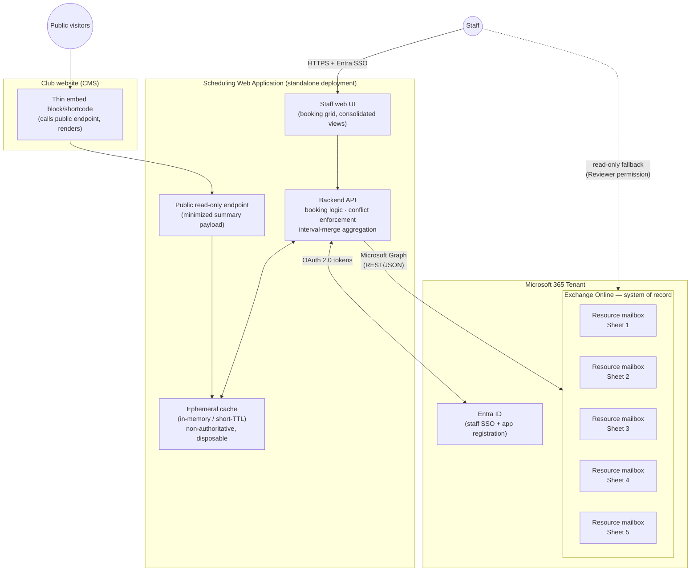
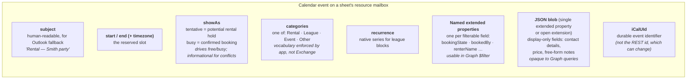
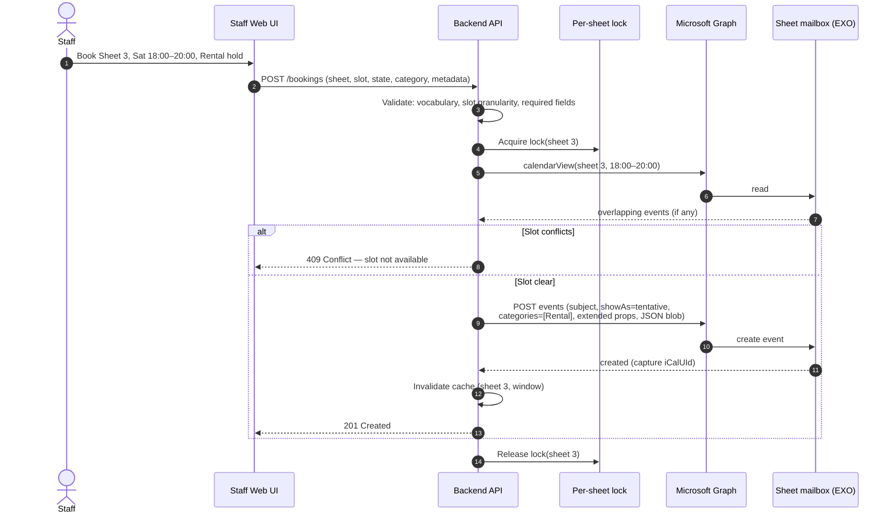
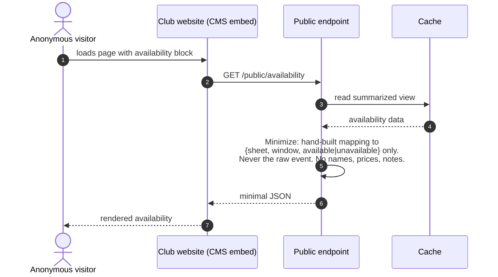

# Facility Scheduling System — Architecture & Design

**Project:** Curling sheet scheduling and availability management on Exchange Online
**Status:** Design phase — no implementation yet
**Date:** 2026-07-11 (updated — Club Events feature; stack decided)
**Author:** Design iteration between club operator and Claude
**Stack:** .NET / C# (explicitly specified by the operator for this project — see §9, D14)

---

## 1. Executive Summary

A web-based system for managing the scheduling and availability of curling sheets, built on Microsoft Exchange Online (EXO) resource mailboxes as the system of record. Each sheet is modeled as an EXO resource mailbox; every booking is a calendar event on that mailbox. A custom web application — not Outlook — is the operational interface for staff, providing per-sheet and consolidated availability views, booking management with domain-specific states (e.g., "potential rental hold" vs. "confirmed rental"), and a minimized read-only public view embeddable in the club's CMS website.

The design deliberately avoids any adjacent authoritative datastore: all booking data, including rich metadata (renter contact, pricing, notes), lives on the calendar event itself. The only additional infrastructure is a short-lived, disposable read cache.

The pattern generalizes to other bookable facilities (bowling lanes, tennis courts, etc.) — nothing in the architecture is curling-specific except the vocabulary.

---

## 2. Scope and Requirements

### 2.1 In Scope

| # | Requirement |
|---|-------------|
| R1 | Model each curling sheet (5 initially) as an independently bookable resource with its own calendar |
| R2 | Staff-mediated booking: staff create, modify, and cancel all bookings through a custom web UI |
| R3 | Booking states beyond free/busy: at minimum **potential rental hold** (soft, blocks other bookings) and **confirmed rental** (hard) |
| R4 | Booking categories: **Rental / League / Event / Other**, consistently represented across all sheets |
| R5 | Rich contextual metadata attached to the booking itself: renter name, contact, price, notes |
| R6 | Multiple views for different purposes: per-sheet grid, all-sheets aligned timeline, and derived/consolidated views (e.g., "times when ≥2 sheets are available for rental") |
| R7 | Anonymous public read-only view of summarized availability, embeddable in the club website (Drupal today, possibly WordPress later) |
| R8 | Outlook/OWA remains available as a **read-only fallback** for viewing calendars — bookings must look sensible there (subjects, colors, free/busy) |
| R9 | Recurring bookings (league blocks) supported via native calendar recurrence |
| R10 | Double-booking prevention — enforced by the application (see §6.1) |
| R11 | **Club Events**: a whole-club shorthand for large events (bonspiels, tournaments) spanning all sheets, kept separate from individual sheet reservations for simpler viewing/filtering (see §4.4) |

### 2.2 Out of Scope (explicitly deferred or rejected)

- Payments, fees, deposits
- Membership rules, booking caps, priority tiers, waitlists
- Member/public self-service booking (no member identity object)
- Post-season reporting or cancellation audit history — cancelled bookings are hard-deleted, metadata loss on cancellation is accepted
- Automatic expiration of rental holds (revisit later; manual for now)
- ICS calendar publishing (evaluated and rejected based on prior operational experience)
- Companion/adjacent authoritative database (explicit constraint: all data of record stays on the calendar event)

### 2.3 Constraints and Environment

| Constraint | Detail |
|---|---|
| Tenant | Existing Microsoft 365 tenant, lower licensing tier (not E3/E5). Resource mailboxes require no license below the size threshold — verify against the specific SKU before build. |
| Concurrency | Effectively 1 staff user at a time; 2 by rare coincidence. |
| Source of truth | Exchange Online. The web app holds no authoritative data. |
| Cache | Ephemeral only: short-TTL, non-authoritative, fully rebuildable from EXO at any moment. |
| Public surface | Must never expose booking metadata (PII, pricing); server-side minimization is mandatory. |
| CMS | Public view integrates as a thin embed calling the app's public endpoint — no Graph logic inside the CMS, keeping it portable across the Drupal-vs-WordPress decision. |

---

## 3. System Architecture

### 3.1 Component Overview



> **Note:** this diagram predates the Club Events feature (§4.4, added 2026-07-11) and does not yet show the 6th "Club Events" resource mailbox alongside the 5 sheet mailboxes. Functionally it sits in the same EXO subgraph as another peer resource mailbox — regenerate this diagram before build if a visual is needed.

Key structural decisions visible above:

- **The staff app is a standalone deployment**, isolated from the CMS's failure domain (core updates, plugin conflicts, theme changes on the website cannot take down booking).
- **The CMS integration is one thin block** that renders JSON from the public endpoint. It contains no credentials and no Graph logic, so it survives a Drupal upgrade or a WordPress migration with trivial rework.
- **The public endpoint reads only from cache**, never triggering Graph calls per anonymous request — unpredictable public/bot traffic cannot exhaust Graph quota.
- **Outlook is a read path only.** Staff hold Reviewer (read-only) calendar permission on the resource mailboxes, which structurally prevents out-of-band edits — the one class of change the app couldn't see (having no webhook infrastructure).

### 3.2 What Exchange Provides vs. What the App Owns

An honest division of labor (this was sharpened during design review — see §6.1):

| Concern | Owner |
|---|---|
| Durable storage of bookings + metadata | Exchange Online |
| Recurrence semantics (league series, occurrences, exceptions) | Exchange Online |
| Free/busy computation (`getSchedule`) | Exchange Online |
| Fallback human-readable calendar UI | Exchange Online (Outlook/OWA) |
| Mailbox permissions, audit logging | Exchange Online |
| **Conflict / double-booking enforcement** | **Application** (direct writes bypass the Resource Booking Attendant) |
| Slot granularity & business validation (e.g., start-on-the-hour) | Application |
| State vocabulary and category schema integrity | Application (sole writer discipline; Exchange validates nothing) |
| Consolidated/derived views (interval merge) | Application |
| Public data minimization | Application |

---

## 4. Data Architecture

### 4.1 Anatomy of a Booking (one EXO calendar event)

Every piece of booking data lives on the event object. Fields are allocated to native properties by *access pattern*:



**Design rule:** any field that could ever appear in a "show me all bookings where X" query gets its own named single-value extended property (server-side filterable to a useful degree). Everything display-only goes in the JSON blob. Both mechanisms are for small payloads — notes stay a single text field, never an append-only log.

**Integrity note:** Exchange validates none of this — not category strings, not extended-property shape. Schema integrity comes entirely from the application being the *sole writer* with a fixed vocabulary. This is a load-bearing invariant, reinforced structurally by staff having read-only Outlook access.

**Read gotcha (found during Phase 3 build, 2026-07-11):** `singleValueExtendedProperties` are never returned on a Graph read by default — writes succeed silently, but any `GET`/`calendarView` call that doesn't explicitly expand them comes back with `RenterName`/`Price`/`BookedBy`/etc. all null, even though the data is genuinely stored. Costly to miss because the failure is silent at the write, not the read. **A blanket `$expand=singleValueExtendedProperties` was not sufficient in testing** — it had to be scoped with a `$filter` sub-clause naming the specific property IDs (`$expand=singleValueExtendedProperties($filter=id eq '...' or id eq '...')`) to actually populate results. Every read path that needs metadata must use the filter-scoped form.

### 4.2 State Model

| Business state | `showAs` | Category | Blocks other bookings? |
|---|---|---|---|
| Open / available | *(no event)* | — | No |
| Potential rental hold | `tentative` | Rental | **Yes** (app-enforced) |
| Confirmed rental | `busy` | Rental | Yes |
| League block | `busy` (or `tentative` if provisional) | League | Yes |
| Event / Other | `busy` | Event / Other | Yes |

- `showAs` does double duty: it keeps `getSchedule` free/busy and the Outlook fallback view semantically honest, and it encodes the hold-vs-confirmed distinction. Conflict *enforcement*, however, is the app's job regardless of `showAs` (§6.1).
- Confirming a rental = update `showAs` from `tentative` → `busy` on the existing event (plus metadata updates). The event's identity and slot are unchanged.
- Cancellation = hard delete of the event. Accepted consequence: metadata is unrecoverable beyond EXO's recoverable-items window (~weeks). Re-entry cost of a lost booking is low at this scale.
- Additional states/categories are expected later; the mechanism (category taxonomy + extended properties) absorbs them without structural change. Auto-expiring holds are a possible future addition (deferred).

### 4.3 Ephemeral Cache

| Property | Value |
|---|---|
| Contents | Recently fetched availability data and event detail, keyed by sheet + time window; precomputed consolidated views |
| TTL | Short (order of 30–60 s) — near-real-time without webhook infrastructure |
| Invalidation | On every write the app itself performs (it is the sole writer, so this is complete) |
| Authority | None. Holds no data of record; empty/stale cache simply rebuilds from Graph on next read |
| Technology | In-memory in the app process; Redis only if deployment topology later demands it |

**Explicitly rejected:** Graph change-notification webhooks. Subscriptions expire (~3 days max) and require renewal jobs and missed-notification reconciliation — infrastructure that exists to catch out-of-band edits, of which there are none by construction (sole-writer app + read-only staff access in Outlook). Revisit only if out-of-band edits ever become possible.

### 4.4 Club Events (added 2026-07-11)

A **6th resource mailbox, "Club Events,"** not tied to any physical sheet — a single calendar for whole-club-scale events (bonspiels, tournaments) that would otherwise require booking all 5 sheets simultaneously.

**Why a dedicated mailbox instead of writing the same event to all 5 sheet calendars:** five independent Graph writes have no transactional guarantee — a partial failure (3 of 5 succeed) leaves the club in an inconsistent state that's hard to detect and reconcile. A single event on a single dedicated calendar is atomic by construction, and it directly satisfies the stated goal ("simpler viewing and filtering") — a calendar containing only bonspiels and tournaments needs no filtering logic at all to view in isolation.

**Data model:** same mechanism as sheet bookings (named extended properties for filterable fields, JSON blob for free-form detail), with its own category taxonomy (e.g., Bonspiel / Tournament / Closure) kept separate from the sheet-level Rental/League/Event/Other set, since it's a structurally different kind of object rather than another instance of the same one. Multi-day events are just a single event with a longer span — no special recurrence handling needed for one-off tournaments.

**Integration with existing mechanisms:**

| Mechanism | How Club Events participates |
|---|---|
| Availability views (§5.3) | A second input source to the interval merge: any window covered by a Club Events entry forces every sheet to "unavailable," overriding what each sheet's own calendar shows. |
| Write-path conflict check (§5.2, §6.1) | **No cross-check in either direction** (decided 2026-07-11): creating a sheet-level booking does not check the Club Events calendar, and creating a club event does not check individual sheet calendars. Simplest to build; conflicts between a booked bonspiel and an existing sheet booking are surfaced only if/when staff notice them. Revisit if this proves to cause real double-booking incidents in practice. |
| Public view (§5.4) | Club events get a **distinct label** on the public page (decided 2026-07-11) — e.g., "Aug 15–17: Club Bonspiel — all sheets reserved" — rather than being folded into generic per-sheet "unavailable" blocks, since these are typically publicly-promoted events anyway. |
| Provisioning (§7) | Add as step 1a: create the Club Events resource mailbox alongside the 5 sheet mailboxes; include it in the same security group and Application Access Policy / RBAC scope. |

---

## 5. API Interactions

### 5.1 Graph Operations by Use Case

| Operation | Graph call | Notes |
|---|---|---|
| Coarse availability, all sheets | `POST /users/{any}/calendar/getSchedule` | One batched call for all 5 mailboxes; returns free/tentative/busy intervals. 62-day window cap per call, confirmed exactly via spike test (§8) — chunk season-long views. |
| Rich per-sheet detail (grid with categories/states) | `GET /users/{sheet}/calendarView?startDateTime=…&endDateTime=…` + `$expand`/property selection | `calendarView` (not `/events`) so recurrences expand into occurrences. Request extended properties explicitly. |
| Create booking | `POST /users/{sheet}/calendar/events` | Direct write; preceded by app-side conflict check under per-sheet lock (§6.1). |
| Confirm hold / edit booking | `PATCH /users/{sheet}/events/{id}` | Update `showAs`, metadata properties. Resolve current REST `id` via `iCalUId` if needed. |
| Cancel booking | `DELETE /users/{sheet}/events/{id}` | Hard delete per §4.2. |
| Category palette setup (one-time) | `GET/POST /users/{sheet}/outlook/masterCategories` | Provision identical name+color sets on every sheet mailbox; repeat when adding sheet #6. |

Timezone rule for every read: pass `Prefer: outlook.timezone` explicitly. The season spans two DST transitions; never assume a fixed UTC offset.

### 5.2 Booking Creation (write path)



The check-then-write under a per-sheet lock closes the race window between two simultaneous staff bookings. At 1–2 concurrent users this is comfortably sufficient; it is correct at any scale where this app remains the sole writer.

### 5.3 Consolidated Availability (derived read path)

```mermaid
sequenceDiagram
    autonumber
    actor Staff
    participant UI as Staff Web UI
    participant API as Backend API
    participant C as Cache
    participant G as Microsoft Graph

    Staff->>UI: "When are ≥2 sheets available for rental?"
    UI->>API: GET /views/consolidated?rule=rentable&min=2&window=…
    API->>C: lookup(view key)
    alt Cache hit (fresh)
        C-->>API: precomputed result
    else Miss / stale
        API->>G: calendarView × 5 sheets (with categories + extended props)
        Note over API,G: getSchedule alone is insufficient here:<br/>"available for rental" depends on category + state,<br/>not just free/busy (a tentative Rental hold counts;<br/>a tentative League block does not)
        G-->>API: full event sets per sheet
        API->>API: Interval merge (sweep-line):<br/>slice timeline at every state boundary,<br/>evaluate rule per sub-interval, count qualifying sheets
        API->>C: store(view key, TTL)
    end
    API-->>UI: qualifying time windows
```

Bookings across sheets don't align to a common grid, so aggregation is an interval-overlay computation owned by the app. Each named view (per-sheet grid, consolidated rental availability, future views) is a rule over the same fetched data — the cache absorbs the fan-out so five differently-shaped views don't mean five independent Graph storms.

### 5.4 Public View (anonymous read path)



The minimization step is a deliberate, separately-maintained mapping — **not** a reuse of the internal API with anonymous access allowed. This prevents the failure mode where a field added to the internal payload silently leaks to the public page. If the cache is cold, the endpoint may serve slightly stale data or trigger one guarded refresh — but anonymous traffic volume never translates 1:1 into Graph calls.

---

## 6. Identity, Security, and Permissions

### 6.1 Conflict Enforcement — Why the App Owns It (design-review finding)

Exchange's native double-booking prevention (`Set-CalendarProcessing` … `AllowConflicts $false`) is enforced by the **Resource Booking Attendant**, which only processes *meeting requests* sent to the resource. This app creates events **directly** on the resource calendar via Graph — no meeting request exists, the attendant never runs, and Exchange will accept overlapping events. This is confirmed, documented behavior, not an edge case.

Booking via meeting invites would restore Exchange arbitration but is asynchronous (accept/decline arrives as a response message) and drags organizer-mailbox semantics into a staff UI that wants instant feedback. **Decision:** direct writes + application-owned conflict enforcement (validate → lock per sheet → check → write), which the concurrency profile (1–2 users) makes trivially safe. Consequence: `showAs` is informational (free/busy honesty, hold-vs-confirmed encoding), not an enforcement mechanism.

### 6.2 Identity Model

| Principal | Mechanism | Used for |
|---|---|---|
| Staff (interactive) | Entra ID SSO → delegated Graph permissions | Booking create/edit/delete from the UI. Exchange natively records the acting staff member — attribution for free. Requires per-staff Editor permission on each sheet's calendar folder (onboarding/offboarding step). |
| App service identity | Client credentials → application permissions | Background work not tied to a session: cache refresh, scheduled fetches, the public endpoint's data source. |
| Staff (fallback viewing) | Reviewer (read-only) calendar permission | Opening sheet calendars in Outlook/OWA. Read-only by design — prevents out-of-band edits. |
| Anonymous public | None — never touches Graph | Receives only the minimized payload from the public endpoint. |

If operational simplicity later wins out and *all* writes move to the app identity, "booked by" attribution must be written into the event's extended properties (the `bookedBy` field exists for exactly this), and mailbox audit logging becomes more important.

### 6.3 Scoping the App Identity (mandatory, not optional)

An unscoped application permission for calendars can touch **every mailbox in the tenant**. Before the app identity is granted anything:

- Place all sheet resource mailboxes in a dedicated mail-enabled security group.
- Constrain the app registration to that group via **Application Access Policy** (`New-ApplicationAccessPolicy`) or its successor, **RBAC for Applications** in Exchange Online — evaluate both at build time and prefer the RBAC mechanism if the tenant supports it.
- Test the scoping negatively: verify the app identity is *denied* access to a non-resource mailbox.

### 6.4 Other Security Requirements

- No secrets in code or plaintext config — environment injection locally, a managed secret store (e.g., Azure Key Vault) in production; client secrets/certificates for the app registration handled the same way.
- The public endpoint is the only internet-anonymous surface: keep it read-only, minimal, rate-limited, and architecturally isolated so what it *can* expose is easy to reason about.
- Enable mailbox audit logging on the resource mailboxes.
- Standard OWASP hygiene on the web app (it is small, but it is still a web app with an authenticated write path).

---

## 7. Tenant Provisioning Checklist (one-time + per-new-sheet)

1. Create resource mailboxes (room or equipment type), one per sheet, **plus one "Club Events" mailbox (§4.4)** — no license required below the size threshold (verify against the tenant's SKU).
2. Create the mail-enabled security group for sheet mailboxes; add all sheets.
3. `Set-CalendarProcessing` per mailbox: primarily calendar hygiene at this point (e.g., retain subjects/organizer detail rather than blanking them) since booking-policy enforcement is app-owned. Settings verified during the build spike (§8).
4. Provision the identical master category list (Rental / League / Event / Other, name + color) on every sheet mailbox.
5. Entra ID app registration: delegated calendar scopes for staff sign-in; application calendar scopes for the service identity; admin consent.
6. Scope the application permissions to the security group (Application Access Policy or RBAC for Applications) and negatively test it.
7. Grant staff: Editor on each sheet calendar folder (delegated write path) and/or Reviewer for read-only Outlook fallback, per §6.2.
8. Enable mailbox audit logging on the resource mailboxes.
9. **Repeat steps 1, 2 (membership), 4, 7 for every sheet added later** — script this from day one.

---

## 8. Risks, Limitations, and Pre-Build Verification Spikes

| Item | Nature | Mitigation / action |
|---|---|---|
| Direct-write bypasses booking attendant | **CONFIRMED via spike (2026-07-11)** — two overlapping events created directly against a live test mailbox were both accepted, no conflict rejection | Validates D3/§6.1 empirically, not just from documentation. App-owned conflict enforcement is load-bearing, as designed. |
| Category filter behavior in `calendarView` | **RESOLVED (2026-07-11) — server-side `$filter` on categories works.** Spike confirmed `$filter=categories/any(c:c eq 'Rental')` correctly returned only the matching test event. | Design can rely on server-side category filtering for category-specific views (e.g., a future "all upcoming rentals" list) instead of always fetching broad and filtering in-app. Note: the core consolidated-availability interval merge (§5.3) still needs the full per-sheet event set regardless of category, since non-Rental bookings also block slots — this finding mainly benefits category-scoped views, not the core aggregation. |
| Extended property / open extension size limits | **RESOLVED (2026-07-11)** — a 4000-character single-value extended property was accepted without error. | Confirms the "small payloads only" design assumption holds comfortably; no need to test further upward since the design doesn't require larger values. |
| `getSchedule` 62-day window cap | **CONFIRMED EXACTLY (2026-07-11)** — a 90-day request was rejected with: *"The requested time duration specified for FreeBusyViewOptions.TimeWindow is too long. The allowed limit = 62 days; the actual limit = 90 days."* | Chunking season-long queries into ≤62-day windows is required, not optional. Already reflected in §5.1; no design change needed, just confirmed as a hard rather than approximate limit. |
| Category color consistency in Outlook shared-calendar views | Still open — client-dependent resolution of master lists, not tested via automated spike | Low stakes (fallback view only); manual visual check across OWA/desktop if it's ever worth closing out, otherwise not blocking. |
| Recurring-series metadata on exceptions | Editing one occurrence's properties creates exceptions with independent values | Design the league-booking edit flows explicitly around occurrence vs. series semantics |
| Accidental deletion of active bookings | Recoverable-items window (~weeks) is the only net; no point-in-time restore in EXO | Accepted at this scale — re-entry from a phone call is cheap |
| Resource mailbox licensing on this SKU | Assumed free below size threshold | Confirm against the tenant's actual licensing docs before build |
| Graph throttling | Non-issue at 5 sheets / handful of staff | Cache absorbs bursts; none expected |
| Schema drift (categories, property names) | Exchange validates nothing | Single fixed vocabulary module in app code; sole-writer invariant; read-only staff access in Outlook |

---

## 9. Design Decision Record

| # | Decision | Rationale |
|---|---|---|
| D1 | EXO resource mailboxes as system of record | Zero-infrastructure hosted store in a tenant already paid for; native recurrence, free/busy, permissions/audit; Outlook as emergency fallback UI. A pragmatic fit rather than a perfect one — accepted with eyes open (Exchange is the datastore and calendar engine, not the referee). |
| D2 | Custom web UI; Outlook read-only fallback | Custom views + contextual metadata are core requirements Outlook can't serve; read-only staff access also protects the sole-writer invariant. |
| D3 | Direct event writes; app-owned conflict enforcement | Resource Booking Attendant doesn't run on direct writes; invite-based flow is asynchronous and clunky for a staff UI. Per-sheet lock + check-then-write is trivially safe at 1–2 users. |
| D4 | `showAs` tentative/busy encodes hold vs. confirmed | Keeps free/busy and Outlook fallback semantically honest; native enum is not extensible, so business taxonomy lives elsewhere. |
| D5 | `categories` for booking type (Rental/League/Event/Other) | Free-form strings validated by app discipline; master-list provisioning gives consistent Outlook colors; web UI owns its own color mapping independently. |
| D6 | Metadata on the event itself: named extended properties (filterable fields) + one JSON blob (display-only) | Explicit constraint against adjacent datastores; split by access pattern works within Graph's filtering limitations. |
| D7 | No companion database | User constraint: avoid fragility/complexity of a second authoritative store. Consequence accepted: cross-event queries are fetch-then-filter in app code. |
| D8 | Ephemeral short-TTL cache; no webhooks | Sole-writer + read-only Outlook access means nothing to catch out-of-band; 30–60 s TTL gives near-real-time views without subscription renewal/reconciliation infrastructure. |
| D9 | Hard delete on cancellation | Cancellation audit/reporting explicitly out of scope; simplifies views; recoverable-items window accepted as the only net. |
| D10 | Standalone app deployment + thin CMS embed | Decouples booking operations from website failure domain; makes the Drupal/WordPress decision irrelevant to this project. |
| D11 | Hand-built minimized public payload | Prevents accidental PII/price leakage; public endpoint reads cache only, insulating Graph quota from anonymous traffic. |
| D12 | Microsoft Bookings and Power Apps rejected | Bookings targets customer self-service, not staff-mediated management with custom states/metadata/consolidated views; Power Apps trades away the custom-view flexibility that motivated the project. |
| D13 | Club Events as a 6th dedicated resource mailbox, no cross-conflict-check with sheet bookings | Atomic single-write vs. 5 non-transactional writes; satisfies "simpler viewing" directly. No cross-check chosen for build simplicity — revisit only if real double-booking incidents occur. |
| D14 | .NET / C# for the standalone app | Explicitly specified by the operator for this project (2026-07-11). A prior recommendation of Node.js/TypeScript was retracted — it had been justified partly by consistency with an unrelated project, which is not a valid basis for this project's stack decisions. |

---

## 10. Generalization Note

To reuse this for bowling lanes, tennis courts, or other facilities: the resource-mailbox-per-unit model, state/category mechanism, conflict enforcement, interval-merge views, and public endpoint are all facility-agnostic. What changes is vocabulary (categories, states), slot-granularity rules, and view definitions — all of which live in the application's configuration/vocabulary layer, not the architecture.
