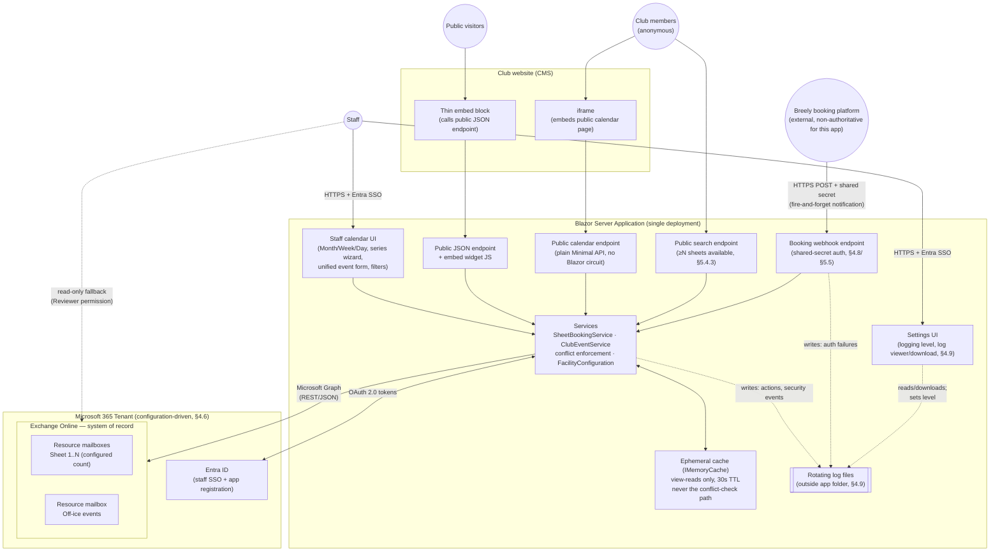

# Facility Scheduling System — Architecture & Design

**Project:** Curling sheet scheduling and availability management on Exchange Online
**Status:** As-built and in production use. This document describes the system as it actually exists, not as originally designed.
**Author:** Design iteration between club operator and Claude
**Stack:** .NET / C#, Blazor Server (.NET 10) — see §9, D14

---

## 1. Executive Summary

A web-based system for managing the scheduling and availability of curling sheets, built on Microsoft Exchange Online (EXO) resource mailboxes as the system of record. Each sheet is modeled as an EXO resource mailbox; every booking is a calendar event on that mailbox. A custom Blazor Server application — not Outlook — is the operational interface for staff: per-sheet/consolidated calendar views (Month/Week/Day), and one-off and recurring bookings spanning multiple sheets at once. Events that use no ice (closures, meetings, away bonspiels) live on their own whole-club mailbox, but the UI presents both kinds as one "event" with an on-ice/off-ice toggle (§4.4, D95) - the mailbox split is an implementation detail staff never see.

Around that core sit four anonymous read-only surfaces (§5.4) — a minimized JSON availability API for a thin CMS embed, a full public calendar page with its own Month/Week/Day views, a search page for finding a window with enough open sheets for a group event, and a practice-ice page listing times any member could volunteer to host — plus two write surfaces beyond the staff UI: an inbound webhook ingesting booking notifications from Breely, the club's separate customer-facing booking platform (§4.8, a one-way stopgap pending real bidirectional sync), and a member-facing practice ice hosting request flow that writes a pending hold for staff approval (§5.4.4). A staff-only Settings page (§4.9) exposes a rotating activity/debug log, added once the Breely webhook started acting on its own and its production behavior proved otherwise invisible.

The design still avoids any adjacent authoritative datastore: all booking data, including rich metadata (renter contact, notes), lives on the calendar event itself. The only additional infrastructure is a short-lived, disposable read cache, deliberately scoped to never touch the paths that enforce double-booking prevention.

Every tenant-specific value (the M365 tenant domain, which mailboxes are sheets vs. the off-ice events mailbox, the facility's local time zone) is configuration, not code — the same deployed app can be repointed at a different tenant, or stood up fresh for a different facility, without a recompile (§4.6).

The pattern generalizes to other bookable facilities (bowling lanes, tennis courts, etc.) — nothing in the architecture is curling-specific except the vocabulary and the configured sheet count.

---

## 2. Scope and Requirements

### 2.1 Delivered

| # | Requirement | Status |
|---|-------------|--------|
| R1 | Model each curling sheet as an independently bookable resource with its own calendar | Done — sheet count and mailbox addresses are configuration (§4.6), not a hardcoded "5" |
| R2 | Staff-mediated booking: staff create, modify, and cancel all bookings through a custom web UI | Done |
| R3 | Booking states beyond free/busy: **Hold** (soft, blocks other bookings) and **Confirmed** (hard) | Done — Hold is available only for Group Event; every other category is always Confirmed (§4.2) |
| R4 | Booking categories, consistently represented across all sheets | Done — sheet categories: Group Event / League / Bonspiel / Maintenance / Practice Ice / Learn To Curl / Other (Event is reserved for Club Events, §4.4) |
| R5 | Rich contextual metadata attached to the booking itself: renter name, contact, notes | Done (Price was cut from scope during build — never used) |
| R6 | Multiple views: per-sheet/all-sheets Month, Week, and Day grids | Done. The derived "≥N sheets available" consolidated view (interval-merge engine) was deprioritized twice during the initial build, then delivered as its own dedicated page (`/public/search`, §5.4.3) once member feedback raised it again |
| R7 | Anonymous public read-only view, embeddable in the club website | Done, as multiple distinct surfaces (§5.4): a minimized JSON availability API + CMS embed widget, a full public calendar page, an availability search page, and a practice-ice availability page |
| R8 | Outlook/OWA remains available as a read-only fallback | Done |
| R9 | Recurring bookings supported via native calendar recurrence | Done (§4.5) |
| R10 | Double-booking prevention, enforced by the application | Done (§6.1); the read cache is deliberately scoped to never weaken this (§4.3) |
| R11 | **Club Events**: a whole-club resource for large events, separate from individual sheet reservations | Done (§4.4), including a closure-conflict cross-check added after build. The dedicated mailbox remains, but the UI-level separation was later removed as staff-reported confusion (D95) - these are now "off-ice events", entered through the same form as a sheet booking |
| R12 | Configuration-driven tenant/mailbox/timezone, no hardcoded tenant values in code | Done (§4.6) |
| R13 | Reflect bookings made through the club's separate customer-facing booking platform (Breely) onto this calendar | Done (§4.8) as an explicit fallback/stopgap - not a replacement for real bidirectional sync, which remains future work (§2.2) |
| R14 | Staff-visible record of what the app has actually done in production (who created/edited/canceled what, plus optional deeper detail while troubleshooting) | Done (§4.9), added after the operator found the Breely webhook's production behavior opaque with no way to see it - a Settings page exposes a Standard/Debug level toggle and a viewer/download for a rotating log file |
| R15 | Members can find open ice and volunteer to host practice ice, subject to staff approval | Done (§5.4.4) — the app's first member-facing (non-staff) write path, which also drove the staff-vs-member authorization split in §6.5 |

### 2.2 Out of Scope (explicitly deferred or rejected)

- Payments, fees, deposits
- Membership rules, booking caps, priority tiers, waitlists
- **General** member self-service booking — members cannot book or rent ice themselves; the public calendar is read-only, and rentals go through staff or Breely. The one deliberate exception is practice ice hosting (§5.4.4): a member can request to host, but that only creates a pending hold requiring staff approval, not a booking.
- Post-season reporting or cancellation audit history — cancelled bookings are hard-deleted, metadata loss on cancellation is accepted
- Automatic expiration of holds, including un-actioned practice ice requests (§5.4.4 documents why this was considered and deliberately deferred)
- ICS calendar publishing (evaluated and rejected based on prior operational experience)
- Companion/adjacent authoritative database (all data of record stays on the calendar event)
- Bulk rental-availability painting tool (a multi-weekday bulk-create wizard) — scoped, then explicitly shelved as overkill for a once-per-season, near-empty-calendar operation; the series wizard covers the real need
- Real bidirectional calendar sync with Breely (the club's booking platform) — the intended long-term answer to keeping the two systems consistent, deferred because it needs real development time the club didn't have. The webhook (§4.8) is an explicit, one-way, best-effort stopgap in the meantime, not a substitute for it - if/when sync is built, most of §4.8 becomes redundant and should be reassessed rather than kept running alongside it.

### 2.3 Constraints and Environment

| Constraint | Detail |
|---|---|
| Tenant | Configuration-driven (§4.6) — a trial tenant was used through most of the build; the app now deploys against whichever tenant its `Facility`/`Graph` configuration points at, without a recompile. |
| Concurrency | Effectively 1 staff user at a time; 2 by rare coincidence. |
| Source of truth | Exchange Online. The web app holds no authoritative data. |
| Cache | Ephemeral only: short-TTL, non-authoritative, fully rebuildable from EXO at any moment; deliberately never applied to conflict-check reads (§4.3). |
| Public surface | Server-side minimization is mandatory for the JSON API — the public payload is a deliberately separate hand-built mapping, never a reuse of internal types (D11). The public calendar shows booking titles by design, under a rule that has three distinct cases: a **staff-typed** title is shown as-is (staff are trained to keep renter PII out of it); a **Breely-originated** title is programmatically replaced with its category label, since it's auto-populated from the customer's real name with no staff opportunity to redact it (D52); and a **practice ice** title deliberately names the volunteer host, an accepted PII exception since hosting is an outward-facing club role (D69). Any new booking source needs its own explicit decision here rather than inheriting one of these by default. |
| CMS | Public view integrates as a thin embed calling the app's public endpoint — no Graph logic inside the CMS. |
| Deployment | Azure App Service is the primary target; see `docs/deployment-guide.md` for the full deployment process and a platform-agnostic requirements section for other hosts. |
| Source of truth for customer-facing availability | Breely, not this app. This calendar's copy of a Breely booking is best-effort and one-way (§4.8) - if the webhook is ever missed or wrong, Breely's own records are what's authoritative for what a customer was actually promised, not this calendar. |

---

## 3. System Architecture

### 3.1 Component Overview

Key structural decisions visible above:

- **One Blazor Server deployment**, not a separate CMS-side service — the CMS integration is a thin embed/iframe with no credentials and no Graph logic.
- **Public read surfaces, not just one.** The JSON API + widget is a subordinate feature (per-sheet availability only). The public calendar page is the *primary* way club members see what's happening club-wide while unauthenticated. The search page (§5.4.3) answers "when can I get N sheets" directly rather than requiring a member to scan the calendar by hand. All three read through the same services, which read through the same cache.
- **One inbound write surface, structurally different in kind from the read surfaces above.** The booking webhook (§4.8/§5.5) is the only anonymous endpoint that *writes* to the calendar - a deliberate, bounded exception to "public surfaces are read-only," serving as a fallback until real bidirectional calendar sync exists (§2.2).
- **Public pages are plain Minimal API endpoints, never Blazor components** sharing the staff app's authenticated circuit (`MapRazorComponents<App>()`). This is a hard architectural rule established the hard way (§8) — not a style preference, and it applies to the webhook too.
- **The cache is scoped to view-rendering reads only.** Every conflict-check read (the thing standing between two staff members double-booking a sheet) always hits Graph live, never the cache. See §4.3.
- **Outlook is a read path only.** Staff hold Reviewer (read-only) calendar permission on the resource mailboxes.
- **The activity/debug log (§4.9) is a flat rotating file, not a database** — consistent with D7 (no companion datastore for booking data). It's written by the same services that write to Graph, and by the webhook endpoint's own auth check; the Settings page reads it and controls the log level, but nothing else in the app depends on it existing.
- **Graph calendar operations sit behind `IGraphEventGateway`** (§11), not `GraphServiceClient` directly — `SheetBookingService`/`ClubEventService` depend on the interface; production wiring still resolves to the real Graph client. Added specifically to make automated testing possible (§11) without driving Graph SDK's fluent request builders directly.

### 3.2 What Exchange Provides vs. What the App Owns

| Concern | Owner |
|---|---|
| Durable storage of bookings + metadata | Exchange Online |
| Recurrence semantics (series, occurrences, exceptions) | Exchange Online |
| Fallback human-readable calendar UI | Exchange Online (Outlook/OWA) |
| Mailbox permissions, audit logging | Exchange Online |
| **Conflict / double-booking enforcement** | **Application** (direct writes bypass the Resource Booking Attendant) |
| Multi-sheet grouping identity (`BookingGroupId`) | Application (§4.5) |
| State vocabulary and category schema integrity | Application (sole writer discipline; Exchange validates nothing) |
| Recurring series creation, per-occurrence edit/cancel semantics | Application |
| Off-ice events / closure-conflict cross-check | Application (§4.4) |
| Public data minimization | Application |
| Tenant/mailbox/timezone configuration | Application, externalized to config (§4.6) |

---

## 4. Data Architecture

### 4.1 Anatomy of a Booking (one EXO calendar event)

Every piece of booking data lives on the event object:

- **subject** — human-readable, for the Outlook fallback (`"{Category} - {RenterName}"` or just `{Category}` if blank).
- **start / end (+ timezone)** — the reserved slot, tagged with the facility's configured local time zone (§4.6), never UTC.
- **showAs** — `tentative` = Hold, `busy` = Confirmed. Drives free/busy and the hold-vs-confirmed encoding; conflict enforcement itself is the app's job regardless of `showAs` (§6.1).
- **categories** — one of Group Event / League / Bonspiel / Maintenance / Practice Ice / Other for sheets (Event is reserved for Club Events, never offered in the sheet-booking picker); Out of Town Bonspiels / Competitions / Activities / Meetings / Closure / Other for Club Events. The category's *display* label (e.g. "Group Event", "Practice Ice", "Out of Town Bonspiels") is kept separate from the enum's own wire value written to/read from this Graph property — renaming a label never risks breaking the read-back parse.
- **recurrence** — native Graph recurring series for league blocks etc. (§4.5).
- **Named extended properties** (server-side filterable): `BookedBy`, `BookingGroupId` (§4.5).
- **JSON blob** (one extended property, display-only): renter name, phone, email, notes.
- **iCalUId / EventId** — `EventId` is the Graph REST id (not durable across some mailbox operations); `ICalUId` is the durable identifier.

**Design rule:** anything filterable gets its own named extended property; everything else goes in the JSON blob, kept small.

**Read gotcha (confirmed during build):** `singleValueExtendedProperties` are never returned by default — a blanket `$expand` is insufficient; it must be scoped with a `$filter` sub-clause naming the specific property IDs. Every read path that needs metadata uses the filter-scoped form.

### 4.2 State Model

| Business state | `showAs` | Category | Blocks other bookings? |
|---|---|---|---|
| Open / available | *(no event)* | — | No |
| Hold | `tentative` | Group Event, or Practice Ice (§5.4.4) | **Yes** (app-enforced) |
| Confirmed | `busy` | Any | Yes |

- **Group Event and Practice Ice are the only categories that can be a Hold.** On the staff booking form, the Hold/Confirmed toggle and phone/email fields are shown only for Group Event — every other staff-created category is always a hard (Confirmed) booking, enforced client-side and coerced server-side. Practice Ice is the one exception to that staff-facing rule, and it doesn't come through this form at all: a member's practice ice request (§5.4.4) writes a `PracticeIce`+`Hold` booking directly, pending staff approval via `/practice-ice/approvals`, which confirms or declines it. Conflict enforcement itself doesn't distinguish Hold from Confirmed either way — any existing event, of any category or state, blocks a new one on that sheet (§6.1); "Hold" is a business-state label on top of that, not a weaker booking. **Learn To Curl (D106) is an ordinary category on this axis** — same as League, Bonspiel, Maintenance, or Other: always Confirmed, no special Hold path, since only the equality check against `GroupEvent`/`PracticeIce` gates Hold eligibility and Learn To Curl matches neither.
- **No category defaults on a new booking, series, or Club Event** — staff must explicitly pick one; Save/Create is disabled with a validation message until they do. This was added after live-testing feedback surfaced confusion from a silently-preselected category. Editing an existing item still loads its real stored category, unaffected.
- **Hold vs. Confirmed also has no default** — a new Group Event booking's state is `null` until staff explicitly picks Hold or Confirmed.
- Confirming a booking = update `showAs` `tentative` → `busy` on the existing event.
- Cancellation = hard delete, with one exception: a Group Event cancel offers "reopen for group event" (flips back to an unclaimed Hold, renter fields stripped) as an alternative to permanent deletion. **The "reopen" choice only appears when the item being cancelled is Confirmed** (found live, fixed 2026-08-03) — cancelling something that's already a Hold and being asked whether to turn it back into an open Hold is a redundant question; `CancelChoiceModal` now checks `State == BookingState.Confirmed` alongside the existing Category check, so cancelling an already-open slot just offers the single "Cancel booking" (permanent removal) choice.
- Time entry is 15-minute increments, covering the full 24-hour day (not just a daytime window) — represented internally as minutes-from-midnight, with 1440 meaning "end of this day" rather than colliding with a start-of-day option. **Entered as two dropdowns, not one** (`TimeOfDayPicker`): the hour (25 options, midnight through 11 PM plus end-of-day Midnight) and the minutes past it (`:00/:15/:30/:45`). Quarter-hours were added after staff feedback that real events start and end on them; a single flat list at that granularity would be 97 options, so `CalendarStyles.TimeOptionsMinutes` remains the authority on what a valid stored value is while the picker renders the two shorter lists. Picking Midnight disables the minutes control — there is no 12:15 AM *end of this day* under the 1440 convention.
- **A time that reaches a draft from outside the picker is snapped to the nearest quarter** (`CalendarStyles.SnapToQuarter`, applied in both `LoadForEdit`s and to the clicked-slot seed in `BookingDraft.Reset`). An Outlook-side edit, or an event created under the older 30-minute grid, can hold any minute value; a `<select>` whose bound value matches none of its options renders its *first* option, so an unsnapped 6:07 PM displayed as 12 AM and saved as midnight. Same reason `Reset` clamps the default two-hour end to 1440 rather than letting an 11 PM click seed 1500.
- **End time must be after start time on every booking/series/Club Event form** — enforced the same way as every other required field (Save/Create disabled with a validation message). Added after a live-found bug: submitting an inverted range (end before start) previously reached Graph's calendar API unvalidated, which rejected it with an unhandled error that took down the Blazor circuit.

### 4.3 Ephemeral Cache

Two layers, added at different points in the build, deliberately kept separate:

| Layer | Scope | TTL | What it must never touch |
|---|---|---|---|
| Staff-facing view cache | `SheetBookingService.GetBookingsForAllSheetsAsync`, `ClubEventService.GetEventsAsync` — the "everything in this window, for display" reads used by the calendar pages | 30s | `GetEventsInRangeAsync`/`GetBookingsAsync` (the per-sheet reads every conflict check uses) are **never cached** — a cached snapshot there could mask a just-created booking and allow a double-booking within the TTL window. This is the one invariant this cache design cannot compromise. |
| Public-facing response cache | `PublicAvailabilityService`'s own computed `GetAvailabilityAsync`/`GetMonthViewAsync` responses | 60s | Sits as an outer layer on top of the staff-facing cache above — a cold public cache still benefits from a warm inner cache, and vice versa. |

Invalidation for the staff-facing layer is a full clear (not precise per-window overlap tracking) of that service's own tracked cache keys, on every successful write — simple, and proportionate given this app's actual write volume (1–2 staff). The public-facing layer expires on its own TTL only, since it doesn't sit behind a write path.

**Explicitly rejected:** Graph change-notification webhooks (subscriptions expire and need renewal/reconciliation infrastructure to catch out-of-band edits, of which there are structurally none — sole-writer app + read-only Outlook access).

### 4.4 Off-Ice Events (`ClubEvent` in code)

A dedicated resource mailbox, not tied to any physical sheet, for whole-club-scale events (bonspiels, closures, club activities) that would otherwise require booking every sheet simultaneously.

**The UI calls these "off-ice events" and presents them as the same kind of thing as a sheet booking** — one "Event" concept with an on-ice/off-ice toggle deciding which service the save dispatches to (D95). Staff had reported the booking-vs-club-event split as artificial: the distinction they actually care about is whether something occupies ice, not which mailbox it lands on. The split below is real and stays, but it is now an implementation detail rather than something the UI enforces. **Code names are deliberately unchanged** (`ClubEvent`, `ClubEventService`, `ClubEventCategory`, the `showClubEvents` query parameter, `/club-events`, and the public API's `clubEvents` array) — the category enum's member names are simultaneously the public API wire value (D79), the Graph category literal, and an Exchange master-category `displayName`, so renaming them is a data migration rather than a rename (D95).

**Why a dedicated mailbox instead of writing the same event to every sheet calendar:** independent per-sheet Graph writes have no transactional guarantee; a single event on a single dedicated calendar is atomic by construction.

**Category taxonomy:** Out of Town Bonspiels / Competitions / Activities / Meetings / Closure / Other. Kept structurally separate from the sheet-level category enum. Member *names* are load-bearing twice over - the public API's wire value (D79) and the Graph category literal - so renaming one is a breaking change, while reordering is free. Picker display order lives in `CalendarStyles.ClubEventCategories` rather than following declaration order. `Bonspiel` was renamed to `OutOfTownBonspiels` (D81) after staff reported confusing it with `BookingCategory.Bonspiel` — a bonspiel held on this club's own ice, an entirely different thing from a club event marking members away at someone else's.

**Create-form defaults and validation (D104, staff feedback 2026-08-27).** A new off-ice event now
opens *timed*, not all-day — `ClubEventDraft.IsAllDay` defaults to `false`, so the time pickers are
visible immediately rather than requiring a toggle first. Most off-ice events staff actually create
(meetings, closures) have a real start and end time; all-day was the wrong default for the common
case. `ClubEvent.IsAllDay` (the persisted Graph record) keeps its own separate `= true` default
untouched - only the form's starting point changed, not what an event becomes if nobody touches the
toggle, and every real save path sets it explicitly from the draft regardless. Separately, a timed
off-ice event's End may now equal its Start - a zero-duration, point-in-time marker (a ribbon cutting,
an announcement) is legitimate and no longer needs a fake minute of padding to pass validation; only
End strictly before Start is rejected. **On-ice bookings are unaffected by either change** - a new
on-ice booking still defaults from `BookingDraft`'s own fields (§4.2), and `ValidateOnIce` still
requires End strictly after Start, since occupying a sheet for zero minutes isn't a real booking.

**Display:** Club Events render **inline within the calendar itself**, never as a separate banner — sorted chronologically alongside sheet bookings (all-day events sort first). In Month view they appear as chips within each day cell; in Week view (an hourly grid whose columns are days, §4.7) an all-day event pins to a slim row at the top of its column and a timed event is laid out at its actual hour as a peer of the bookings, sharing lane width with anything concurrent. **Day view diverges**, because its columns are sheets and a club event is on no sheet: every club event on the day — all-day and timed alike — lists in one band above the hourly grid, and a timed one additionally gets a thin rail, in its band row's own category colour, in a narrow strip between the hour gutter and Sheet 1, positioned and sized at its real hours. Concurrent rails lane side by side. That divergence is the D19 amendment (§8): timed club events were full-width bands in Day view too until 2026-08-27, which meant two overlapping ones painted over each other and over every booking beneath them. On the **staff** calendar every off-ice chip/band carries a dotted border (as opposed to bookings' dashed=hold/solid=confirmed), so border style alone identifies the kind of item independent of its category color. The **public** calendar dropped that border (D99): members reported the dotted outline as hard to see, and once off-ice categories became separately colored and separately filterable (D97) it no longer carried information they needed. Clicking a Club Event chip anywhere on the staff calendar opens its edit form directly (a bug where the click instead bubbled up to the day cell's own "jump to Day view" handler was found and fixed). Both calendars filter them **per category**, in an OFF ICE row of chips paired with an ON ICE row,
each row carrying an All/None link (D95). This replaced a single all-or-nothing show/hide toggle; the
rows are grouped rather than run together because both category families contain `Other`, and on-ice
`Bonspiel` vs off-ice `OutOfTownBonspiels` is the exact pair D81 renamed because staff conflated them
— which row a chip sits in is what disambiguates it.

**Integration with sheet bookings — narrower than originally designed:**

| Mechanism | Behavior |
|---|---|
| Write-path conflict check | **Narrowed after build** from the original "no cross-check in either direction" (D13): a Club Event flagged `MarksSheetsUnavailable=true` now *is* cross-checked against new sheet bookings/series, since staff live-testing surfaced this as a real gap. Implemented at the `Calendar.razor` page level (not inside either service — `SheetBookingService`/`ClubEventService` stay mutually decoupled, per D13's original build-simplicity intent). Blocking for a single booking's create/edit (same UX as a real sheet conflict); informational-only for the series wizard preview (staff can still choose to skip a flagged date, matching how every other series-preview conflict already works). Club-Event-vs-Club-Event and non-closure-Club-Event-vs-sheet-booking checks remain intentionally absent. |
| Public view | Club Events get a distinct label on the public calendar rather than being folded into generic per-sheet blocks. |
| Provisioning | Add as step 1a: create the Club Events resource mailbox alongside the sheet mailboxes; same security group/access policy scope. |

### 4.5 Recurring Series and Multi-Sheet Bookings

Two related mechanisms:

**Multi-sheet bookings.** A single conceptual booking (e.g., a rental spanning 3 sheets) is represented as one event per sheet, linked by a shared `BookingGroupId` (a named extended property) — every booking gets one, even single-sheet ones, so downstream code never branches on single-vs-multi. Creation across sheets is all-or-nothing: every requested sheet is conflict-checked before anything is written.

**Recurring series.** Graph has no concept of a recurring series spanning multiple mailboxes, so a multi-sheet recurring booking (e.g., a 5-sheet league) is five independent native Graph recurring series — one per sheet — sharing one `BookingGroupId`. Conflicts during series review are informational only, never auto-skipped; staff explicitly choose which candidate dates to skip.

**A real bug found and fixed via live testing:** `BookingGroupId` does **not** reliably propagate from a recurring series' master event down to its individual occurrences — it only persists on an occurrence once that specific occurrence has been individually edited. An untouched occurrence always reads back `BookingGroupId = Guid.Empty`. Naively grouping chips by `BookingGroupId` in Month/Week view therefore incorrectly merged multiple *unrelated* bookings that happened to share that same empty default, hiding all but one. Fixed by falling back to `(SheetMailbox, EventId)` — always unique per booking — as the grouping key whenever `BookingGroupId == Guid.Empty`. Diagnosed via a differential test: Day view (which doesn't group by `BookingGroupId` at all) showed the data correctly, isolating the bug to the dedup/display layer rather than the fetch.

**Adding a sheet mid-edit was silently dropped (found live, fixed 2026-08-03).** Editing an existing multi-sheet group and *adding* a sheet that wasn't already part of it appeared to save successfully (the form closed with no error) but never actually created anything on the new sheet — Calendar.razor only ever built a list of the group's *existing* members to pass to `UpdateGroupAsync`, and a newly-selected sheet has no existing event to include in that list, so it had nothing to attach to. `UpdateGroupAsync` now also accepts new sheets to add in the same call, conflict-checks and locks them alongside the existing members (same all-or-nothing guarantee as every other group write), and creates fresh events for them under the group's shared `BookingGroupId`.

**Whole-series editing (`UpdateSeriesAsync`, D82).** Originally the series master itself was reachable only through the "cancel entire series" backdoor — no edit path touched it. Staff feedback wanted title/notes/category corrections and sheet changes to apply retroactively across a whole league, not per occurrence. Time is deliberately excluded: unlike a single occurrence, a series spans months, and moving it would mean re-validating every date against everything else on the calendar — ruled out as more risk than the feature was worth. Since each sheet's recurrence is an independent native Graph series (no cross-mailbox recurrence, as above), "editing the series" resolves per sheet:

- **Kept sheets** — PATCH the series master directly (`includeTime: false`, so Start/End are never sent); Graph propagates the change to every occurrence, past included, with a single write.
- **Removed sheets** — DELETE the series master, taking every occurrence on that sheet with it. Never conflicts, so needs no check — this is the same reasoning as `CancelGroupAsync` dropping a sheet.
- **Added sheets** — the one case that can conflict. Occurrence windows are read back from Graph (`GetInstancesAsync` against a reference sheet that is staying, not one about to be removed) rather than recomputed from the recurrence pattern, so occurrences staff individually excluded at series-creation time are respected rather than reappearing. Every window is conflict-checked on the new sheet before anything is written, all-or-nothing across the whole series — matching every other multi-sheet write in this app rather than introducing a new "partially applied" shape. On success, the new sheet's series replicates the reference master's `Recurrence` verbatim, then has the same excluded dates deleted individually to mirror the reference series' gaps.

Unticking every sheet is a no-op rather than an implicit whole-series delete — that stays behind the existing, deliberately separate cancel-series confirmation.

**Season-excluded candidate dates never rewrite what staff typed (D85).** See §4.10 for the season window itself; the interaction worth recording here is specific to the wizard. First date/Last date on Step 1 are never modified by the season check — an earlier version clipped them in place, which silently moved the picker's displayed end date while a banner simultaneously said dates had been "removed," two contradictory signals for an edit staff never made (live-found 2026-08-18). Season-excluded candidates are instead folded into `SeriesDraft.SkippedDates` — the same mechanism a manual Skip uses, so `CreateSeriesAsync` excludes them automatically — but rendered on Step 2 with no Skip/Include toggle at all, since unlike a real scheduling conflict this isn't staff's call to override.

### 4.6 Configuration Model

Added during production hardening. Nothing tenant-specific is hardcoded in source:

- **`FacilityOptions`** (bound from a `Facility` config section, same pattern as the pre-existing `GraphOptions`): `TenantDomain`, `SheetMailboxLocalParts` (an explicit array, not a count — a different facility's mailboxes won't necessarily follow a `sheet1..sheetN` naming convention), `ClubEventsMailboxLocalPart`, `TimeZone`, plus `Name` and `LogoPath` (accepted now for future white-labeling; not yet wired into any UI).
- **`FacilityConfiguration`** — a singleton service that validates and derives the actual mailbox addresses/`TimeZoneInfo` from those options. Fails fast at application startup (not lazily on first request) if `TenantDomain`, `SheetMailboxLocalParts`, or `TimeZone` are missing — deliberate, given this app has already shipped multiple real bugs from silent wrong timezone defaults; a misconfigured deployment should error immediately, not limp along wrong.
- **`FacilityConfiguration.Today`/`.Now`** (added 2026-08-04) — facility-local wall-clock "today"/"now", derived via `TimeZoneInfo.ConvertTimeFromUtc(DateTime.UtcNow, ZoneInfo)`. **A third instance of the timezone-default bug class, found live:** every "today" anchor across the app - the staff calendar's initial view and Today button, the public calendar's defaults and Today links, the public search's default range, the public availability window's own start, and every new-booking/series/club-event form's default date - had been computed from `DateTime.UtcNow.Date` directly. From roughly 5pm PDT (4pm PST) onward, UTC has already rolled to tomorrow, so every one of those silently anchored a day ahead during the facility's own evening hours - exactly when curling ice is busiest, and specifically meaning the public availability feed and search were dropping the rest of tonight's open ice from anonymous visitors. All of these now route through `FacilityConfiguration.Today`/`.Now` instead. Domain draft classes (`BookingDraft`, `ClubEventDraft`, `SeriesDraft`) have no DI access to this service, so their `Reset()` methods now take `today` as an explicit parameter from the calling page rather than defaulting internally.
- `GraphOptions` (the Entra app-registration credential: `TenantId`/`ClientId`/`ClientSecret`) remains a separate config concern, unchanged.
- The provisioning script (`docs/provision-categories.ps1`) takes `-TenantDomain` and `-SheetCount` parameters rather than hardcoding either.

See `docs/deployment-guide.md` for the full configuration reference and where each value belongs (user-secrets locally, Azure App Service Application Settings or equivalent in production).

### 4.7 Week and Day Views — Hourly Grids

Both Week and Day are hourly time-grids sharing one time axis (`CalendarStyles.HourRows`, midnight through midnight — full 24-hour coverage, matching the 24-hour booking window in §4.2), rendered against a common set of positioning helpers (`TopPx`/`HeightPx`) so the two views can never drift out of sync with each other. Day view has one column per sheet; Week view has one column per day.

**Consolidation across sheets (Week view).** A single conceptual multi-sheet booking (one event per sheet, linked by `BookingGroupId`, §4.5) collapses into one displayed item rather than showing once per sheet, with a `· N sheets` suffix when the group spans more than one. This reuses the same `BookingGroupId`/`(SheetMailbox, EventId)` dedup key already established for Month view (§4.5's `BookingGroupId` propagation bug).

**Lane layout for concurrent items (Week view).** Because Week's columns are per-day (not per-sheet), two different bookings on two different sheets at overlapping times land in the same column. A classic calendar-view lane algorithm — cluster overlapping items, then greedily assign each to the first lane whose prior occupant has already ended — lays them out side-by-side instead of overlapping, with each cluster's own lane count (not the whole day's busiest moment) determining item width. Implemented once as a generic `CalendarStyles.LayoutLanes<T>` and reused verbatim by the public calendar's Week view (§5.4.2), rather than each maintaining its own copy of the same algorithm.

**A live-found rendering bug (2026-07-23):** the hour-label gutter's cells didn't set `box-sizing: border-box`, so a 2px top padding was added on top of the declared row height rather than included within it — a 2px-per-hour drift between the labels and the actual grid rows that compounded to a full row's offset by mid-afternoon. Fixed by adding `box-sizing: border-box` to every gutter cell (and the Week view's day-header row, which had the same class of issue from its own padding/border). A reminder that every fixed-height cell sharing a coordinate system with pixel-computed absolute positioning must be box-sizing-consistent, not just individually correctly sized.

**Every calendar cell title (Month/Week/Day, and the public calendar, §5.4) is prefixed with its start time** (e.g. `7PM - League Practice`, or `7:30PM - …` when not exactly on the hour) — added so the time is visible without needing to click a chip, even in Month view where nothing else conveys time-of-day. All-day Club Events are the one exception (no specific hour to show).

**Click-to-book on an open slot (staff calendar only).** Clicking empty grid space opens `EventFormModal` directly, prefilled from the click and set to on-ice, rather than requiring the "+ New Event" menu. Day view has always done this (`DayGrid.OnSlotClick`, per-sheet columns) — clicking a slot prefills both the sheet and the start time. Week view has no sheet dimension (its columns are per-day, with bookings across sheets consolidated, above), so its equivalent (`WeekGrid.OnSlotClick`, added 2026-08-22) prefills only the date/start time and leaves the sheet for staff to pick in the dialog (D93). Both default the end time to a 2-hour duration (`BookingDraft.Reset`), clamped to end-of-day so a late-evening click can't seed a time the picker has no option for (clicking the 11 PM slot used to produce 1500, which rendered as 12 AM); neither clamps to facility closing hours, matching the pre-existing Day-view behavior. The day-column header's own click (jump to Day view, unchanged) is a separate click target from the hourly grid body beneath it, so both remain available side by side.

### 4.8 External Booking-Platform Integration (Breely webhook)

Bookings taken through Breely (a separate, third-party booking site with its own calendaring, used for public-facing group-event sales) are not entered by staff into this app directly. Breely is the source of truth for what a customer was actually promised (§2.3) — this app's copy is a best-effort, one-way reflection, kept current so staff have a working calendar without needing to also watch Breely, but not relied upon for the authoritative answer to "is this customer actually booked." A real bidirectional sync was the originally preferred design (§2.2) but wasn't ready in time; this webhook is the stopgap that ships instead, and becomes redundant if/when that sync exists.

**Trigger and identity.** Breely fires **one webhook call for an entire multi-sheet reservation at creation**, not one per sheet as originally assumed — that original assumption was inferred from single-sheet and reschedule samples and turned out to be wrong the first time a real multi-sheet booking was tested live (2026-08-03: a 3-sheet reservation only claimed 1 sheet). At **reschedule or cancellation**, Breely does fire one call per event, since its own UI requires rescheduling a multi-sheet reservation's sheets one at a time. See "Multi-sheet reservations" below for how this app discovers and groups the sibling sheets despite that asymmetry. Each event carries a stable `event.id` that persists across a reschedule (confirmed empirically). Since there is no companion database (D7), "have I seen this external booking before" is answered by storing `breely:{event.id}` in a new extended property, `ExternalBookingId` (same named-extended-property pattern as `BookedBy`, §4.1), and querying for it live via a Graph `$filter` across every configured sheet (`SheetBookingService.FindByExternalIdAsync`) rather than any local index. The value is validated against a strict allow-list (`^[A-Za-z0-9:_-]+$`) before ever being embedded in a Graph filter string — the id is webhook-controlled input, and Graph's `$filter` syntax has no parameterization to fall back on.

**Multi-sheet reservations (found live, fixed 2026-08-03).** A multi-sheet booking's sibling sheet-events are only discoverable via a nested `submission.events[]` array in the webhook payload — the top-level `event` object alone only ever names one of them. `BreelyBookingProcessor.ProcessAsync(BreelyWebhookPayload, ...)` resolves the full set of events to process as the union of `submission.events[]` and the top-level `event` (deduplicated by id, with the top-level `event`'s own data always winning for its own id, since that's the one this specific call is actually about — an important distinction because `submission.events[]` is a **static snapshot from the original creation call**: a later reschedule/cancellation call for one sibling still shows the *original* pre-reschedule data for the others in that array, not their current state). Every resolved id is checked against `FindByExternalIdAsync` regardless of whether it's the "primary" one for this call, so a sibling that was never individually claimed (a straggler from before this fix) still gets reconciled by claiming it. This same resolve-then-process-each-independently structure is why the fix applies uniformly to creation, reschedule, and cancellation without special-casing any of them - each event's own `Canceled`/`start_date`/`start_time` fields (from the top-level `event` if it's the one being updated, or from its own array entry otherwise) drive what happens to it, one at a time, each in its own try/catch so one failing sibling doesn't block the rest.

**A sibling can only ever be *created* from array data, never *mutated* by it (found live, fixed 2026-08-04).** Because `submission.events[]` is a static snapshot, a sibling entry that isn't the top-level `event` could show a time or a `canceled` flag that's stale relative to what's already booked. `ProcessEventAsync` guards against this explicitly: if a resolved id already has a claimed booking *and* it isn't the primary event for this call, processing stops immediately, before the reschedule/cancel logic ever runs - the possibly-stale array entry is never allowed to reschedule or cancel something already correctly claimed. Only a genuinely never-seen sibling is claimed from array data (a pure create, not a mutation of existing state); only the primary event can change an already-known booking.

**Grouping (found live, fixed 2026-08-03).** All sheets claimed from one multi-sheet submission now share one `BookingGroupId`, so they display/edit/cancel together in the staff Calendar UI the same way a staff-created multi-sheet booking does. The group id can't come from Breely's own `submission_unique_id` — live-tested and found to be a *different* value for every sibling event in the same reservation (513847/513848/513849 for three sheets from one 3-sheet booking), so it's evidently scoped to the event/submission-action, not the reservation. Instead, `ProcessAsync` resolves one shared id per webhook call: reuse an existing sibling's `BookingGroupId` if any of the resolved events was already claimed before (so a reschedule keeps its booking in the same group instead of forking into a new one, and a late-arriving straggler joins its siblings' existing group), otherwise mint a fresh `Guid.NewGuid()` for a genuinely new submission. `ClaimHoldAsync` and `ForceCreateConfirmedAsync` both take this id explicitly now rather than minting their own internally.

**"Dumb webhook" design philosophy.** By the time this fires, the booking already happened in the real world — the job is to reflect that, never to reject or drop it. Concretely:
- Always acknowledge fast (HTTP 200), even on malformed JSON, an unrecognized shape, or a processing exception — there is no retry semantics this app controls either way, and a non-2xx wouldn't cause Breely to do anything more useful. Failures are surfaced via logs and the `NeedsTriage` marker below, never via the HTTP response.
- If a new booking doesn't match any existing open Group Event hold on any sheet (a customer bought a slot the public search never advertised, or Breely and this calendar's holds have drifted), the booking is force-written anyway (`ForceCreateConfirmedAsync`, bypassing the normal conflict check entirely) and a `NeedsTriage` Club Event marker (title `⚠ Web booking needs review`, non-blocking, `MarksSheetsUnavailable: false`) is created for staff to reassign manually. A real booking is never silently guessed at or dropped. Which sheet it lands on is offset by the event's position within its batch (`batchIndex % SheetMailboxes.Length`, zero for a standalone notification) rather than always the first configured sheet — **found live, fixed 2026-08-04**: without this, several siblings from one multi-sheet reservation that all failed to match a hold force-booked onto the *same* sheet, producing multiple overlapping bookings instead of a spread-out, individually-correctable mess.
- Sheets are always tried in configured order (`Facility.SheetMailboxes`, i.e. sheet 1, then sheet 2, …) when claiming a hold — satisfies the operator's explicit "always assign sheets in numerical order" requirement without any extra sorting logic.

**Hold-claiming, not hold-blocking.** Every existing staff-facing write path treats a Group Event hold as something a new booking must avoid overlapping. This integration instead treats a hold covering the requested window as *claimable*: `SheetBookingService.ClaimHoldAsync` walks sheets in configured order, locks one sheet at a time (same per-sheet `SemaphoreSlim`, §6.1), finds a hold that fully covers the requested window, converts it to a Confirmed booking carrying the customer's name/phone/email and `ExternalBookingId`, then trims the remainder of the original hold (`TrimHoldAsync`) rather than deleting it outright — so a 10am–2pm hold claimed for a 10am–12pm booking still leaves 12pm–2pm open, and a hold covering multiple sheets still shows the others as available. Trimming deletes the hold (zero remainder), patches it in place (one remainder), or splits it into two events (two remainders); a hold that's a recurring occurrence is deleted and recreated as a standalone event for its remainder rather than PATCHed, since Graph rejects a Start/End change on an occurrence that would cross into an adjacent occurrence (the same restriction already known from `UpdateGroupAsync`, §5.1). A remainder segment shorter than the operator-configured **minimum group event booking interval** (Settings page, default 60 minutes — added 2026-08-03) is dropped entirely rather than kept as an unusably short bookable sliver; each side (before/after the claim) is judged independently. Every remainder `TrimHoldAsync` creates or keeps is titled **"Available for Group Events"**, distinguishing an app-generated "the rest of this slot is still open" fragment from a plain staff-created hold (which keeps its category-label title).

**Reopening a claimed booking reunites adjacent fragments (found live, fixed 2026-08-03).** Cancelling a Breely-claimed booking with "reopen as available" chosen previously just reopened that booking's own window as a hold, leaving it as a separate chip sitting back-to-back with whatever `TrimHoldAsync` remainder(s) already existed alongside it - one open block of ice showing as 2-3 disjoint chips. `SheetBookingService.AbsorbAdjacentHoldsAsync`, called from `CancelGroupAsync`'s reopen path before writing, now finds any Group Event hold on the same sheet immediately touching the slot being reopened (extending outward on both sides as far as the chain goes) and folds them into one contiguous hold, deleting the absorbed neighbor(s) - not Breely-specific, since the same fragmentation risk exists whenever a hold sits adjacent to another hold regardless of how either one got there. `CancelGroupAsync` gained proper per-sheet locking as part of this fix (it had none before) - merging now reads other holds before deciding what to write, a genuine race against a concurrent Breely claim on the same sheet, not just a courtesy lock. A recurring-occurrence booking being reopened into a merged span is deleted and recreated as a standalone event, same restriction as `TrimHoldAsync`'s own recurring case above.

**Reschedule and cancellation.** A reschedule notification (same `event.id`, new time) is handled as cancel-then-reclaim: the existing booking is released back to an open Group Event hold (`CancelGroupAsync(reopenAsGroupEventHold: true)`), then the new window is claimed fresh via the same `ClaimHoldAsync` path above — which may land on a different sheet than before if the original sheet isn't free at the new time; that's expected. The reclaim preserves the booking's existing `BookingGroupId` (see "Grouping" above) rather than minting a new one, so a rescheduled sheet stays linked to its siblings. A cancellation notification releases the matching booking the same way, or is logged and ignored if no matching booking is found. **Cancellation has now been exercised against real Breely traffic** (2026-08-03, as part of testing the multi-sheet fix above) via the reschedule path's release step; a standalone `canceled: true` notification (no accompanying reschedule) is still only confirmed against sample payloads.

**A released hold used to keep the departing booking's identity (found live, fixed 2026-08-04).** The reopen-as-hold PATCH only ever included the extended properties `ToGraphEvent` was given a non-empty value for - `ExternalBookingId` and `BookedBy` were simply omitted when reopening, and Graph's PATCH semantics leave an omitted extended property untouched rather than clearing it. The released hold therefore kept the just-departed Breely booking's `ExternalBookingId`, so the *next* notification for that same external id could match the leftover hold via `FindByExternalIdAsync` instead of the real booking, which had already moved elsewhere. `ToGraphEvent` gained a `clearUnsetOptionalProperties` flag, used only by the reopen path, that explicitly writes an empty string for `BookedBy`/`ExternalBookingId` when the reopened booking doesn't carry its own value - an empty string can never satisfy `FindByExternalIdAsync`'s exact-match `$filter`. `FindByExternalIdAsync` also now prefers a Confirmed match over a Hold if more than one result is ever returned, as defense in depth against the same class of stale-identity bug elsewhere.

**Processing runs detached from the request, not on its cancellation token (found live, fixed 2026-08-04).** The endpoint previously awaited `ProcessAsync` before returning `200`, on the request's own `CancellationToken` - meaning a multi-sheet batch (potentially dozens of sequential Graph calls) could take far longer than "ack fast" implies, and an HTTP timeout on Breely's side would abort processing *mid-write* (e.g. between releasing an old slot and claiming the new one on a reschedule), leaving a booking missing from this calendar while it still exists in Breely. `BreelyBookingWebhookEndpoint` now acknowledges immediately and runs `ProcessAsync` detached, on `CancellationToken.None`, so once started it always runs to completion. Safe specifically because every service `BreelyBookingProcessor` depends on is registered as a Singleton (Program.cs), not scoped to the request - nothing in the detached task is tied to a DI scope that ends when the response is sent.

**A per-external-id lock closes a duplicate-delivery race.** Breely has been observed re-sending the same creation notification twice within minutes of each other. Without a lock, two concurrent deliveries for the same external id could both see "no existing booking" via `FindByExternalIdAsync` and independently claim two different sheets for what's really one booking - the per-sheet locks in `SheetBookingService` don't cover this, since the race is in the lookup that happens *before* either request has picked a sheet to lock. `BreelyBookingProcessor` now holds a static per-external-id `SemaphoreSlim` (`ExternalIdLocks`) around the entire lookup-then-act sequence for a given id, re-checking `FindByExternalIdAsync` fresh once the lock is acquired (the batch-level pre-fetch used for the shared-group-id decision is only a hint, not trusted once inside the lock).

**Payload handling.** Breely's real webhook payload is large and mostly irrelevant to this app (CRM/marketing fields, signed-PDF blobs, raw form-answer dumps); `BreelyBookingProcessor`'s DTOs (`BreelyEvent`/`BreelyWebhookPayload`) map only the handful of fields actually used (`id`, `start_date`, `start_time`, `duration_in_minutes`, `booked_with`, `canceled`, client contact fields, `event_type`, `admin_url`) via `[JsonPropertyName]`; everything else is silently ignored by `System.Text.Json`, not an oversight. `start_date`/`start_time` are parsed as facility-local time (`MMM d, yyyy h:mmtt`) — the "PDT"/"PST" abbreviation Breely also sends is deliberately ignored, since the facility's own configured time zone (§4.6) is the authority on local time here, matching how the rest of the app already treats `DateTime` as local-without-offset. An event whose `booked_with` isn't the configured sheet resource-type string (currently `"Curling Sheet"`, hardcoded — Breely has no API for this app to discover the name on its own) is ignored as not applicable to this calendar (e.g. a warm-room add-on, if Breely ever sends one as its own top-level event).

**Payload shape was reverse-engineered, not documented.** Breely's own webhook documentation was too sparse to build against directly; the actual shape was determined empirically from real captured payloads (a first booking, a reschedule pair, a corrected single-sheet sample after an earlier one turned out to be manually-edited and unreliable, and — critically — the `submission.events[]` array and per-sibling `submission_unique_id` values described above). **If the payload shape ever needs re-checking against some future Breely change, the mechanism is the endpoint's own Debug-tier raw-body log (§4.9)** — turn Debug on at the Settings page, capture a real notification, turn it back off. That log is deliberately raw rather than DTO-shaped precisely so it can reveal fields this app doesn't yet parse, which is exactly how the multi-sheet behavior above was found.

### 4.9 Application Activity/Debug Log and Settings Page

Added immediately after the Breely webhook (§4.8) shipped, once the operator found its production behavior opaque: the framework's own `ILogger` output only reaches the console/Azure Log Stream, isn't retained anywhere staff can see without portal access, and wasn't answering "what did the webhook actually do." `AppLogService` is a second, deliberately separate log aimed at that gap — a flat rotating text file, not a database (same D7 spirit as the rest of this app's data model), with a staff-facing **Settings** page (`/settings`) to control it and read it.

**Two tiers, one on by default.** *Standard* entries are definitive actions — a booking, series, or Club Event created, edited, or canceled — and are always written, along with a small set of security-relevant events (a failed webhook-secret check) that matter regardless of level. *Debug* entries — the raw (PII-redacted) Breely webhook payload, the external-id lookup result, staff sign-in events — are a no-op unless the level is currently set to Debug. The level is chosen on the Settings page, takes effect immediately (no restart), and persists to a small marker file in the log directory itself rather than to `appsettings.json`, so a level change survives an app restart without needing a redeploy.

**Actor identity reuses the existing sign-in trust boundary, not a new one.** Every Standard-tier staff action logs the real signed-in Entra display name (`ClaimsPrincipal.Identity.Name`) — the same value already shown in the header and defaulted into the free-text "Booked By" field (§6.2) — rather than that editable free-text field itself, since a typed field isn't a reliable audit identity. Breely-originated actions log the actor as the literal string `"Breely webhook"`, matching the `BookedBy` value those bookings already carry.

**Storage location is deliberately outside the deployed app folder.** `AppLog:LogDirectory` (configuration, §4.6-style — never hardcoded) points at where daily-rotating files (`app-yyyy-MM-dd.log`) and the level marker live. Left unset, it falls back to `App_Data/logs` under the content root and logs a startup warning — adequate for local dev, but on Azure App Service that folder is replaced by every redeploy/zip-deploy, silently losing log history. Production deployments must point this at a persistent path outside the deployed folder (see the deployment guide). Files older than `AppLog:RetentionDays` (default 30) are deleted automatically on the next day's rotation — a deliberate bound so leaving Debug mode on doesn't grow the log without limit.

**PII handling in Debug-tier webhook logging.** Breely's payload carries the customer's name, email, and phone number. Logging it raw in Debug mode would create a second at-rest copy of customer contact information outside Exchange, for as long as retention keeps it — decided against explicitly with the operator. `BreelyBookingProcessor`'s Debug-tier payload log redacts those three fields (`client_full_name`/`client_email`/`client_phone` → `[redacted]`) while keeping everything else (booking id, times, sheet, `admin_url`, event type) intact, so the log stays useful for troubleshooting a payload-shape question without becoming a PII store.

**"All network traffic" was scoped down from its literal reading.** The original request for Debug mode was "all network traffic, authorizations, webhook calls, webhook actions." Literal HTTP-level tracing of every Microsoft Graph call would have meant hooking into the Graph SDK's HTTP client pipeline (Kiota's `IRequestAdapter`/`DelegatingHandler` plumbing) — riskier to get right without the ability to test locally against real Graph traffic (per the same constraint that shaped §4.8's build), and it would flood the log with routine calendar-page reads that have nothing to do with what an operator is actually trying to debug. What shipped instead: every step of the Breely webhook's own processing (payload received, external-id lookup, hold-claim attempt, force-book fallback), plus staff sign-in events. If Debug mode turns out not to show enough once exercised against real production traffic, this is the boundary to revisit first.

**Log viewer and download.** The Settings page shows the most recent 500 lines (`AppLogService.TailAsync`, walking backward through older rotated files if the current day's file doesn't have 500 lines on its own) with a manual Refresh button — not auto-refreshing, consistent with every other view in this app being a simple request/response read rather than a live-updating one. `GET /settings/logs/download` (§5.6) zips every rotated file for download, since a support conversation shouldn't be limited to "whatever's in today's file."

**Raw webhook payload capture, added mid-investigation (2026-08-03).** The Debug-tier `WebhookPayloadReceived` line above only logs the fixed subset of fields `BreelyEvent` maps — useless for discovering a field the DTO doesn't know about yet, which is exactly what the multi-sheet investigation (§4.8) needed. `BreelyBookingWebhookEndpoint` now also logs the **entire raw request body** at Debug tier (`WebhookRawPayloadReceived`), redacting the same three known PII field values via regex substitution on the raw text (not full JSON parsing, since the point is to see fields the DTO doesn't parse) and capping the logged length at 8000 characters — Breely's real payload can carry a signed-PDF blob or other large CRM fields, and a single log line shouldn't balloon to megabytes for one diagnostic capture. This is genuinely the mechanism that found the `submission.events[]` array and the per-sibling `submission_unique_id` behavior documented in §4.8 - kept in place as a standing diagnostic, not removed after that investigation concluded.

**Application start/stop, added 2026-08-03.** `Program.cs` registers `IHostApplicationLifetime.ApplicationStarted`/`ApplicationStopping` callbacks that log `AppStarted`/`AppStopping` at Debug tier - lets a Settings-page reader see "the app restarted at X" without needing Azure portal access to the platform's own Activity Log (which tracks this independently either way, and is unaffected by whether the app-level log captured it). `ApplicationStopping` fires on a graceful shutdown (recycle, deploy swap, manual stop) with a short grace period to complete the write; it will not fire on a hard crash or OOM kill, so a missing `AppStopping` line doesn't rule that out as the cause.

**A related live-found fix, surfaced by testing this feature.** Cancelling a booking (`SheetBookingService.CancelAsync`/`CancelGroupAsync`) could throw an unhandled `ODataError` ("The specified object was not found in the store," Graph's 404) if the target event no longer existed by the time the delete/patch ran — crashing the entire Blazor circuit, the same failure mode already on record elsewhere in this app (§8). Live-hit 2026-08-03: the most likely cause is the Breely webhook (§4.8) claiming or trimming a hold out from under a staff browser tab that had loaded it moments earlier and was now stale. Fixed by tolerating a 404 on cancel/reopen as "already gone, treat as already-cancelled" — the exact pattern `CancelSeriesAsync` already used for a missing series master, just not previously applied to the plainer single/group cancel paths (D37).

**A UI-facing PII warning was added to the level toggle (2026-08-04).** Debug mode's raw webhook payload capture (above) is exactly the kind of thing a well-intentioned operator could leave switched on. The Settings page now shows a standing warning banner - visible on load if Debug is already active, and live as the radio is toggled - stating plainly that Debug mode may log customer names, emails, and phone numbers, and that it should be switched back to Standard once troubleshooting is done. This is a UI nudge only, not an enforcement mechanism (there's no auto-revert - see §8 for why that was deliberately not built).

**Minimum group event booking interval (added 2026-08-03, hardened 2026-08-04).** A Settings-page field (default 60 minutes) controlling `TrimHoldAsync`'s remainder-dropping threshold (§4.8) - initially a free-text number input, changed to a fixed 30/60/90/120-minute dropdown after a live-found circuit crash: typing a negative number reached `SheetBookingService.SetMinimumGroupEventBookingIntervalAsync`'s `ArgumentOutOfRangeException` guard unhandled. The dropdown makes an invalid value structurally impossible from this page; a persisted value from before the dropdown existed (or one edited directly on disk) is snapped to the nearest of the four choices on load rather than rejected. Deliberately still not a dedicated service for one int - read once at `SheetBookingService` construction, re-persisted only on Save, same reasoning as when this was first built.

**An `ErrorBoundary` now catches unhandled exceptions from a page's own event handlers (added 2026-08-04).** Every staff page's UI event handlers (`LoadAsync`, `SaveDraft`, and the like) have never had their own try/catch - a transient Graph failure, a validation gap, or (as above) a bad input reaching a service call unhandled has crashed the entire SignalR circuit multiple times over this project's history, always requiring a full page reload to recover. `MainLayout.razor` now wraps `@Body` in a Blazor `ErrorBoundary`: an unhandled exception from a routed page shows an in-page "something went wrong, try again" message and lets the operator retry in place, without taking down the circuit (and whatever else might have been open) entirely. This is a backstop, not a substitute for input validation - it catches whatever validation still misses, the same way the circuit-level "unhandled error" banner already did, just without needing to reload the whole app.

### 4.10 Publish Cutoff and Booking Season (added 2026-08-18)

Two independent staff-configurable date settings, both owned by a new `SchedulingWindowService` and set from two new Settings-page sections, added for two related but distinct needs:

- **Public calendar publish cutoff** — staff wanted to build out a season's schedule on the staff calendar before members can see it, without a per-booking draft flag. A single date hides anything starting after it from `/public/calendar` and the JSON/embed widget only (`PublicAvailabilityService.GetRangeViewAsync`/`ComputeAvailabilityAsync`) — `/public/search` and practice ice are untouched, since those are functional tools, not season browsing. A club event straddling the cutoff shows if it starts on or before it (D79's inclusive-boundary convention, reused here).
- **Booking season window** — surfaced once the first feature exposed the real gap: nothing stopped a booking landing on a date the facility isn't operating. A start/end pair rejects new sheet bookings outside it and stops advertising off-season slots on `/public/search`, the widget, and practice ice. **Club Events are exempt by design** — closures, off-season meetings, and next season's planning are exactly what staff need to record *about* the off-season.

**Persistence: one JSON file, not the established one-file-per-value convention (D83).** `SheetBookingService`'s `booking-policy.txt` and `AppLogService`'s `level.txt` (§4.9) each hand-roll a single plain-text value. `SchedulingWindowService` owns three related values, and its season setter sets two of them together — splitting those into separate files would make "together" true in the API but not in storage, since a failed write between two file operations could leave one bound updated and the other stale. `scheduling-window.json` in `AppLog:LogDirectory` avoids that and collapses three near-identical load/parse/fallback blocks into one, at the cost of introducing the one JSON-backed setting among otherwise-plain-text ones. Missing file, missing key, or unparsable JSON degrades to "nothing configured" per value, same fail-soft tolerance as the other two. Every write also calls `ViewCacheRegistry.InvalidateAll()` — unlike a booking write, nothing else invalidates when only a Settings value changes, so without this a just-set cutoff would still read stale for up to the public cache's 60s TTL.

**Season enforcement scope, and why it needs no per-caller special-casing (D84).** The gate lives in exactly one place: the top of `SheetBookingService.CreateAcrossSheetsAsync`, before any sheet lock is acquired, returning a synthetic conflict entry (`SeasonConflictSheetMailbox = "__season__"`, rendered through `EventFormModal`'s existing conflict UI with dedicated copy rather than the closure branch's hardcoded "closes all sheets" text) rather than a new result type. Because both the staff booking form and `PracticeIceRequestService.SubmitAsync` funnel through this one method, gating it here covers both. It does **not** cover Breely (`BreelyBookingProcessor` writes through `ClaimHoldAsync`, a different method entirely — deliberate: the operator tests Breely in the off-season by design, and public booking availability is controlled outside this app) or edits to an existing booking's time (`UpdateGroupAsync`/`UpdateSeriesAsync`, also different methods — the operator's rule is new creations only). All three exclusions fall out of which method is called, not a flag threaded through a shared one. `CreateSeriesAsync` is deliberately **not** gated the same way — its documented contract is "trusts the caller, doesn't conflict-check" (§5.1) — so season exclusion for a series happens client-side instead, in `SeriesWizardModal`'s preview step (§4.5).

**`GetPracticeIceWindowsAsync`'s season clamp reuses its own existing horizon-clamp shape** (`earliestStart`/`latestEnd`) rather than adding a second, independent filter — a season start pushes `earliestStart` forward, a season end pulls `latestEnd` back to that date's exclusive midnight boundary, and the method's existing final per-window clamp already drops anything that ends up with `End <= Start` as a result, with no extra filtering pass needed.

### 4.11 Multi-Day Sheet Bookings (added 2026-08-19)

Staff feedback: a booking (the motivating case is a bonspiel running Friday evening through Sunday
afternoon across several sheets at once) needed to span multiple calendar days with custom
start/end times — previously `BookingDraft` had a single `Date` field, so every sheet booking was
implicitly same-day.

**Most of the stack already supported this by construction.** `SheetBooking.Start`/`End` are plain
`DateTime`s with no same-day constraint; every `SheetBookingService` conflict check
(`CreateAcrossSheetsAsync`, `GetEventsInRangeAsync`, `UpdateGroupAsync`) is a generic Graph
`calendarView` overlap query, span-length-agnostic. `CalendarStyles.TopPx`/`HeightPx` already clip
an event to the day column being rendered (an `anchorDate` parameter) rather than to the event's own
start date — proven before this feature existed, since a non-all-day Club Event could already span
multiple days and render correctly, clipped per day, on the hourly grids.

**The actual gap was narrower: `BookingDraft` itself, and four rendering filters.** `BookingDraft`
now splits `Date` into `StartDate`/`EndDate` (mirroring `ClubEventDraft`'s own split, §4.4), with
`Start`/`End` computed the same way (`StartDate.Date.AddMinutes(StartMinutes)` /
`EndDate.Date.AddMinutes(EndMinutes)`) and `LoadForEdit` computing each `Minutes` field relative to
its *own* date — the exact bug found and fixed in `ClubEventDraft.LoadForEdit` (computing
`EndMinutes` off `Start`'s date instead of `End`'s, silently drifting the end time on re-save) is
not repeated here. `Reset()` defaults `EndDate = StartDate`, so the common same-day case costs
nothing extra. A ~14-day span is a soft validation-message cap (not a technical limit) guarding
against a fat-fingered end date.

Four booking-membership filters, in `MonthGrid.razor`, `WeekGrid.razor`, and twice in
`PublicCalendarEndpoint.cs` (Month's day-cell builder, and the `TimedItemsForDay` shared by public
Week and Day), had compared `b.Start.Date == day.Date` — exact-date equality, unlike the
range-containment form Club Events used two lines away in the same files. All four now go through
`CalendarStyles.OccursOnDay(start, end, day)`, a shared pure function so the four call sites can't
drift apart the way a duplicated policy has before (D75). A companion
`CalendarStyles.ContinuationMarks(start, end, day)` returns which of a `→` (more of the booking
follows on a later day) or `←` (part of it happened on an earlier day) mark a chip should show — both
can apply on a middle day of a longer span — so a multi-sheet, multi-day booking's chips read as one
continuous event rather than a wall of unrelated same-titled repeats. Deliberately scoped to sheet
bookings only at first: New Series (`SeriesDraft`) stayed untouched, a separate type with its own
single-occurrence-per-date model with no interaction to design around.

**`OccursOnDay`'s end became genuinely exclusive (D107, live-found 2026-08-27).** The original formula
above was `start.Date <= day.Date && day.Date <= end.Date` — inclusive by `.Date` on both ends. That's
right for the ordinary case (a booking ending at 6PM, or even 11:59PM, still only occurs on the day
it's on either way), but wrong at exactly one boundary: an item ending precisely at midnight has
midnight's own `.Date` equal to the day it's the *start* of, so the old formula counted it as occurring
on the following day too — a 10PM-12AM booking showed on both days' cells, with the second one being a
sliver of zero real duration. Rewritten as a true half-open interval (`start < day+1 && end > day`),
with one necessary exception: `start == end` (a genuine zero-duration off-ice marker, D104) is treated
as point membership by `.Date` rather than interval overlap, since an empty interval would otherwise
occur on no day at all. **Extended to Club Events at the same time**, closing an identical bug that had
been separately duplicated (not shared through `OccursOnDay`) in `DayGrid.razor`, `MonthGrid.razor`,
`WeekGrid.razor` (×2), and `PublicCalendarEndpoint.cs` (×3) — each comparing raw `ce.Start.Date`/
`ce.End.Date` inline. Those seven call sites now go through `OccursOnDay(ce.Start, ce.ExclusiveEnd, day)`
(§4.4's `ExclusiveEnd`, which already existed for the closure-overlap fix and correctly converts an
all-day event's inclusive-last-day `End` into a real boundary, alongside just passing a timed event's
real `End` through unchanged) — one function now used for every membership test, sheet booking or
Club Event, timed or all-day. The public calendar's `PublicClubEventLabel` DTO can't carry the same
computed property itself (its own doc comment: any property added there becomes public JSON response
surface by default, since `System.Text.Json` serializes every public readable property of a record,
not just constructor parameters) — `CalendarStyles.ClubEventExclusiveEnd(end, isAllDay)` is the same
logic as a static helper instead, and `ClubEvent.ExclusiveEnd` now delegates to it so the two can't
silently diverge.

**Follow-up UI corrections (2026-08-21), live-found from the shipped feature.** Three related fixes,
made together once staff started actually using multi-day bookings:

1. **A cell's start-time prefix (e.g. "9AM - Hot Shots") was still showing on every day of a
   multi-day item, not just its actual first day** — on a Saturday in the middle of a Friday-Sunday
   booking, "9AM" read as a daily 9AM recurrence rather than a continuation of Friday's booking. Every
   render site that prefixes a start time (`MonthGrid`/`WeekGrid`/`DayGrid` and both
   `PublicCalendarEndpoint` sites) now only does so when the rendered day equals the item's own
   `Start.Date`; other days show the title alone (plus the continuation arrow). `DayGrid.razor`
   additionally had a second line showing the item's raw `Start`-`End` time range unconditionally,
   equally wrong on a middle day (implying the booking runs 9AM-4PM *that specific day* when it
   actually runs the full day) — replaced with `TimeRangeForDay`, which shows the true start time on
   the first day, the true end time on the last day, and `"All day"` on a middle day, with the
   original single-day format preserved when both are the same day.
2. **The `→`/`←` continuation marks, and the same stale-start-time bug, applied only to sheet
   bookings, not Club Events** — an all-day or timed multi-day Club Event (a multi-day closure, an
   Out of Town Bonspiels trip) showed no continuation indicator at all, while a booking spanning the
   same days did, an inconsistency staff noticed directly. Reversing the original scoping decision
   above, `ContinuationMarks` and the day-matched start-time suppression now apply to Club Events too,
   in every one of the render sites listed above (staff `DayGrid.razor` still shows no arrows for
   either kind, unchanged — it only ever renders one day, so there is nothing to point across).
3. **The Start date and End date pickers could be left in an
   inverted state** (then `BookingFormModal`/`ClubEventFormModal`, now the single `EventFormModal`) — moving Start date past the currently-selected End date left End date stale and
   earlier than Start, an invalid range until End date was also touched. The Start-date
   change handler now pulls End date forward to match whenever the new start would otherwise outrun
   it — never backward, so a multi-day span staff already set up is left alone unless the new start
   date genuinely passes it. This is a UX default, not a silent correction of a value staff typed
   directly into End date itself.

### 4.12 Staff Event Search (added 2026-08-21)

Staff feedback: there was no way to find an event without already knowing roughly when it was — the
calendar only ever loads the window currently in view, and the only list surface
(`Components/Pages/ClubEvents.razor`, the Off-Ice Events page) covers off-ice events alone with no
search box. `/search`, a staff-only Blazor page (D86), searches both kinds across a date range with a
small keyword grammar.

**Paging (D87).** `GraphEventGateway.GetCalendarViewAsync` previously left `$top` unset, so Graph
served its small default page size and the `@odata.nextLink` loop drained it serially. Setting
`$top = 200` cuts the request count for any range — the returned set is identical either way — and
applies to every caller, so ordinary calendar loads and conflict checks benefit incidentally. This
was believed at the time to be the whole fix for wide ranges; it wasn't (see D90 below).

**Grammar**: `category:<value>` (resolved across both `BookingCategory` and `ClubEventCategory`),
`day:<value>` (full weekday name or 3-letter abbreviation), `type:on-ice`/`type:off-ice` (the pre-D95 `type:booking`/`type:clubevent` remain as silent aliases)
(restricts to one record kind), and a bare word or `"quoted phrase"` matching the display title only
— never `RenterPhone`, `RenterEmail`, or `Notes` (a deliberate privacy scope decision the help card
states explicitly, since staff can already see all of that once they open a result). Terms combine
with AND across fields and OR within one field (`day:saturday day:sunday` means the weekend, which is
why there's no separate `day:weekend` alias). Value matching is normalized (lowercase, non-alphanumerics
stripped), so `practiceice`, `"practice ice"`, and `Practice-Ice` all resolve identically. An
unrecognized prefix (`foo:bar`) falls back to literal title text plus a notice, since real titles can
contain colons; a recognized prefix with an unresolvable value (`category:zamboni`) matches nothing
plus a notice, since that's a clear intent that shouldn't be silently reinterpreted as text. The date
range is deliberately *not* part of the grammar — it stays two date inputs, since it's the one input
that costs Graph calls and is subject to the clamp below, which needs a visible control to be honest
about.

**The bonspiel category collision (D89).** `category:bonspiel` resolves to *both*
`BookingCategory.Bonspiel` and `ClubEventCategory.OutOfTownBonspiels`, with an inline note pointing at
`category:outoftownbonspiels` or `type:on-ice` to narrow. This isn't a special case — the vocabulary
resolver (`Domain/Search/SearchCategoryVocabulary.cs`) returns whichever enum families a normalized
token happens to hit, so `category:other` (present in both enums) collides identically with zero extra
code, and the parser's collision notice fires whenever a resolution spans more than one family. Union
rather than picking one: the two result kinds are already visually distinct in a result row (a colored
category chip plus an explicit "Off-ice" marker for the latter), and D81 renamed that Club Event
category specifically because staff conflate the two — the correct response to a known conflation is
to show both and say so, not guess.

**Range default and clamp** (`Domain/Search/SearchRange.cs`): today−14d → today+46d by default (60
days total), bounded to today−1y…today+2y (matching `PublicCalendarEndpoint.ParseMonth`'s existing
precedent) and capped at a 60-day span — see D90 for why 60, not the much wider range originally
shipped. One range applies uniformly to both bookings and Club Events; deliberately not decoupled
into two different caps even though Club Events aren't the expensive half (no recurring-series
expansion cost regardless of range width) — two different "how far was actually searched" answers
for one search box would be a confusing result to explain, not a real usability win. `Resolve` itself
still clamps-and-warns defensively (unchanged, still the standing no-silent-date-mutation pattern
applied to a range rather than a single date) — but as of the live-testing pass, the *page* no longer
lets a search reach that clamp for the two conditions staff can trivially cause: a >60-day span or an
end date before the start date. Both are checked reactively against the picked dates on every render,
before Search is ever clicked, and the Search control is disabled with a specific inline reason while
either holds — live-found the after-the-fact "the end date wasn't reached" banner read as vague and
easy to trigger by accident, so the fix is to make the guaranteed-to-be-clamped state unreachable
rather than explain it well after the fact. The absolute year-bound clamp (a date typed years out) is
unchanged and still warns after the fact, since it's a much rarer case than the 60-day cap.

**Cost discipline**: `OnInitialized` performs no fetch — only an explicit Enter/Search-button click
does (never search-as-you-type, since a keystroke could otherwise trigger a fan-out if the range had
changed). The fetched range and results are held in page state, so refining the query text against an
unchanged range costs zero further Graph calls; only a range change re-fetches. A bUnit test
(`EventSearchTests.Render_OnInitialLoad_IssuesNoGatewayReads`) asserts this invariant directly, via a
counting `IGraphEventGateway` decorator around the fake, rather than trusting it by inspection alone.

**Grouping consolidation (D88 precursor).** Before this feature, the "which siblings belong to this
multi-sheet booking occurrence" rule existed as three near-duplicates: `MonthGrid`/`WeekGrid`'s own
`DedupeKey` (group id only) and `Calendar.razor`'s `OpenDetail` (group id *plus* `Start`/`End`
equality, to avoid merging different weeks of one recurring series). A search result set makes the gap
between those two encodings concrete — even at the 60-day range (§ below), a result set holds several
occurrences of one weekly league sharing a single `BookingGroupId`, and group-id-only matching would
open a multi-date "group" as if it were one booking. `CalendarStyles`
now owns one `BookingGroupKey`/`SiblingGroup` pair combining both components, and `MonthGrid.razor`,
`WeekGrid.razor`, `Calendar.razor`, and the search page all call it — a fourth independent copy was
exactly the D75 failure shape this consolidation avoids. `CalendarStyles.BookingDisplayTitle` (the
`RenterName` → category-label fallback) was extracted the same way, so the search matcher and every
calendar chip agree on what a booking "is called" by construction.

**Read-only detail, not a second edit flow (D88).** Clicking a result opens the existing
`BookingDetailModal`/`ClubEventDetailModal` with a new additive `ReadOnly` parameter — Edit/Cancel are
replaced by "Open on calendar," which deep-links to `/calendar?view=day&date=…` (a new
`Calendar.ResolveDeepLink`, mirroring `PublicCalendarEndpoint`'s existing `ParseDate`/`ParseView`;
`/calendar` had no query-parameter support before this). Wiring full edit/cancel into the search page
was considered and rejected: it would mean a second, untested copy of `Calendar.razor`'s
partial-sheet-edit and group-id-split rules (`SaveDraft`'s `splitGroupId` logic), the single most
delicate piece of booking-identity logic in the app, with no bUnit coverage on the original to compare
against. Reusing the existing detail markup with one additive parameter means there's still exactly
one copy of it, and search/calendar can't drift apart.

**Performance corrections, live-found after shipping (D90, D91, D92).** The feature was designed and
unit-tested without a live tenant, and three separate problems surfaced once it met real data. They
are recorded together because the investigation repeatedly mistook one for another.

*Range width, not request count (D90).* The first live search took 20+ seconds for one result. Three
controlled comparisons isolated it: the ordinary ~6-week Staff Calendar load on the same instance was
fast (so `$top` itself wasn't harmful), a cache-bypassing repeat of the same wide search took 90+
seconds (ruling out caching and cold start), and narrowing the range below 90 days brought it back to
a few seconds. **`calendarView`'s cost scales with the width of the requested range when recurring
series are involved** — Graph expands every occurrence across the whole window on every call — which
is independent of `$top` and directly contradicted D87's assumption that round-trip count was the
whole story. `PublicSearchEndpoint` had already reached the same conclusion when it was built; its
60-day cap is now shared.

*Two Blazor bugs wearing the same costume (D91, D92).* A search that took ~4 minutes with the
"Searching…" text never appearing was initially concluded to be a one-time environmental fluke after
several fast retries, including across a service restart and a 12-hour gap. **That conclusion was
wrong** — the symptom recurred, and instrumented diagnosis found two real, fully reproducible bugs
that had been masked by their own intermittency:

- **D91** — the spinner was structurally unreachable on the search where it mattered. The
  `_isSearching` check was nested inside a branch gated on `_hasSearched`, which only flips true when
  a search *finishes*, so it could never show on the first search of a page load. Extracted into a
  pure, tested `ResolveViewState(isSearching, hasSearched)` that checks `isSearching` first (D75).
- **D92** — results never rendered on the Enter-key path. `OnQueryKeyDown` did `_ = RunSearch();`,
  discarding the task from a synchronous handler. **Blazor Server's automatic "await the handler,
  then re-render" only covers the `Task` it is actually given**; a task detached from a synchronous
  handler is invisible to it, so the search computed correctly server-side and the final render was
  never sent — not delayed, never sent. The Search button worked throughout because `@onclick` binds
  straight to the async method. Fixed by awaiting it.

Two lessons worth carrying beyond this feature: a fire-and-forget `Task` in a Blazor event handler
silently loses its final render, and an intermittent bug that fails to reproduce a few times has not
been shown to be absent.

**Known gap, not yet closed**: recurring-series noise. Searching a league's name still returns every
occurrence within the searched range as a separate row — v1 does not collapse them. Collapsing would
need a key of `SeriesMasterId` (per-sheet) plus `BookingGroupId` and a decision about what date a
collapsed row displays; flagged for the operator rather than guessed at.

**CSV export (added 2026-08-27, D102/D103).** An "Export CSV" link beside Search, visible only once a
search has actually returned at least one result, downloads every match as `event-search-<date>.csv`
via a new endpoint (§5.7) — see `StaffSearchExportEndpoint` and `Domain/Search/SearchResultsCsv.cs`.

*Why CSV, not PDF (D102).* PDF was the format first proposed and planned in detail, but the plan's
central tension was real: a one-click download needs either a new non-Microsoft dependency
(QuestPDF/similar) on a project that had none, or a print-friendly HTML view the user opens and saves
via the browser's own print dialog — two clicks, and the exact output depends on the browser's print
engine. CSV needs neither compromise: zero new dependencies (`System.Text` is the whole implementation)
and a genuine one-click download, following the exact pattern `SettingsLogsEndpoint`'s log archive
already established. XLSX was considered and set aside for the same reason PDF's library option was —
it would be the project's first non-Microsoft package — revisit if staff end up reformatting every CSV
export by hand, at which point that cost is measured rather than assumed.

*Shares the screen's exact result set, not a second implementation of it (D103).* The match/group/sort
logic that used to live only in `EventSearch.razor`'s private `ApplyResults` moved to
`Domain/Search/SearchResultsBuilder.Build`, called by both the page and the export endpoint. Without
this, the screen and the export would each carry their own copy of "what counts as a match" and "how a
multi-sheet booking collapses to one row" — precisely the two-copies-drift failure this codebase's own
history keeps citing (§4.5's `BookingGroupKey` consolidation, D75, D88's grouping-consolidation
paragraph above). `SearchResultsBuilder` applies no row cap — `EventSearch.MaxRenderedRows` (300) is a
render-cost concern for the live page, and a CSV silently missing rows past some cap would be strictly
worse than a screen showing "showing the first 300 of N," since nothing on a static file says a row was
dropped. The endpoint re-parses and re-fetches rather than trying to snapshot whatever the circuit
currently holds: that's what makes the export URL shareable, keeps a page reload from invalidating it,
and hits `SheetBookingService`'s existing 30-second view cache (§4.3) — exporting immediately after
running the identical search on screen costs no extra Graph calls.

The same reasoning extended one step further after the export shipped: it needed the "sheet mailbox →
person-readable label" helper (`sheet3@…` → `Sheet 3`), which by then existed as five separate
identical private copies (`EventSearch.razor`, `CancelChoiceModal.razor`, `DayGrid.razor`,
`EventFormModal.razor`, `BookingDetailModal.razor`) — a sixth copy in the new CSV code would have made
it worse rather than better. Hoisted to `CalendarStyles.SheetLabel`, the same home `BookingGroupKey`,
`SiblingGroup`, and `BookingDisplayTitle` already share for exactly this reason. `SeriesEditModal`'s and
`SeriesWizardModal`'s own private copies, and the two genuinely different implementations
(`PublicAvailabilityService`'s public-safe label, `BreelyBookingProcessor`'s admin-log label), were left
alone — consolidating those wasn't what this change needed, and folding them in without review risked
conflating labels that read differently on purpose.

*What's in a row.* `Date, Start, End, Title, Type, Category, Sheets, Status, All day`. Start/End are
full timestamps (`yyyy-MM-dd HH:mm`) rather than bare times — a deliberate departure from how the
column was first described, made once the multi-day case was worked through: a bare time would have
silently dropped the end *date* of any multi-day booking or bonspiel, which the screen can get away
with because a click opens the detail modal and a CSV row cannot. An all-day club event gets date-only
Start/End (no fabricated midnight) rather than blank cells, so a multi-day closure's real end date
still survives into the file. `RenterPhone`/`RenterEmail` are excluded outright, by operator decision —
the search page already tells staff those fields aren't searched, and a spreadsheet is exactly the
artifact that piece of customer contact data would most easily leave the building in.

*Two correctness properties, not polish.* A leading UTF-8 BOM (`Encoding.UTF8.GetPreamble()`), because
Excel on Windows — the realistic opener for a file with this name — guesses Windows-1252 without one
and renders any non-ASCII renter name as mojibake. And a CSV-formula-injection guard (OWASP's standard
one: a cell starting with `=`, `+`, `-`, `@`, tab, or CR gets a literal leading `'` prefixed) applied to
Title — the one field in this export that can carry text nobody at the club reviewed before it landed
here, since `RenterName` on a Breely-sourced booking comes straight from that platform's
`ClientFullName` (§4.8). Without it, a booking named `=HYPERLINK(...)` becomes a live formula the
instant the file is opened in Excel or Sheets.

**Search entire season (added 2026-09-02, D111).** A "Search entire season" checkbox beside Start/End,
for the report the 60-day cap otherwise makes impossible without stitching several searches together
by hand: every instance of one event across a whole season (e.g. every Tuesday League game all
winter). Checked, it greys out Start/End (they're not consulted at all) and searches the operator's
configured Booking Season (`SchedulingWindowService.SeasonStartDate`/`SeasonEndDate`, Settings page,
§4.10) via a new `SearchRange.ResolveSeason` — the one deliberate exception to `MaxSpanDays`'s cap,
since a full-season report is exactly the case that cap exists to prevent on every other search. Still
clamped to the same outer +/-1yr/+2yr bound `Resolve` applies, and still warns rather than silently
guessing if the season itself is misconfigured (end before start). Disabled with an explanatory label
when no season is configured, or only half of one is — a search needs a genuinely closed window, unlike
the Settings page's own "either half may be blank" convention for the season toggle itself. The
checkbox's own description carries the operator's explicit ask verbatim: a full-season search reads far
more data than usual and may take a long time. `Export CSV` (§5.7) gained a matching `season=1` query
flag rather than encoding the resolved season dates directly - the endpoint re-reads
`SchedulingWindowService` live at export time instead, so a season change (or clearing) between the
on-screen search and the export click can't leave the download quietly out of sync with what's
configured, consistent with that endpoint's existing "stateless, re-derives everything itself" design.

---

## 5. API Interactions

### 5.1 Graph Operations by Use Case

| Operation | Graph call | Notes |
|---|---|---|
| Per-sheet/consolidated calendar detail | `GET /users/{sheet}/calendarView?startDateTime=…&endDateTime=…` + `$expand` | `calendarView` (not `/events`) so recurrences expand into occurrences. Paginated — every read path follows `@odata.nextLink` until exhausted (a real bug: a wide Month-view window with several expanded recurring series could exceed one page, silently truncating results if only the first page was read). |
| Create booking (single or multi-sheet) | `POST /users/{sheet}/calendar/events` | Direct write; preceded by an app-side conflict check under a per-sheet lock (§6.1), across every requested sheet, all-or-nothing. |
| Create recurring series | `POST /users/{sheet}/calendar/events` + `Recurrence` | One native recurring series per sheet, per §4.5. |
| Confirm hold / edit booking | `PATCH /users/{sheet}/events/{id}` | Occurrence PATCHes must omit `Start`/`End` entirely unless the time actually changed — Graph rejects a resent-but-unchanged time on a recurring occurrence with "Modified occurrence is crossing or overlapping adjacent occurrence." |
| Cancel booking / series | `DELETE /users/{sheet}/events/{id}` (occurrence) or `.../{seriesMasterId}` (whole series) | Whole-series cancel is a deliberately de-emphasized "backdoor," not a primary UX path. |
| Category palette setup (one-time) | `GET/POST /users/{sheet}/outlook/masterCategories` | Provisioned via `docs/provision-categories.ps1`, parameterized by tenant domain and sheet count (§4.6). |

Timezone rule for every read/write: pass `Prefer: outlook.timezone` (reads) and tag `Start`/`End`/`RecurrenceTimeZone` (writes) with the facility's configured zone (§4.6) — never assume UTC. A distinct, separately-discovered gotcha: `calendarView`'s `startDateTime`/`endDateTime` **query parameters** are always interpreted as UTC when no explicit offset is present, and are *not* reinterpreted by the `Prefer` header the way an event body's own `Start`/`End` are — query bounds must be converted to a true UTC instant first (`FacilityConfiguration.ToUtcQueryString`).

### 5.2 Booking Creation (write path)

Validate → acquire a per-sheet lock (sorted lock order across every requested sheet, to avoid deadlock on overlapping multi-sheet requests) → `calendarView` conflict check on every requested sheet → write only if every sheet is clear → invalidate the staff-facing view cache → release locks. All-or-nothing across sheets, not just per-sheet.

Added after build: the same page-level check also queries for an overlapping `MarksSheetsUnavailable` Club Event before writing (§4.4) — blocking for a direct create/edit, informational for series preview.

### 5.3 Consolidated Availability — Delivered as `/public/search`

The "≥N sheets available for rental" interval-merge view (R6) was deprioritized during the initial build and struck from the active plan, pending real feedback. That feedback arrived, and the view shipped as `/public/search` (§5.4.3) rather than folded into `/public/calendar` — a dedicated search page, not a permanent calendar overlay.

### 5.4 Public Views (anonymous read path) — three distinct surfaces

**5.4.1 JSON availability API + CMS embed widget** (`/api/public/availability`, `/embed/availability-widget.js`) — a subordinate feature. "Available" here means an existing Group Event+Hold booking (the same "open for group event" slots staff already create), not raw free/busy — simpler than computing complementary free time, and more correct, since unbooked League/Bonspiel/Practice Ice time isn't necessarily something staff want the public booking. Excludes any window overlapping a `MarksSheetsUnavailable` Club Event. Rate-limited (fixed window, 60/min) and CORS-scoped (`AllowAnyOrigin`, GET-only) — safe specifically because this data is intentionally public and anonymous, no cookies/credentials ever flow through it. **`Notes` never appears on this feed (D108, 2026-09-01)** — unlike `/public/calendar`'s click-to-detail popup, this response has no per-item detail view for a Notes value to serve any purpose in, so `PublicClubEventLabel.Notes` is `[JsonIgnore]`d off the wire format entirely rather than value-gated the way the calendar page's own copy is; a booking's Notes was never on this feed to begin with, since there's no booking-shaped DTO here at all, only `PublicSheetSlot` (open windows).

**5.4.2 Public calendar** (`/public/calendar`) — the *primary* way club members see what's going on club-wide while unauthenticated. Three views, matching the staff calendar: Month (the default), Week, and Day, selected via `?view=`, with `?month=` (Month) or `?date=` (Week/Day) clamped to a bounded window around today (a year back, two years forward) — unclamped, `DateTime.TryParse` accepts ~120k distinct values, and every unseen month/week/day is a cache miss fanning out live Graph calls across every mailbox, an anonymous quota-exhaustion/cache-growth vector (found and closed for Month in the security review, §6.4; the same clamp now applies to `?date=` too). Shows every category and state, with titles (a league's own name, a renter's own chosen title) prefixed with the start time (§4.7) — not just group-event-availability slots. The general privacy stance: a confirmed booking's actual renter name is not stripped programmatically for a *staff-entered* title; staff are expected to handle that themselves. **One exception, found live and fixed 2026-08-04:** a Breely-originated booking's `RenterName` is populated automatically from `client_full_name`, with no staff opportunity to redact it before it reaches this page - `PublicAvailabilityService.PublicTitle` now substitutes the category label instead of the real name whenever `SheetBooking.ExternalBookingId` is set (a signal only ever written by the webhook, never by staff-facing UI), so a Breely customer's real name never appears on this anonymous surface. The staff-facing Calendar still shows the real name. **A multi-sheet booking's title includes the sheet count** (e.g. "Big Bonspiel · 3 sheets"), added 2026-08-04 - `PublicAvailabilityService.GetRangeViewAsync` groups a booking's sibling sheet-events by the same `BookingGroupId`-based key the staff Week/Day grids already use (`WeekGrid.razor`/`MonthGrid.razor`'s own `DedupeKey`), paired with `(Start, End)` since this method runs over a whole month/week range at once rather than one already-selected day - `BookingGroupId` alone is shared across every occurrence of a recurring series, so `Start`/`End` has to stay part of the key to avoid merging two different dates' occurrences into one. Never names which sheets, only the count, matching the same "count not identity" stance `/public/search` already takes (§5.4.3). A pre-existing multi-sheet Breely rental whose sibling sheets were each claimed through a separate pre-D45/D46 webhook delivery has no shared `BookingGroupId` to detect - the count silently doesn't show for that legacy data (accepted, not fixed - see §8) rather than being inferred some other way. Chips are clickable, opening a small popup with the exact time (the month grid itself doesn't show hour-level detail; Week/Day already do via the hourly axis). **A staff-written `Notes` value shows in that same popup (D108, operator request 2026-09-01)**, in its own neutrally-styled line separate from the closure warning above — a staff Note is trusted the same way a staff-typed title already is, but it is never shown for a Breely-originated booking (`ExternalBookingId is not null`) or the webhook's own "⚠ Web booking needs review" triage marker (`BookedBy == BreelyBookingProcessor.BookedByLabel`), both of which can carry a real customer name or other unreviewed text (the same signal D52 already uses for titles). Truncated to 300 characters. Off-ice chips are distinguished by their own category colors and the OFF ICE filter group, not by a border (D99, §4.4) - unlike the staff calendar, which keeps the dotted border. Week and Day are hourly grids reusing the exact same hour-axis math and lane-layout algorithm as the staff Week/Day grids (`CalendarStyles.LayoutLanes`, extracted as a shared generic method specifically so the staff and public grids can't drift apart). Since every view/date change here is a full server-rendered page reload (no client-side routing, consistent with this endpoint never touching the Blazor component tree), a "Loading…" overlay appears immediately on any nav-link click - added after a live UX gap where the page gave no visible feedback while the server computed the next view. Iframe-embeddable; currently has **no `Content-Security-Policy: frame-ancestors` restriction** (documented, deliberate, revisit once the public surface gets more real-world scrutiny). **The header's "Host practice ice" and "Search available ice" links carry `target="_top"` (D112, live-found via a real embed 2026-09-03)** - without it, clicking either one navigates inside the embedding site's own iframe (D53's `X-Frame-Options: DENY` is sent by every route except this one, so the destination refuses to render inside a frame this page itself is already sitting in); `target="_top"` breaks the click out to the top-level page/tab instead, a no-op when the calendar isn't embedded at all.

**Category filters (SHOW row), added 2026-08-04.** A plain `<form method="get">` above the grid - checkboxes for the six sheet categories (`CalendarStyles.SheetCategories`, mirroring the staff calendar's own filter set exactly) plus one Club Events toggle, submitted via full page reload rather than client-side JS, matching `/public/search`'s own filter-form pattern and this endpoint's "no framework" rule (D15). Filtering (`PublicCalendarEndpoint.ApplyFilter`) happens *after* the cached `PublicMonthView` comes back, so `PublicAvailabilityService`'s cache never fragments by filter combination. A bare `/public/calendar` link (no `?filtered=`) behaves exactly as it did before this feature existed - every category and Club Events shown - so existing bookmarks/embeds keep working unchanged. The selection is carried forward through every Prev/Today/Next and Month/Week/Day-tab link (`FilterQuery`), so navigating dates doesn't silently reset it. Two deliberate simplifications over a naive "list what's checked" design: no recognized category present (whether the filter was never touched, or every box was unchecked) falls back to *all* categories rather than none - a blank calendar from a stray misclick isn't a real use case worth supporting - and the generated nav-link query string omits the category list entirely whenever the full set is selected, so the common case (toggling only Club Events) stays a short URL. `showClubEvents` doesn't get the same "absence means all" fallback: unlike the multi-select categories, unchecking it is the entire point of the control, so its absence has to reliably mean off once `filtered=1` is present.

**5.4.3 Availability search** (`/public/search`) — finds date/time windows where at least N sheets have an open Group Event hold simultaneously (R6, §5.3). A form (date range, capped at 60 days span, plus the same ±1yr/+2yr window as the other two endpoints; a minimum-sheets dropdown sized to the tenant's actual configured sheet count, never hardcoded) followed by a results list, each entry linking to that day's `/public/calendar?view=day`. Computed with a two-pass interval algorithm in `PublicAvailabilityService`: merge each sheet's own open slots into that sheet's maximal contiguous blocks, then sweep across every sheet's blocks counting how many are open at each point in time, reporting contiguous stretches meeting the threshold. Reuses `GetOpenSlotsAsync` - the same open-slot computation `/api/public/availability` uses, including the per-sheet-overlap-subtraction correctness fix below - so a window is never reported as available if it isn't genuinely open. Cross-linked with `/public/calendar` (a link each way in the header).

**A live-found correctness bug in the open-slot computation (2026-07-28):** `GetOpenSlotsAsync` reported a Group Event hold's own advertised Start/End as fully open without checking whether *another* booking existed on the same sheet overlapping part of that window. The app's own write-path conflict check should prevent that overlap from ever being created through the app, but that invariant doesn't protect data written outside it (direct Graph/Outlook writes, seeded test data) - and the public feed must never promise ice that's actually occupied regardless of how the conflicting data got there. Found via a hold that fully covered a separately booked, confirmed League game on the same sheet, which `/public/search` then reported as available across its full advertised window. Fixed by subtracting every other overlapping booking on the same sheet out of each hold's window (0, 1, or 2 remaining open sub-ranges as needed) before reporting it - this fixes both `/public/search` and `/api/public/availability`, since both share `GetOpenSlotsAsync`.

**The architectural incident behind all four surfaces' final shape:** an earlier attempt to make public-calendar chips clickable used Blazor Server's own `@onclick`, which requires the interactive SignalR circuit — and a first fix attempt (`.AllowAnonymous()` applied to the shared `MapRazorComponents<App>()` registration) was live-tested and found to **disable authorization for every staff page in the app**, not just the intended public one, because ASP.NET Core's authorization rule is "if `AllowAnonymous` metadata is present anywhere on an endpoint, it wins" and `MapRazorComponents<App>()` maps every routable component through one shared endpoint set. Reverted immediately. A second attempt (vanilla JS instead of Blazor event handlers) fixed the clicks but still showed an unremovable "unhandled error" banner for anonymous visitors, traced to the shared host shell (`App.razor`) always loading `blazor.web.js` regardless of the specific page's render mode. The user explicitly rejected hiding the error banner rather than fixing the actual cause. **The real fix, and the standing rule for any future anonymous page (including the write-capable one in §5.5):** every public route is a plain Minimal API endpoint (`Endpoints/PublicAvailabilityEndpoints.cs`, `Endpoints/PublicCalendarEndpoint.cs`, `Endpoints/PublicSearchEndpoint.cs`, and now `Endpoints/BreelyBookingWebhookEndpoint.cs`), each with its own explicit `.AllowAnonymous()`, hand-building their response outside the Blazor component tree entirely — zero shared circuit, nothing for anonymous traffic to be rejected from. Every public page's HTML is hand-built via `StringBuilder`, with every dynamic string passed through `WebUtility.HtmlEncode` (no Razor auto-escaping to fall back on, and titles are staff-entered free text — a real stored-XSS risk if skipped).

**5.4.4 Practice ice hosting.** A fourth public surface, added after design discussion recorded in full in `docs/practice-ice-hosting-design.md` (rationale, rejected alternatives, and every open question worked through with the operator). Any properly-trained member may volunteer to host practice ice, open to the whole club. Three routes:

- `GET /public/practice-ice` — anonymous, plain Minimal API per D15 (same as every other surface in this section). Lists upcoming windows where **every sheet is genuinely free of any activity** — this is a deliberate reversal of the "available" definition every other surface in this section uses (§5.4.1's Group Event+Hold slots): group events, by explicit operator policy, always take priority over practice ice even as an unsold hold, so `PublicAvailabilityService.GetPracticeIceWindowsAsync` subtracts every booking regardless of category or state, plus any `MarksSheetsUnavailable` club event, within configured eligible hours (`PracticeIce:EligibleStartHour`/`EligibleEndHour`), clipped to a minimum lead time and maximum horizon (`PracticeIce:MinLeadHours`/`MaxHorizonDays`) and aligned to a 30-minute grid (D68). Each open half-hour links to the request page carrying the chosen start time.
- `GET/POST /practice-ice/request` — an ordinary authenticated Blazor page (not a Minimal API endpoint - D15 only forces that pattern on *anonymous* surfaces, and this one requires sign-in), gated by the app's existing default-authenticated fallback policy. Member sign-in reuses the existing staff Entra ID tenant via B2B guest invites, not a separate CIAM system (D72). Every input from the query string/form is re-validated server-side against a fresh availability check before writing anything - the courtesy check and the actual safety net (a live, per-sheet-locked conflict check inside `CreateAcrossSheetsAsync`, same as every other write path, §4.3) are deliberately distinct. On success, writes a `PracticeIce`+`Hold` booking across every sheet immediately (D7 - there's nowhere else a pending request could live) and emails the approver group.
- `GET/POST /practice-ice/approvals` — an authenticated Blazor page listing pending requests, ordered by upcoming start time (not submission age - `SheetBooking` carries no created-at field). Approve confirms the group (`UpdateGroupAsync`); Decline requires a reason (shared with the volunteer) and cancels it (`CancelGroupAsync`, hard delete per D9). Both email the volunteer.

The host's name is shown publicly in the booking title ("Practice Ice - Hosted by Jane Curler") - a deliberate, operator-approved exception to how every other category's title works, distinct from and not overriding D52 (D69). Notification (`Mail.Send`, application permission) reuses the sheet mailboxes' existing Application Access Policy group rather than a dedicated one (D73) - see §7 and the deployment guide for the exact provisioning steps, including a real live-diagnosed gotcha worth reading before repeating it. A failed notification never turns an already-successful write into an apparent failure (D70); both the volunteer's confirmation and the staff approvals page surface whether the email actually went out rather than assuming it did.

### 5.5 Booking Webhook Endpoint (anonymous write surface)

`POST /api/webhooks/breely` (`BreelyBookingWebhookEndpoint`) is the one anonymous endpoint that writes rather than reads (§1, §4.8). Contract:

- **Auth:** a static shared-secret header, `X-Webhook-Secret`, compared against `Webhook:BreelySharedSecret` (configuration, §7) using `CryptographicOperations.FixedTimeEquals` (constant-time, avoids a timing side-channel on the comparison). A missing/unconfigured secret or a mismatch returns `401`. This is a materially weaker guarantee than an HMAC-signed body — a leaked secret is reusable indefinitely rather than scoped to one request — but it's what Breely's own webhook configuration actually supports (a fixed URL, static custom headers, and a body; no per-request signature capability, confirmed empirically since Breely's documentation didn't cover it).
- **Body:** `{ "event": { ... }, "submission": { "events": [ ... ] } }`; only the subset of fields `BreelyEvent`/`BreelySubmission` map (§4.8) is read. Malformed JSON is logged and acknowledged (`200`), not rejected; a body with neither a top-level `event` nor a `submission.events` array is likewise acknowledged and ignored.
- **Response:** always `200` once past the secret check, returned immediately without waiting for processing to finish (as of 2026-08-04 - see §4.8's "Processing runs detached from the request" for why: the earlier awaited version risked an HTTP-timeout abort mid-write on a large multi-sheet batch). Never signals a processing failure via the response either way, per the "dumb webhook, never reject a real booking" philosophy (§4.8); server logs and the `NeedsTriage` Club Event marker are the failure-signaling channel.
- **Rate limiting:** its own fixed-window limiter (`booking-webhook`, 30/min), separate from the `public-api` limiter the three read surfaces share — a flood aimed at one shouldn't starve the other. Rate-limit rejections return `429 Too Many Requests` (fixed 2026-08-04 - the ASP.NET Core default is `503`, which every other doc/comment describing this app's rate limiting had already assumed was `429`).

### 5.6 Log Download Endpoint (Settings page support, §4.9)

`GET /settings/logs/download` (`SettingsLogsEndpoint`) is the one staff-facing surface built as a plain Minimal API endpoint rather than a Blazor page — the same "raw HTTP semantics don't fit the SignalR circuit" reasoning as the public endpoints (D15), just gated by the app's default authenticated fallback policy instead of `.AllowAnonymous()`, since this one isn't meant to be public. It zips every rotated log file in `AppLog:LogDirectory` (§4.9) into a single in-memory archive and returns it as `application/zip` — small enough at this app's log volume to build in memory rather than streaming to a temp file. `404` if no log files exist yet (e.g. immediately after a fresh deploy with nothing logged).

### 5.7 Search Export Endpoint (Event Search support, §4.12)

`GET /search/export.csv` (`StaffSearchExportEndpoint`) is the second staff-facing plain-Minimal-API
surface, added for the same reason as §5.6's: a file download is a real HTTP response, and the
interactive-server circuit is the wrong place for one. Explicitly bound to
`StaffAuthorizationPolicies.StaffOnly` rather than left to inherit the global fallback policy — the
same belt-and-suspenders choice `SettingsLogsEndpoint` already made, since §8/D74 records that how
ASP.NET Core resolves `FallbackPolicy` against a Minimal API endpoint's own metadata has never actually
been confirmed against a real non-staff sign-in.

Takes the same three inputs the search page's own state holds (`q`, `start`, `end`), re-parses and
re-fetches rather than reading anything out of the circuit, and returns `400 Bad Request` for a blank
query rather than a valid-but-pointless empty file. §4.12 covers what shaped the CSV itself; this
section is only the endpoint's own contract.

**`season=1`** (added 2026-09-02, D111) overrides `start`/`end` entirely: it re-reads the operator's
currently configured Booking Season live (`SchedulingWindowService`) and resolves via
`SearchRange.ResolveSeason` instead of `SearchRange.Resolve` — the one caller of that method outside
the search page itself. Returns `400 Bad Request` if no season (or only half of one) is configured
rather than silently falling back to the default 60-day window, since that would export a report the
staff member never asked for with no on-screen indication it happened. The branching logic
(`StaffSearchExportEndpoint.ResolveExportRange`) is factored out the same way `ParseDate` already was
(D60 precedent) so it's directly unit-testable without a full ASP.NET Core host.

---

## 6. Identity, Security, and Permissions

### 6.1 Conflict Enforcement — Why the App Owns It

Unchanged: the Resource Booking Attendant only processes meeting requests, and this app writes events directly — the attendant never runs, and Exchange accepts overlapping events. Confirmed via spike, not just documentation. Direct writes + application-owned conflict enforcement (validate → lock per sheet → check → write) is trivially safe at the 1–2-user concurrency profile; the read cache is deliberately scoped so it can never weaken this (§4.3).

### 6.2 Identity Model

| Principal | Mechanism | Used for |
|---|---|---|
| Staff (interactive) | Entra ID SSO + the `facility:staff` claim (§6.5) | Booking create/edit/delete from the UI, Settings, Club Events, practice ice approvals. Graph itself stays on the app-only credential below, not a delegated on-behalf-of flow — deliberately, to avoid per-request token acquisition complexity for a benefit (native Exchange attribution) the design accepted skipping. This same identity is also the "actor" recorded on every Standard-tier activity-log line for a staff action (§4.9), reusing this trust boundary rather than introducing a new one. |
| Member (interactive, practice ice only) | Entra ID SSO (same tenant, B2B guest), no `facility:staff` claim | Submitting a practice ice hosting request (`/practice-ice/request`) - the one page any signed-in user, staff or not, may reach (§6.5). |
| App service identity | Client credentials → application permissions | All Graph reads/writes, including the public endpoints' data source. |
| Staff (fallback viewing) | Reviewer (read-only) calendar permission | Opening sheet calendars in Outlook/OWA. |
| Anonymous public (read) | None — never touches Graph directly | Served only by the four read-only plain Minimal API endpoints (§5.4), through the app's own service layer. |
| Anonymous external system (write) | Static shared-secret header (§5.5) | Breely's booking webhook (§4.8) — the one anonymous caller that writes to the calendar, distinguished from the identities above by carrying its own bearer-style secret rather than relying purely on route isolation. |

### 6.3 Scoping the App Identity (mandatory, not optional)

Unchanged: sheet + Club Events mailboxes live in a dedicated mail-enabled security group; the app registration is constrained to that group via Application Access Policy or RBAC for Applications; negatively tested (verify the app identity is denied access to a mailbox outside the group).

### 6.4 Other Security Requirements

- No secrets in code or plaintext config — user-secrets locally, Azure App Service Application Settings (or equivalent secret-injection mechanism for another host) in production. See `docs/deployment-guide.md`.
- The four anonymous read surfaces (§5.4) are read-only, minimized (JSON API) or hand-encoded (public calendar, search, practice ice), rate-limited, and CORS-scoped only to those routes. The Breely booking webhook (§4.8/§5.5) is the one anonymous endpoint that writes, gated by its own static shared secret rather than by being read-only — a bounded, explicit exception, not a broadening of the general rule.
- **The webhook's static-secret auth is the weakest credential in this app's security posture, accepted deliberately.** Unlike an HMAC-signed webhook, a leaked `BreelySharedSecret` is reusable indefinitely rather than scoped to one request or time window. Accepted because Breely's own webhook configuration has no capability to compute a per-request signature (confirmed empirically); mitigated by the endpoint's own rate limiter (§5.5), the "dumb webhook" design never trusting the payload's shape blindly, and the fact that a forged request can at most create a spurious booking or release a real one — both staff-visible and correctable, not a data-exfiltration or privilege-escalation risk.
- **A specific, live-verified gotcha:** never apply `.AllowAnonymous()` to `MapRazorComponents<App>()` itself — it disables authorization for every page in the app, not just an intended public one (§5.4). Any future anonymous page must be a plain Minimal API endpoint outside the Blazor component tree.
- Static assets (CSS/JS/images) are explicitly `.AllowAnonymous()`'d (`app.MapStaticAssets().AllowAnonymous()`) — safe, since they carry nothing sensitive, and necessary since the global `FallbackPolicy` otherwise gates every routed endpoint including these.
- Mailbox audit logging enabled on every resource mailbox.
- **Clickjacking/MIME-sniffing hardening headers, added 2026-08-04.** Previously no response carried `X-Frame-Options`, a `frame-ancestors` CSP, or `X-Content-Type-Options` at all - a code-review finding, not a live incident. A pipeline middleware in `Program.cs` now adds `X-Frame-Options: DENY` and `Content-Security-Policy: frame-ancestors 'none'` to every response **except** `/public/calendar`, the one page deliberately built to be iframed on the club's own site (§5.4.2); `X-Content-Type-Options: nosniff` applies to every response regardless, public or staff-facing.
- **The activity/debug log (§4.9) is its own security surface, not covered by the points above.** `AppLog:LogDirectory` should be a path only the app's own process account can read/write — the same "keep secrets out of anything world-readable" concern as everything else in this section, since a Debug-tier Breely log line still carries booking times/sheets/admin URLs even with customer PII redacted. `/settings/logs/download` is gated by the default authenticated fallback policy (§5.6), not `.AllowAnonymous()`, so it requires the same staff sign-in as every other page.
- **Security review completed (2026-07-16).** Confirmed sound: the auth model above, XSS encoding discipline on both public surfaces, input clamping on `?days=`, CORS scoping, secrets posture, and the uncached conflict-check invariant (D16). Found and fixed: missing rate limiting on `/public/calendar`, the unbounded `?month=` quota-exhaustion vector (§5.4.2), and an `innerHTML` interpolation in the embed widget (admin-config data only, hardened to `textContent` as defense in depth since that script executes on the club's own website). **Accepted with eyes open:** the rate limiter is a single global 60/min bucket, not per-IP — stronger Graph-quota protection, but one abusive client can starve the widget for legitimate visitors; revisit with per-IP partitioning (plus forwarded-headers config) if real traffic warrants.

### 6.5 Staff vs. Member Authorization

Practice ice hosting (§5.4.4) introduced member (non-staff) guest sign-in for the first time - before it, every guest in the tenant was staff/committee by the club's own existing process, so "authenticated" and "staff" were the same set. They no longer are, and the app's authorization model was tightened accordingly (D74).

**The default flipped, not the exception list.** The `FallbackPolicy` (defined in `StaffAuthorizationPolicies`) requires `RequireAuthenticatedUser()` **and** the staff claim, applied to every page/endpoint with no explicit authorization metadata - Calendar, Settings, Club Events, and `/practice-ice/approvals` all inherit this automatically, no per-page changes needed. The one deliberate carve-out is `/practice-ice/request` (`@attribute [Authorize(Policy = StaffAuthorizationPolicies.AnyAuthenticatedUser)]`), the single page members-but-not-staff are meant to reach. `/settings/logs/download` (a Minimal API endpoint, not covered by `FallbackPolicy` since it already opted into authorization via a bare `.RequireAuthorization()`) needed its own explicit fix to the named `StaffOnly` policy - a live-caught gap, not something covered "for free" by the `FallbackPolicy` change (§8).

**The staff claim is an app-owned claim type (`facility:staff`) matched with `RequireClaim`, deliberately not `ClaimTypes.Role` + `RequireRole` (found live 2026-08-12, on the very first deploy).** The original version used the role-based pair, which looks self-consistent but silently never matched: `RequireRole` resolves through `ClaimsPrincipal.IsInRole`, which only considers claims whose type equals `ClaimsIdentity.RoleClaimType`, and **Microsoft.Identity.Web overrides that to `"roles"` for Entra tokens**. The claim was written at sign-in and never matched at authorization time, so nobody was ever staff and every staff page denied access. This is the second bug from this same library silently overriding a claim type - D71 was `NameClaimType`, which made `Identity.Name` return a UPN instead of a display name. **The general lesson: never assume a claim type constant is what the identity actually uses.** Matching on an app-owned type this codebase fully controls depends on none of those conventions. Regression-tested in `StaffAuthorizationPolicyTests` against principals shaped the way Microsoft.Identity.Web shapes them.

**Policies live in `StaffAuthorizationPolicies`, not inline in `Program.cs`, specifically so they're testable.** The bug above shipped precisely because inline policy lambdas in `Program.cs` are unreachable from the test project - there was no way to assert that a principal carrying the claim actually satisfies the policy. The policy objects are now built in one place used by both `Program.cs` and the tests, so what's asserted is what runs.

**Where the `Staff` claim comes from - deliberately not Entra's native mechanism.** The obvious approach (an Entra App Role, assigned to a security group) is unavailable: group-based assignment to an app/app role requires an Entra ID P1 license, and this tenant is Entra ID Free. Assigning individual users to an App Role directly works on Free, but makes every staff change its own Entra admin action - specifically the bottleneck the operator wanted to avoid (only two people in the tenant hold Entra admin rights). Instead, `StaffAccessService` checks live Entra group membership itself, in the `OnTokenValidated` hook already used for the `StaffSignIn` debug log line, via a new `IGraphGroupGateway`/`GraphGroupGateway` (`checkMemberGroups`, requiring **both** the `GroupMember.Read.All` and `User.Read.All` application permissions - live-verified 2026-08-15, since the call resolves the user object as well as its memberships and `GroupMember.Read.All` alone returns a 403. Directory operations, **not** subject to Application Access Policy scoping the way `Calendars.ReadWrite`/`Mail.Send` are, since group membership isn't an Exchange Online mailbox resource). This moves the actual bottleneck from "an Entra admin per staff change" to "a group Owner per staff change" - group Ownership can be delegated to non-admins, so ongoing staff membership management needs no Entra admin action at all once the group exists (deployment guide Step 7).

**Fails closed.** If the Graph check itself fails (a transient outage, throttling), `StaffAccessService.IsStaffAsync` logs it (`StaffGroupCheckFailed`) and returns `false` rather than propagating the exception - sign-in still succeeds, the person just doesn't get the staff claim for that session. An authorization check should never grant elevated access as its failure mode; the alternative (fail open) would mean a Graph hiccup could accidentally grant everyone staff access, which is the wrong direction to fail in.

**The claim is evaluated once, at sign-in, and then lives in the auth cookie.** Nothing re-checks group membership per request - that would mean a Graph call on every request. Two consequences worth knowing operationally:

- **Adding someone to the staff group doesn't take effect until they sign out and back in.** "Add them to the group, then have them sign out and in" is the whole procedure.
- **A cookie issued before an authorization change keeps its old claims until it turns over.** A still-valid cookie means the app accepts the request as authenticated and skips the OIDC flow entirely, so `OnTokenValidated` never runs and the claim is never added. Live-found 2026-08-15 immediately after D75 shipped: a real staff member was authenticated-but-never-staff in their normal browser while a private window worked fine, and browser session-restore ("continue where you left off") preserved the cookie across restarts, so restarting didn't clear it either.

**Which is why the Microsoft.Identity.Web UI pages are explicitly anonymous** (`AllowAnonymousToAreaFolder("MicrosoftIdentity", "/")` in `Program.cs`). Under the staff-only fallback those pages were denied too, so `/MicrosoftIdentity/Account/SignOut` - the one action that would have replaced the stale cookie - was itself unreachable, and the only escape was deleting cookies in browser devtools. `AccessDenied` has the same problem by definition: it's shown *to* a forbidden user. Same class of gap as `/Error` and `/not-found` (§8), found separately and later.

**Not yet live-verified: whether the per-page `@attribute [Authorize(Policy=...)]` carve-out actually overrides `FallbackPolicy` the way this design relies on.** This is the documented behavior of .NET 8+'s unified Blazor Web App routing/authorization integration, but this dev environment has no real Azure AD tenant to sign in against and confirm it live. Given the failure direction matters here (worst case: a non-staff member reaching a staff page), this needs explicit verification with a real non-staff test account before relying on it in production - sign in as a known-non-staff guest and confirm `/practice-ice/request` works while every staff page correctly denies (§8).

**The header menu (D76) hides what a non-staff member can't use.** Each staff-only entry is wrapped in an `<AuthorizeView Policy="StaffOnly">` bound to the *same registered policy object* the pages enforce - deliberately not a second hand-rolled claim check, since a drifting duplicate of that rule is exactly what caused the D75 lockout. A member guest-invited purely to request practice ice is left with Public Calendar, Practice Ice, and Sign out. This is presentation only: every page still enforces its own access independently, so a bug here is a dead link rather than an access hole. Covered by `MainLayoutTests`, which asserts both directions (staff see everything, non-staff see only the three) against the real policy.

**Interaction with the Enterprise Application's own sign-in gate (deployment guide Step 4b), live-confirmed 2026-08-12.** That pre-Phase-11 mechanism ("Assignment required?") also can't use a security group on this tenant's Entra ID Free plan - the same P1 limitation as §6.5's own reasoning above, just discovered on a different screen. It's now deliberately left off: the `Staff` claim supersedes the reason it existed (there's no longer "no staff/role check in the code"), and turning it on would put the exact bottleneck this section avoids for staff onto every member instead, before they ever reach the in-app check.

---

## 7. Tenant Provisioning Checklist (one-time + per-new-sheet)

A summary of the tenant-side work, in dependency order. `docs/deployment-guide.md` is the actual
walkthrough — it carries the commands, the portal paths, and the troubleshooting; the step numbers
below map to its own.

1. **Resource mailboxes** — one room mailbox per sheet, plus one Club Events mailbox (§4.4). No
   license required. *(Deployment guide Step 1.)*
2. **`Set-CalendarProcessing` per mailbox — configured to auto-decline every meeting invite**, with
   an `AdditionalResponse` pointing the sender at the app. Not merely "calendar hygiene": booking
   policy is app-owned (§6.1), and leaving the room default in place would let Exchange book a sheet
   itself, bypassing the conflict check and producing an event with none of the app's metadata
   (§4.1). See D78. *(Step 1a.)*
3. **Mailbox audit logging** enabled on every mailbox — the only record of a change made outside the
   app, and not something the app can verify for itself. *(Step 1b.)*
4. **Two security groups — one of mailboxes, one of people** *(Step 2)*. The mailbox group holds
   every sheet mailbox, Club Events, and the practice ice mailer (D73), and exists solely to scope
   the Application Access Policy; it must be mail-enabled, since a plain Entra security group cannot
   scope one. The staff group holds people and is used for both steps 5 and 9 below. Conflating them
   would make every mailbox a staff account, and grant the sheets calendar permission on each other
   instead of granting it to anyone.
5. **Staff Reviewer (read-only) calendar permission**, granted to the *staff* group, per §6.2 —
   preserving the sole-writer invariant for the Outlook fallback path (D2). Group-granted, so
   membership changes in step 9 carry it automatically with no per-person mailbox work. *(Step 3.)*
6. **Entra app registration**, single-tenant, with **ID token issuance enabled** (`id_token` is
   Microsoft.Identity.Web's response type for a sign-in-only app; without it every sign-in fails
   `AADSTS700054`). Delegated `User.Read` (the default) is the entire delegated requirement — staff
   sign-in is identity-only and every Graph call runs app-only (§6.2). *(Steps 4 and 12.)*
7. **Five application permissions, all admin-consented** *(Step 5)*. Four are exercised by the app:
   `Calendars.ReadWrite` (§5.1) · `Mail.Send` (practice ice, §5.4.4) · `GroupMember.Read.All`
   **and** `User.Read.All`, both required for `checkMemberGroups` (live-verified 2026-08-15, §6.5).
   The fifth, `MailboxSettings.ReadWrite`, is **never called by the app** — it exists solely for
   `provision-categories.ps1` (step 10), which has no identity of its own and authenticates as this
   same app registration; writing another mailbox's `masterCategories` is app-only, with no
   delegated or Exchange PowerShell equivalent. Kept granted rather than revoked after provisioning
   because step 8 already confines it to the facility mailboxes, where a credential holding
   `Calendars.ReadWrite` gains almost nothing from it. A permission added but not consented fails
   identically to one never added.
8. **Application Access Policy** scoping the app registration to the group from step 4, **negatively
   tested** — verify the app identity is *denied* a mailbox outside the group (§6.3). *(Step 6.)*
9. **Populate and delegate the staff group** from step 4, with management delegated to at least one
   non-Entra-admin so ongoing staff changes need no Entra admin action (§6.5). Its **object id** (a
   GUID, never the display name or SMTP address) becomes `StaffAccess:StaffGroupId`. *(Step 7.)*
10. **Master category lists** on every sheet mailbox (Group Event/League/Event/Bonspiel/Maintenance/
    Practice Ice/Learn To Curl/Other) and the Club Events mailbox (OutOfTownBonspiels/Competitions/Activities/Meetings/Closure/Other), via
    `docs/provision-categories.ps1`. Its preset colors mirror `CalendarStyles.CategoryColor` as
    closely as Exchange's fixed palette allows, so the Outlook fallback (D2) doesn't show a different
    scheme — if either side changes, change both. Renaming a category after mailboxes are
    provisioned leaves existing events on the old literal string until migrated (as happened with
    Rental → Group Event; see `docs/migrate-rental-category.ps1`). *(Step 8.)*
11. **App configuration** (§4.6) set to this tenant's real values, including
    `PracticeIce:ApproverDistributionEmail`/`MailerMailbox` if practice ice is enabled. *(Step 10.)*

**Per new sheet added later:** repeat steps 1, 2, 3, 5 and 10 for the new mailbox, add it to the
mailbox group from step 4, and add one indexed `Facility:SheetMailboxLocalParts` entry. No Entra
admin action and no redeploy.

**Two things that cost real time the first time through**, both now in the deployment guide's
troubleshooting appendix rather than repeated here: group-*membership* changes to an existing
Application Access Policy propagate on a slower cache than `Test-ApplicationAccessPolicy` reads (so
`Granted` plus a still-failing send means "correct, wait" — not "re-diagnose"), and a failed staff
group check writes nothing to `ILogger`, so an Azure log stream looks identical for success and
failure.

See `docs/deployment-guide.md` for the full deployment process this checklist feeds into.

---

## 8. Risks, Limitations, and Resolved Verification Spikes

| Item | Status |
|---|---|
| Direct-write bypasses booking attendant | **CONFIRMED** via spike — validates D3/§6.1. |
| Category filter behavior in `calendarView` | **RESOLVED** — server-side `$filter` on categories works. |
| Extended property size limits | **RESOLVED** — 4000-character values accepted without error. |
| `getSchedule` 62-day window cap | **CONFIRMED EXACTLY** at 62 days (not used by `/public/search`'s consolidated-availability view, §5.3/§5.4.3 - that view reads through the existing `calendarView`-based booking fetch, already paginated, rather than `getSchedule`; its own 60-day search-span cap is a separate, deliberate design limit, not related to this Graph-side cap). |
| `calendarView` pagination | **Found live, not a pre-build spike** — a wide Month-view window with several expanded recurring series can exceed one page; every read path now follows `@odata.nextLink`. |
| `BookingGroupId` propagation to recurring occurrences | **Found false via live testing** (§4.5) — only persists once an occurrence is individually edited; fixed via a dedup-key fallback. |
| Blazor circuit + anonymous pages | **Serious incident, resolved** (§5.4) — public pages are now plain Minimal API endpoints, never Blazor components sharing the staff circuit. |
| Category color consistency in Outlook shared-calendar views | Still open, low stakes, client-dependent; not automated. |
| Accidental deletion of active bookings | Recoverable-items window (~weeks) is the only net; accepted at this scale. |
| Resource mailbox licensing | Confirmed against the tenant's actual SKU — resource mailboxes need no per-mailbox license. |
| Graph throttling | Non-issue at this scale; cache absorbs bursts. |
| Schema drift (categories, property names) | Mitigated by the sole-writer invariant + read-only staff Outlook access. |
| iframe embedding of the public calendar | No `frame-ancestors` CSP restriction — deliberate for now (simplicity over locking to a specific domain), documented as a future hardening candidate. |
| The public calendar's "Host practice ice"/"Search available ice" links didn't work when the calendar was embedded via iframe | **Found live, fixed (2026-09-03, D112)** — D53's `X-Frame-Options: DENY` is sent by every route except `/public/calendar` itself, so clicking either header link (a plain same-frame navigation by default) tried to load `/public/practice-ice` or `/public/search` inside the embedding site's existing iframe, and the browser refused - both destinations explicitly deny being framed. Practice ice was the worse case: even exempting `/public/practice-ice` from D53 wouldn't have been enough, since its own request flow needs an Entra sign-in redirect, and Microsoft's login page refuses to be framed regardless of anything this app sends. Fixed by adding `target="_top"` to both links, breaking the click out to the top-level page/tab - a no-op for a direct (non-embedded) visit, and what actually resolves the framed case. |
| Missing end-after-start validation on booking/series/Club Event forms | **Found live, fixed (2026-07-23)** — none of the three forms checked that the end time came after the start; an inverted range reached Graph's calendar API unvalidated and the resulting unhandled error took down the Blazor circuit. Fixed by adding the check to each form's existing `CanSave`/validation-message pattern (§4.2). |
| Week/Day hourly grid label drift | **Found live, fixed (2026-07-23)** — the hour-label gutter's cells didn't set `box-sizing: border-box`, so padding was added on top of the declared height rather than included in it, drifting the labels out of alignment with the grid by a full row over the course of a day (§4.7). |
| Category rename leaves old data behind | Renaming a `BookingCategory` (Rental → Group Event) only changes what the app writes going forward — the literal string already stored in `categories` on existing events doesn't change on its own, since it isn't a foreign key into the master category list. A category rename after real data exists needs an explicit one-time migration (`docs/migrate-rental-category.ps1`), not a code change alone. |
| Public open-slot computation trusted a hold's advertised window blindly | **Found live, fixed (2026-07-28)** — `GetOpenSlotsAsync` reported a Group Event hold's full Start/End as open without checking for another overlapping booking on the same sheet. Fixed by subtracting every other same-sheet overlapping booking out of the hold's window before reporting it (§5.4.3). Affected both `/api/public/availability` and the new `/public/search`, since both share this method. |
| Day view could silently hide a booking | **Found live, fixed (2026-07-28)** — a sheet column rendered every booking on that sheet at full column width with no lane-splitting; two bookings genuinely overlapping on the same sheet meant the wider one completely painted over the narrower one. Fixed by lane-splitting within each sheet's column using the same `CalendarStyles.LayoutLanes` algorithm Week view already used across days (D26). |
| Day view could silently hide a booking, again — this time under a club event | **Found live, fixed (2026-08-27)** — the same class of bug as the row above, reached from the other item type. Timed club events bypassed lane layout entirely: each was its own `left:0; right:0` absolute overlay at `z-index:2`, so two overlapping ones painted over each other, and both painted over every booking in every sheet column beneath (only legible at all because of an `opacity:.92` that let titles bleed through). Fixed by D100's band-plus-rail split rather than by laning the overlays, since lanes would have left them still covering the sheets. `DayGrid` had **no test coverage whatsoever** before this — the direct reason both the overlay and its colour mismatch survived; `DayGridClubEventTests` is that gap closed (§11). |
| An event ending exactly at midnight showed on the following day's cell too | **Found live, fixed (2026-08-27)** — `CalendarStyles.OccursOnDay` compared by `.Date` alone, and midnight's own `.Date` is the day it *starts*, not the evening that led up to it, so a 10PM-12AM booking (or a timed off-ice event with the same shape) showed on both days — the second a sliver of zero real duration. Fixed by D107, which also closed the identical bug independently duplicated seven times across every Club Event membership filter (§4.4/D107). Only the exact-midnight boundary was ever wrong; 11:59PM already worked. |
| Typing lag in the search box and the event title | **Found live, fixed (2026-08-27)** — reported by one staff member on a high-latency connection, with no accompanying `ReconnectModal` overlay (so a stable circuit, not a dropping one). Two separate causes. The query box bound **both** `@oninput` and `@onkeydown`, and its keydown handler was `async Task`, which yields and renders twice even for a key it ignores — 3 renders and 2 SignalR round trips per character, each re-rendering the entire results list up to `MaxRenderedRows` = 300. The event dialog re-rendered all ~8.8KB of itself, 58 `<option>` elements included, on every character of Title/Notes/Phone/Email. Fixed by D101 to 0 renders in both; the round trips are inherent to the model and remain. |
| Breely webhook auth is a static shared secret, not HMAC | **Accepted, not a defect** — Breely's own webhook configuration has no capability to compute a per-request signature (§6.4). A leaked secret is reusable indefinitely; mitigated by the endpoint's own rate limiter and the bounded blast radius of a forged request (spurious/released booking, staff-visible and correctable). Revisit if Breely ever adds signed-webhook support. |
| `FindByExternalIdAsync`'s Graph `$filter` query | **RESOLVED, verified against real production traffic** — confirmed working correctly across multiple real Breely notifications (creation, reschedule, and reschedule-of-a-reschedule) during the 2026-08-03 multi-sheet investigation (§4.8). |
| Breely cancellation path | **Exercised against real traffic** (2026-08-03) via the reschedule path's release step (§4.8), which uses the identical `CancelGroupAsync(reopenAsGroupEventHold: true)` call a standalone cancellation would. A standalone `canceled: true` notification with no accompanying reschedule is still only confirmed against sample payloads. |
| Original "one webhook per sheet, always" assumption was wrong for creation | **Found live, fixed 2026-08-03** — a real 3-sheet booking only claimed 1 sheet. Breely actually fires one call per *reservation* at creation (sibling sheets discoverable only via `submission.events[]`) but one call per *event* at reschedule/cancellation. See §4.8 for the full fix (multi-sheet resolution + shared `BookingGroupId`). |
| `submission_unique_id` is not a stable per-reservation key | **Disproved live, 2026-08-03** — three sibling sheet-events from the same 3-sheet reservation each carried a *different* `submission_unique_id` (513847/513848/513849). Grouping instead relies on co-occurrence in `submission.events[]` at creation, and on reusing an already-claimed sibling's `BookingGroupId` thereafter (§4.8). |
| This calendar's copy of a Breely booking can diverge from Breely's own record | By design (§2.3, §4.8) — Breely is the source of truth; this app's copy is best-effort. A missed/failed webhook, a manual Breely-side edit, or the untested paths above could all cause drift. Accepted because the operator confirmed one-off manual reconciliation is acceptable as long as the vast majority of bookings sync correctly; not a defect to "fix" so much as a standing operational reality until real bidirectional sync exists. |
| Cancelling a booking could crash the Blazor circuit on a 404 from Graph | **Found live, fixed (2026-08-03)** — `CancelAsync`/`CancelGroupAsync` let an unhandled `ODataError` ("specified object was not found in the store") propagate out of a Blazor event handler, taking down the whole circuit. Most likely cause: the Breely webhook (§4.8) claiming/trimming the exact hold a staff browser tab had loaded moments earlier, leaving that tab's view stale. Fixed by tolerating a 404 on cancel/reopen as "already gone" (D37) — the same pattern `CancelSeriesAsync` already used for a missing series master, extended to the plainer single/group cancel paths that didn't have it. |
| `AppLog:LogDirectory` unset falls back to a path inside the deployed app folder | Adequate for local dev; on Azure App Service that folder is replaced on every redeploy, silently losing log history with no error (§4.9). Deployments must set this explicitly to a persistent path — added to the deployment guide's config table and post-deploy checklist. |
| Debug-tier "network traffic" logging is scoped to the Breely webhook flow, not literal Graph HTTP tracing | **Accepted, not a defect** — hooking the Graph SDK's own HTTP pipeline was judged riskier to get right without local Graph testing, and would have buried webhook-specific detail under routine calendar-page reads. Revisit if Debug mode proves insufficient once exercised against real production traffic (§4.9). |
| Reopening a claimed booking left fragmented, disjoint chips | **Found live, fixed (2026-08-03)** — cancelling a Breely-claimed booking with "reopen as available" only reopened its own window, leaving it as a separate chip alongside any `TrimHoldAsync` remainder(s) already sitting next to it. Fixed via `AbsorbAdjacentHoldsAsync` (§4.8), which folds touching Group Event holds into one contiguous hold before writing. |
| Editing a multi-sheet group to add a new sheet silently did nothing | **Found live, fixed (2026-08-03)** — `UpdateGroupAsync` only ever PATCHed existing members; a newly-selected sheet with no existing event was dropped with no error (§4.5). Fixed by having `UpdateGroupAsync` also accept and create new sheets in the same all-or-nothing operation. |
| Cancel dialog asked a redundant "reopen as available?" question for an already-open slot | **Found live, fixed (2026-08-03)** — `CancelChoiceModal` offered the reopen choice for any Group Event item regardless of state; now gated on `State == BookingState.Confirmed` (§4.2), since reopening something already open is meaningless. |
| `DateTime.UtcNow.Date` used as "today" throughout the app | **Found via code review, fixed (2026-08-04)** — silently anchored a day ahead from ~5pm PDT onward, including the public availability window's own start (dropping the rest of tonight's ice from the anonymous feed). See §4.6, `FacilityConfiguration.Today`/`.Now`. |
| A reopened Breely hold kept the departed booking's `ExternalBookingId` | **Found via code review, fixed (2026-08-04)** — Graph PATCH leaves an omitted extended property untouched, not cleared; a later notification for that id could match the stale hold instead of the real (moved) booking. See §4.8. |
| Webhook processing awaited on the request's own cancellation token | **Found via code review, fixed (2026-08-04)** — a large multi-sheet batch could exceed Breely's own HTTP timeout, aborting mid-write. Now acknowledges immediately and processes detached on `CancellationToken.None` (§4.8/§5.5). |
| Force-booked siblings within one batch could all stack onto the same fallback sheet | **Found via code review, fixed (2026-08-04)** — offset by the event's position in its batch instead of always the first configured sheet (§4.8). |
| A stale `submission.events[]` entry could reschedule/cancel an already-claimed sibling | **Found via code review, fixed (2026-08-04)** — only the primary event for a given call can now mutate an existing booking; a sibling-only entry can create a never-seen booking but never change one that already exists (§4.8). |
| Public calendar showed a Breely customer's real name | **Found via code review, fixed (2026-08-04)** — `PublicAvailabilityService.PublicTitle` substitutes the category label for any booking carrying `ExternalBookingId`; the staff calendar is unaffected (§5.4.2). |
| No clickjacking/MIME-sniffing hardening headers on any response | **Found via code review, fixed (2026-08-04)** — `X-Frame-Options`/`frame-ancestors` added to every route except `/public/calendar`; `X-Content-Type-Options` added to every route (§6.4). |
| Rate-limit rejections returned `503`, not the `429` every doc assumed | **Found via code review, fixed (2026-08-04)** — `RateLimiterOptions.RejectionStatusCode` set explicitly. |
| No unhandled-exception recovery for staff pages | **Found via code review, fixed (2026-08-04)** — an `ErrorBoundary` around `@Body` in `MainLayout.razor` now catches an unhandled exception from a page's own event handler and shows a recoverable in-page message instead of crashing the whole circuit (§4.9). |
| Debug mode had no in-UI reminder that it can log customer PII | **Found via code review, fixed (2026-08-04)** — a standing warning banner on the Settings page, visible whenever Debug is the active/selected level (§4.9). No auto-revert to Standard - deliberately not built; see the next row. |
| Debug logging level has no automatic timeout back to Standard | **Accepted, not a defect** — considered and deliberately not built (matches this project's general "don't overbuild for a rare, staff-supervised toggle" stance). The UI warning above is the mitigation; an unattended auto-revert risked surprising an operator mid-troubleshooting session. |
| Minimum group event booking interval accepted an arbitrary (including negative) number | **Found live, fixed (2026-08-04)** — a negative value reached `SetMinimumGroupEventBookingIntervalAsync`'s `ArgumentOutOfRangeException` guard unhandled, crashing the circuit (before the `ErrorBoundary` above existed). Changed to a fixed 30/60/90/120-minute dropdown, which makes an invalid value structurally impossible from the UI (§4.9). |
| Two concurrent duplicate Breely deliveries for the same external id could double-claim it | **Found via code review, fixed (2026-08-04)** — a per-external-id lock (`BreelyBookingProcessor.ExternalIdLocks`) now serializes the lookup-then-act sequence per id, re-checking fresh once acquired (§4.8). |
| `AbsorbAdjacentHoldsAsync` requires exact `Start`/`End` equality to merge touching holds | A sub-minute misalignment (e.g. a hand-edited event in Outlook) silently prevents an otherwise-adjacent hold from merging. Noted via code review 2026-08-04, not yet addressed - low likelihood, cosmetic (a fragmented-but-correct calendar) rather than a correctness risk. |
| A member signed in only to submit a practice ice request had the same access as staff to the entire app | **Fixed (D74/§6.5)** - a live Entra group-membership check gates every page except `/practice-ice/request` behind the staff claim. Partially live-verified: the first deploy immediately surfaced the `RoleClaimType` bug below, which is now fixed and regression-tested. Still open: (1) the per-page `[Authorize(Policy=...)]` carve-out overriding the stricter global default hasn't been confirmed with a real *non-staff* account - the failure direction matters (worst case a non-staff member reaches a staff page), so verify before relying on it; (2) the top nav still shows staff-only links to non-staff members, who are correctly denied on click but see a broken-looking link - deliberately deferred, not forgotten. |
| The staff claim was added as `ClaimTypes.Role` but matched with `RequireRole`, and never matched | **Found live 2026-08-12 on the first deploy, fixed same day (§6.5).** `RequireRole` matches only claims whose type equals `ClaimsIdentity.RoleClaimType`, which Microsoft.Identity.Web overrides to `"roles"` - so the claim was written at sign-in and ignored at authorization, locking every staff member out of every page. Root cause confirmed empirically (a throwaway test reproducing the old wiring denied; a control with the default `RoleClaimType` allowed) rather than by inspection alone. Fixed by matching on an app-owned claim type via `RequireClaim`, immune to that convention. **Second occurrence of this library silently overriding a claim type** - D71 was `NameClaimType`. |
| The Microsoft.Identity.Web sign-in UI was behind the staff-only fallback policy | **Found live 2026-08-15, fixed.** `MapRazorPages()` maps those pages (SignIn/SignOut/SignedOut/AccessDenied/Error) with no authorization metadata, so they inherited the staff-only fallback - meaning a user the app had just denied could not reach `/MicrosoftIdentity/Account/SignOut` to replace the stale cookie causing the denial, and `AccessDenied` (shown *to* forbidden users by definition) was itself forbidden. Escape required deleting cookies in devtools. Now explicitly anonymous, scoped to that one area via a page convention rather than a blanket `AllowAnonymous` on `MapRazorPages`. Third instance of the same class as `/Error` and `/not-found` - **the recurring lesson is that a global fallback policy silently captures every framework-provided route the app didn't write itself.** |
| A staff member was locked out by their own pre-existing auth cookie | **Found live 2026-08-15, no code fix - inherent to the design (§6.5).** The staff claim is added only at sign-in; a still-valid cookie makes the app skip the OIDC flow, so a cookie issued before D75 kept its old (claimless) principal indefinitely. Presented confusingly: a private browser window worked, the normal one didn't, and browser session-restore preserved the cookie across restarts. Recovery is to sign out (now reachable, see the row above) or clear site cookies. Mitigated going forward only in that the sign-out path works; the general "membership changes need a re-sign-in" property is accepted, since re-checking per request means a Graph call per request. |
| A failed staff group check was logged at Debug tier only | **Found while fixing the above (2026-08-12), fixed.** `StaffAccessService` fails closed on a Graph error (a missing or unconsented permission, throttling) - correct - but logged it at Debug tier, which is off by default in production, *and* the Settings log viewer that would explain the lockout is itself behind the staff-only policy. A misconfiguration would have locked staff out silently with no diagnostic trail. Now Standard tier, alongside the failed-webhook-secret event. **This fix is what made the 2026-08-15 production lockout below diagnosable at all.** |
| `checkMemberGroups` needs `User.Read.All` as well as `GroupMember.Read.All` | **Live-found in production 2026-08-15**, on the first real deploy of the staff/member split: every staff sign-in completed normally and was then denied every page. The documented grant was `GroupMember.Read.All` alone, which returns `403 Insufficient privileges to complete the operation` - the call resolves the *user* object as well as its memberships. Both permissions are now required by the provisioning checklist (§7 step 7) and deployment guide Step 5, whose Appendix C also gained a troubleshooting table for this exact symptom. Worth noting how it presented: an Azure log stream showing a clean token validation and then silence looks identical for success and failure, because nothing on this path writes to `ILogger` - the answer was only in the app's own log file. |
| No automated test coverage anywhere in the repo | **RESOLVED (2026-08-04)** — an xUnit/bUnit test suite (§11) now covers concurrency locking, Breely webhook processing, conflict/booking rules, facility-timezone conversion, anonymous-endpoint request parsing, and two staff pages; wired into CI. Recurring-series instance expansion (`CreateSeriesAsync`'s excluded-date deletion) and full HTTP-level endpoint integration testing remain uncovered (§11). |
| Pre-existing multi-sheet Breely rentals don't show a sheet count on the public calendar (D65) | **Accepted, not a defect** — confirmed live 2026-08-04 against the operator's own test-tenant data: sibling sheets claimed through separate pre-D45/D46 webhook deliveries never shared a `BookingGroupId`, so there's no identity linking them for the count logic to find. Operator confirmed this is test-tenant data only and chose not to backfill it; every Breely rental claimed since D45/D46 landed gets a correctly-shared group id going forward, so this doesn't recur for new bookings. |
| Enter-key search computed results and never rendered them | **Found live, fixed (2026-08-22)** — `OnQueryKeyDown` discarded its `Task` (`_ = RunSearch();`) from a synchronous handler. Blazor Server's automatic post-handler re-render only covers the `Task` it is actually given, so the final render was never sent — not delayed, never sent (D92, §4.12). The Search button was unaffected, which is why this read as intermittent for days. **Generalizes: any fire-and-forget `Task` in a Blazor event handler silently loses its final render.** |
| A live bug was declared a one-time environmental fluke after several clean retries | **Wrong conclusion, corrected (2026-08-22)** — the search slowdown above failed to reproduce across a service restart and a 12-hour gap and was closed as an anomaly; it recurred, and instrumented diagnosis found two fully reproducible bugs (D91, D92). Recorded because the cost was real: the premature conclusion nearly closed an active defect as unfixable. **An intermittent bug that fails to reproduce a few times has not been shown to be absent.** |
| An all-day closure blocked no bookings on the days it closed | **Found live, fixed (2026-08-23)** — an all-day off-ice event stores `End` as the inclusive last day at midnight, so a single-day closure had `Start == End == that day's midnight` and the staff cross-check's half-open overlap test never saw it covering any time later that day. `IsAllDay` defaults to true, so **the most natural way to record "we're closed Tuesday" silently permitted Tuesday bookings.** `PublicAvailabilityService` had already open-coded the fixup for practice ice, so the public side was correct while the staff side was not — the divergence is what hid it. Fixed by giving `ClubEvent` a single `ExclusiveEnd` definition both callers use (D98). Found only because the predicate was being extracted for testing. |
| A booking's public Notes has no JSON-feed counterpart (D108) | **Resolved by scoping Notes out of the JSON feed entirely, 2026-09-01** — rather than adding a new booking-shaped DTO to `/api/public/availability` (a real shape change to a feed the CMS embed widget already consumes) to close the asymmetry, the operator chose to drop Notes from the JSON feed altogether: `PublicClubEventLabel.Notes` (the one place Notes had reached that feed) is now `[JsonIgnore]`d off its wire format too, so Notes is exclusively a `/public/calendar` (HTML) feature. |
| A new event's Start/End dates could silently seed a multi-day/week span | **Found live, fixed in two rounds (2026-09-01, D109/D110)** — the "+ New Event"/"New Off-Ice Event" dropdown seeded a brand-new event's Start **and** End date from `_anchorDate` (whatever date the calendar happened to be scrolled to), not from an explicit user choice. A staff member who navigated forward a few weeks, opened the dropdown, then corrected only Start to the date they actually meant left End stranded on the original far-future anchor date - a one-day booking silently became a multi-day/week span, blocking ice or saving wrong until noticed and re-edited. **Round 1 (D109)** dropped the anchor-based default entirely, falling back to `BookingDraft.Reset`'s own pre-existing fixed "tomorrow" default. **That traded the span bug for a usability regression, reported live the same day**: staff who deliberately navigate ahead to enter a future event now had to re-navigate forward again after the dialog opened, since "tomorrow" ignored where they'd already scrolled to. **Round 2 (D110)** replaced the fixed default with a period-aware one (`Calendar.DefaultCreateDate`) - Today when Today is actually part of whatever period is in view, otherwise that period's first day - which fixes the original span bug the same way D109 did (no path back to `_anchorDate` itself) without reintroducing the extra-clicks complaint. An actual clicked grid slot (`OpenSlotForm`/`OpenWeekSlotForm`) was unaffected by either round - that's a genuine, unambiguous date choice and continues to seed the form on the exact clicked date/time. |

---

## 9. Design Decision Record

Each entry states a decision that holds in the system as it exists today, with the reasoning behind it. Entries that existed only to record removing a feature nobody in production ever saw have been pruned, so the numbering has intentional gaps — **numbers are never reused or renumbered**, since code comments and other docs cite them directly.

| # | Decision | Rationale |
|---|---|---|
| D1 | EXO resource mailboxes as system of record | Zero-infrastructure hosted store; native recurrence, free/busy, permissions/audit; Outlook as emergency fallback UI. |
| D2 | Custom web UI; Outlook read-only fallback | Custom views + contextual metadata Outlook can't serve; read-only staff access protects the sole-writer invariant. |
| D3 | Direct event writes; app-owned conflict enforcement | Resource Booking Attendant doesn't run on direct writes; invite-based flow is asynchronous and clunky for a staff UI. |
| D4 | `showAs` tentative/busy encodes hold vs. confirmed | Keeps free/busy and Outlook fallback semantically honest. |
| D5 | `categories` for booking type | Free-form strings validated by app discipline; own color mapping independent of Exchange's. |
| D6 | Metadata on the event itself: named extended properties + one JSON blob | Explicit constraint against adjacent datastores. |
| D7 | No companion database | Avoid fragility/complexity of a second authoritative store. |
| D8 | Ephemeral short-TTL cache; no webhooks | Sole-writer + read-only Outlook access means nothing out-of-band to catch. |
| D9 | Hard delete on cancellation | Audit/reporting explicitly out of scope. |
| D10 | Single Blazor Server deployment + thin CMS embed | Decouples booking operations from the website's failure domain. |
| D11 | Hand-built minimized public payload | Prevents accidental PII leakage; a deliberately separate mapping, never a reuse of the internal API with anonymous access bolted on. |
| D12 | Microsoft Bookings and Power Apps rejected | Bookings targets customer self-service; Power Apps trades away custom-view flexibility. |
| D13 | Club Events as a dedicated resource mailbox, no cross-conflict-check with sheet bookings | Atomic single-write vs. non-transactional multi-write. **Narrowed after build** (§4.4): closure (`MarksSheetsUnavailable`) events now are cross-checked against new sheet bookings/series; everything else about D13 stands. |
| D14 | .NET / C#, Blazor Server for the app | Explicitly specified by the operator for this project, independent of any other project's stack. |
| D15 | Public/anonymous pages are always plain Minimal API endpoints, never Blazor components | Established after a live-verified incident (§5.4) where sharing the authenticated Blazor circuit's endpoint registration either exposed every staff page or left an unfixable client-runtime error banner for anonymous visitors. Not a style preference — a hard rule for any future public page. |
| D16 | The ephemeral cache is scoped to view-rendering reads only, never conflict-check reads | A cached snapshot on the conflict-check path could mask a just-created booking and allow a double-booking within the TTL window — unacceptable given D3's whole premise. The two read paths are kept structurally separate in code specifically so this can't happen by accident. |
| D17 | Tenant/mailbox/timezone are configuration, never hardcoded | Added once a real production tenant existed — the same deployed app must be repointable at a different tenant, or stood up fresh for a different facility, without a recompile (§4.6). |
| D18 | Week view rebuilt as an hourly grid (one column per day), matching Day view's layout, instead of a condensed chip list | Staff feedback: Week view needed the same hour-level detail Day view already had, not just a list of same-day items. Concurrent bookings on different sheets are laid out in side-by-side lanes rather than one-per-sheet columns, since Week's columns are per-day, not per-sheet (§4.7). |
| D19 | Club Events render inside the same hourly timeline as sheet bookings in Week/Day (full-width bands for timed events, a pinned row for all-day ones), not a separate banner; distinguished by a dotted border rather than a fourth color scheme | Keeps club events visually part of the calendar staff are already looking at rather than a detached list above it, while still being unmistakably a different kind of item from a sheet booking at a glance (§4.4, §4.7). **The border half of this was later dropped on the public calendar only (D99);** the inline-timeline placement stands on Week and on both public grids. **Amended for staff Day view by D100.** |
| D101 | Free-text inputs suppress their own re-render via `ShouldRender()`, and event handlers that can do nothing return `Task.CompletedTask` synchronously rather than being `async Task` | Blazor Server turns every bound DOM event into a SignalR round trip plus a server render. For a text field that render is pure waste: the browser already holds the characters, and the server needs them at Save/Search time, not per keystroke. `EventSearch` renders nothing while typing (`_query` is read only by `RunSearch`); `EventFormModal` renders only when the validation tuple actually flips, so the first character into an empty title still enables Save and the thirtieth costs nothing. The `async Task` point is separate and easy to miss: a handler that awaits nothing still yields, and Blazor renders both at the yield and on completion, so a keydown handler that ignored every key but Enter was costing two renders per keystroke. **This does not remove the round trips**, which are inherent to the interactive-server model (D14) — only a binding change (`@onchange`) or a JS debounce would, both with real costs, deliberately not taken (§8). Pattern to follow for any new free-text field; the remaining `@oninput` bindings in `SeriesWizardModal`/`SeriesEditModal` have not been converted. |
| D100 | In staff **Day view only**, timed Club Events moved out of the hourly timeline into the same band as the all-day ones, with a thin category-coloured rail in its own strip carrying when each runs | D19's full-width band works wherever columns are days, because a whole-club event genuinely does span every column. Day view's columns are sheets, and a club event is on no sheet — so a full-width band there isn't a statement about the ice at all, it's just an overlay, and one per event meant N of them stacked on the same pixels: two overlapping club events hid each other and every booking underneath (§8, live-found 2026-08-27). Splitting the two jobs fixes it without losing what D19 was protecting — the band row says *what*, the rail says *when*, and neither can cover a booking. The rail is deliberately its row's own category colour with no separate closure red: its only job is to point at one row of the band, so a colour that row doesn't share defeats it. Concurrent same-category events are told apart by lane position rather than by inventing a colour that isn't theirs. |
| D104 | A new off-ice event defaults to timed, not all-day (`ClubEventDraft.IsAllDay = false`); a timed off-ice event's End may equal its Start (zero duration) — only End strictly before Start is rejected | Staff feedback 2026-08-27. Most off-ice events staff create (meetings, closures) have a real start/end time, so all-day-by-default meant unchecking a box on every one just to reach the time pickers; and a point-in-time marker (a ribbon cutting, an announcement) has no real span to enter, so requiring one meant padding a fake minute onto every such event just to satisfy validation. `ClubEvent.IsAllDay`'s own persisted-record default stays `true`, untouched — only the form's starting point changed. On-ice bookings are deliberately unaffected by either half: `ValidateOnIce` still requires End strictly after Start, since occupying a sheet for zero minutes isn't a real booking (§4.4). |
| D106 | Added `BookingCategory.LearnToCurl` ("Learn To Curl"), pink (`#cc4b8a`), inserted before `Other` in the enum declaration | Explicit operator request, 2026-08-27. Inserted before `Other` rather than appended after it because `CalendarStyles.SheetCategories` (the on-ice category picker and the ON ICE filter row, §4.2) derives its display order directly from enum declaration order with no separate curated list the way `ClubEventCategories` has (§4.4) - appending after `Other` would have put the catch-all category ahead of a real one everywhere that list renders. The pink (hue ~330) was chosen to sit the same ~35-40° from `Event`'s magenta-purple (hue ~294) that `PracticeIce`'s lavender (hue ~250) already sits on the other side, the same distinguishability reasoning `CalendarStyles`'s own class doc comment states for Practice Ice; it lands at ~4.25:1 white-text contrast, matching the rest of the palette's ~4:1 target. No other code change was needed beyond `CalendarStyles.CategoryColor`/`CategoryLightBg`/`CategoryLabel`: `SheetCategories`, `Domain/Search/SearchCategoryVocabulary`'s `category:` search grammar, and the public API's category round-trip (`Enum.TryParse`) all derive from `Enum.GetValues<BookingCategory>()` rather than a hardcoded list, so the new category is automatically filterable, searchable (`category:learntocurl`, `category:"learn to curl"`), and publicly serializable by construction. Exchange's fixed preset palette (`docs/provision-categories.ps1`) has no preset resembling pink beyond Cranberry, already used for `Event`; `LearnToCurl` shares it there rather than inventing a mismatched substitute, the same limited-palette tradeoff `Maintenance`/`Closure` already make by sharing Gray. |
| D105 | `BookingDetailModal`'s "Part of a recurring series" note and `SeriesEditModal`'s header both now show the series' configured start/end date, fetched live from the series master's `Recurrence.Range` | Staff feedback 2026-08-27: neither dialog showed this at all. Neither could, without a new read — `Group` in both is only this one occurrence's sibling bookings (same start/end, same sheets), and Graph's `calendarView` never returns a recurrence pattern on an individual occurrence, only on the master. Both dialogs previously opened instantly with zero Graph calls; this adds exactly one GET, and only for a recurring booking — an ordinary one is unaffected. Deliberately reads only the master's configured range (one GET) rather than enumerating every live occurrence the way the sheet-add conflict check does (`SeriesOccurrenceWindowsAsync`): "the dates staff picked when creating the series" is the more honest answer to what this note means, and an individually-deleted mid-series date correctly doesn't move either endpoint shown. Both dialogs open on their first render exactly as before (an explicit `StateHasChanged()` before the fetch, same pattern as `EventSearch.RunSearch`'s spinner) and show "loading series dates…" until it resolves; a Graph failure (stale master reference, transient error) degrades to showing nothing extra rather than breaking either dialog. |
| D108 | A booking's or Club Event's `Notes` is exposed on `/public/calendar` only (never on the `/api/public/availability` JSON feed) whenever a staff member wrote it, and withheld whenever the Breely webhook did | Operator request, 2026-09-01: Notes often carries genuinely useful information for the public ("bring your own broom tonight," "back by 6pm") that was previously staff-visible only. The gate reuses D52's exact signal rather than a new one: a booking's Notes is withheld when `ExternalBookingId is not null` (Breely-populated, never staff-reviewed — the same reason its title is already suppressed), and a Club Event's Notes is withheld when `BookedBy == BreelyBookingProcessor.BookedByLabel` (the "⚠ Web booking needs review" triage marker, `FlagNeedsTriageAsync`, is the only Club Event the webhook itself creates, and its Notes embeds the real customer name Breely sent plus an internal admin URL — exactly the kind of unreviewed PII this gate exists to catch, just reached through Club Event's door instead of a booking's, since `ClubEvent` has no `ExternalBookingId` field to key off of). `BreelyBookingProcessor.BookedByLabel` was promoted from `private` to `internal` so `PublicAvailabilityService` can reference the one constant rather than a second copy of the literal string. Truncated to 300 characters (`CalendarStyles.TruncateForConflictDisplay`, its own `maxChars` override) and rendered into the existing click-to-detail overlay via a new `data-notes` attribute/element, deliberately separate from the pre-existing red/bold `data-note`/`pub-cal-overlay-note` ("All sheets closed") so a genuinely helpful Note never inherits alarming styling. **The JSON feed never carries Notes at all**, for either type — a first pass let a Club Event's Notes ride along there too (since `PublicClubEventLabel` backs both surfaces), but the operator asked for it removed rather than left as an asymmetric gap against bookings (which had no DTO to carry Notes on that feed regardless): `PublicClubEventLabel.Notes` carries `[JsonIgnore]`, which strips it from `/api/public/availability`'s wire format while leaving the calendar page's own C#-level read of `ce.Notes` (never through this type's JSON serialization) untouched. |
| D109 | The "+ New Event"/"New Off-Ice Event" dropdown no longer seeds a new event's date from `_anchorDate` (the calendar's currently-viewed date); only an explicit click on a grid slot does | Staff feedback, 2026-09-01 (live bug): defaulting from "whatever's currently in view" meant navigating forward and then using the dropdown silently seeded both Start and End on that far-future date. Correcting only Start (the date actually meant) left End stranded weeks later, producing an unintended multi-day/week span with no warning. `OpenCreateForm` now passes the dropdown's "no date" case through rather than substituting `_anchorDate`. `OpenSlotForm`/`OpenWeekSlotForm` (an actual clicked grid slot) are unaffected - a clicked slot is an explicit, unambiguous date choice, exactly the kind of gesture this fix preserves. **What that "no date" case falls back to was replaced same-day by D110** - initially `BookingDraft.Reset`'s pre-existing fixed "tomorrow" default, which fixed the span bug but cost staff extra clicks of their own when they'd deliberately navigated ahead; D110 is the version that shipped and stayed. |
| D110 | The dropdown's "no date was clicked" default is period-aware (`Calendar.DefaultCreateDate`): Today when Today falls within the period currently in view (this month in Month view, this week in Week view, the one day shown in Day view), otherwise that period's first day | Staff feedback, 2026-09-01, same day as D109: landing on a fixed "tomorrow" regardless of where the calendar was scrolled to meant re-navigating forward again after the dialog opened, whenever staff had deliberately navigated ahead to enter a future event - exactly the "click forward multiple months" friction the feedback named. This keeps D109's fix (never `_anchorDate` itself, so the original multi-day/week span bug can't come back) while restoring the convenience of "the dialog opens where I'm already looking" for the common case of navigating ahead on purpose. Time-of-day is unrelated and unaffected - still defaults to 6 PM either way, computed separately by `OpenCreateForm` after the date is chosen. |
| D111 | A "Search entire season" checkbox on `/search` bypasses `SearchRange.MaxSpanDays`'s 60-day cap and searches the operator's configured Booking Season instead (`SearchRange.ResolveSeason`); disabled with an explanatory label unless both a season start and end are configured | Operator request, 2026-09-02: staff sometimes need every instance of one event across a whole season - a report a 60-day-at-a-time search can't produce without stitching several searches/exports together by hand. Reuses `SchedulingWindowService.SeasonStartDate`/`SeasonEndDate` (§4.10) rather than a new setting - the season is already the operator's own answer to "how wide is a season," and a second definition would risk drifting from it. `ResolveSeason` still applies the same outer +/-1yr/+2yr bound and never-silently-swap-a-backwards-range rule `Resolve` does - only the 60-day span cap itself is skipped, and only on this one explicit, checkbox-gated path. The CSV export (§5.7) gained a matching `season=1` flag that re-reads the season live at export time rather than trusting whatever dates the page last resolved, so a season change between the on-screen search and the export click can't produce a silently-wrong download. The checkbox's description states the operator's own explicit ask verbatim - a full-season search reads far more data than usual and may take a long time. |
| D112 | The public calendar's "Host practice ice" and "Search available ice" header links carry `target="_top"` | Live-found via a real iframe embed, 2026-09-03: D53 sends `X-Frame-Options: DENY` on every route except `/public/calendar`, so clicking either link inside an embedding site's iframe tried to load a DENY-framed destination inside that same existing frame and was silently refused by the browser - worse for practice ice specifically, whose own request flow needs an Entra sign-in redirect that Microsoft's login page itself refuses to render framed, independent of anything this app controls. `target="_top"` breaks both links out to the top-level page/tab, resolving the framed case while staying a no-op for a direct (non-embedded) visit. Neither destination page needed the same treatment for its own outbound links (a "Back to calendar" link, practice-ice's own slot links) - by the time a visitor reaches either page, they're already in the top-level context this fix put them in. |
| D20 | Booking/series/Club Event time pickers and the Week/Day grids cover the full 24-hour day, not a fixed daytime window | Staff feedback during build: some legitimate ice time (early-morning maintenance, late-night league) falls outside any reasonable daytime window, so there's no safe place to draw that boundary. |
| D21 | Category display label kept separate from the category's Graph wire value (`CalendarStyles.CategoryLabel`) | Renaming `BookingCategory.Rental` to `GroupEvent` and adding `PracticeIce` needed human-readable multi-word labels ("Group Event", "Practice Ice") without touching the literal string round-tripped through `Enum.TryParse` against Graph's `categories` property — decoupling the two means a future label rename is presentation-only. |
| D22 | Public calendar gained Week and Day views, matching the staff calendar's three-view structure | Member feedback: the public calendar only offered Month, giving no hour-level detail at all. Reused the staff Week/Day grids' hour-axis math and lane-layout algorithm exactly (rather than a second implementation) via the shared `CalendarStyles.LayoutLanes<T>` (§4.7). |
| D23 | A JS "Loading…" overlay was added to the public calendar's nav links | The public calendar is deliberately plain server-rendered HTML with full-page navigation, not a client-routed app (§5.4) — but that left date/view changes with no visible feedback while the server computed the next view. The overlay is shown on click and is simply replaced along with the rest of the DOM once the new page arrives; it doesn't change the underlying full-page-reload architecture. |
| D26 | Day view's per-sheet columns lane-split overlapping bookings, reusing `CalendarStyles.LayoutLanes` | Live-found: every booking on a sheet was rendered at that column's full width with no lane-splitting, so two bookings genuinely overlapping on the same sheet (the app's own conflict check should prevent this via the app, but doesn't protect data written outside it) meant the wider one completely painted over the narrower one - a real booking silently disappeared from the view. Week view already had this via the lane algorithm (D18); Day view never needed it under the "sheets can't self-overlap" assumption, which turned out not to hold for all data. |
| D28 | The Breely integration is an inbound webhook that upserts by `event.id`, not the originally-scoped bidirectional-sync design | A real two-way sync wasn't going to be ready in time; the operator explicitly deprioritized it once webhook-based one-way sync was confirmed sufficient, given Breely (not this calendar) is the true source of truth for customer-facing availability and occasional manual reconciliation is acceptable (§2.3, §4.8). |
| D29 | Booking claims a hold rather than blocking on it (`ClaimHoldAsync`), and trims the hold's remainder instead of deleting it outright | Every other write path treats a hold as something new bookings must avoid; a Breely booking is *of* the hold it was sold against. Trimming (delete/patch/split, §4.8) preserves the operator's requirement that a partial claim (e.g. 2 of 4 hours, or 1 of several sheets) still leaves the rest visibly open rather than clearing the whole hold. |
| D30 | Sheets are claimed in `Facility.SheetMailboxes` configured order, with no additional sorting | Explicit operator requirement: "when assigning sheets for rentals, always go in numerical order (first is sheet 1, second is sheet 2, etc.)" — already satisfied by the existing configuration order (§4.6), so no new sorting logic was needed. |
| D31 | An unmatched Breely booking is force-written (bypassing the conflict check) rather than rejected or queued | Consistent with the "dumb webhook, never drop a real booking" philosophy (§4.8) — the booking already happened in the real world regardless of what this calendar's holds show. Paired with a non-blocking `NeedsTriage` Club Event marker so staff can find and reassign it, rather than silently accepting a possibly-wrong sheet assignment. |
| D32 | Breely webhook auth uses a static shared secret compared with `CryptographicOperations.FixedTimeEquals`, not an HMAC signature | Breely's webhook configuration only supports a fixed URL, static custom headers, and a body — no per-request signing capability (confirmed empirically). Constant-time comparison avoids a timing side-channel on the one credential available; accepted as weaker than HMAC given the sending platform's real constraints (§6.4). |
| D33 | A second, app-level activity/debug log (`AppLogService`) was added, separate from `ILogger` | The operator found the Breely webhook's production behavior opaque once it went live — `ILogger`'s console/Azure Log Stream output isn't retained anywhere staff can see without portal access. A flat rotating file (§4.9), not a database, matching D7's spirit; exposed via a new staff-only Settings page rather than requiring Azure portal access for something this operational. |
| D34 | The activity log's "actor" for staff actions reuses the signed-in Entra display name already shown in the header, not a new claim-resolution path | Consistency with the existing trust boundary (§6.2) already used for the "Booked By" default — a typed, editable field isn't a reliable audit identity, but the actual signed-in identity is. |
| D35 | Debug-tier Breely webhook payload logging redacts customer name/email/phone, keeping every other field | Decided explicitly with the operator (§4.9) — logging raw customer contact info would create a second at-rest PII store outside Exchange for the whole retention window, undermining the same privacy discipline already applied to the public surfaces (D11). |
| D36 | Debug-mode "network traffic" logging covers the Breely webhook's own processing steps and staff sign-ins, not literal Graph HTTP-level tracing | The literal reading would mean hooking the Graph SDK's HTTP pipeline - riskier to get right without local Graph testing access, and would flood the log with routine calendar-page reads unrelated to what an operator is actually debugging. Explicitly flagged to the operator as a scoping call, open to revisiting (§8). |
| D37 | `CancelAsync`/`CancelGroupAsync` tolerate a 404 from Graph on cancel/reopen as "already gone," instead of letting it crash the Blazor circuit | Live-hit 2026-08-03 while testing the new logging feature: cancelling a booking whose event had likely already been claimed/trimmed by the Breely webhook (§4.8) out from under a stale staff view threw an unhandled `ODataError` that took down the whole circuit. Extends the same 404-tolerance pattern `CancelSeriesAsync` already had for a missing series master to the plainer cancel paths, which didn't have it. |
| D38 | A minimum group event booking interval (Settings page, default 60 min) drops a `TrimHoldAsync` remainder shorter than it instead of offering it as a bookable slot | Operator requirement: nobody can realistically use a 5-minute sliver of ice left over from claiming a Breely booking out of a larger hold. Read once at `SheetBookingService` construction, re-persisted only on Save - deliberately not a dedicated service for one int (§4.9-style persistence, reusing `AppLogService.LogDirectory` rather than introducing a second storage-location concept). |
| D39 | Every hold `TrimHoldAsync` creates or keeps is titled "Available for Group Events," distinct from the plain category-label title a staff-created hold gets | Operator requirement, so an app-generated "this is the leftover of a claimed slot" fragment reads differently from a hold staff deliberately created. |
| D40 | The real webhook endpoint logs the entire raw request body at Debug tier (regex-redacted, length-capped), not just the fields the DTO maps | The fixed-subset `WebhookPayloadReceived` log couldn't reveal a field the DTO doesn't parse - exactly the problem when investigating the multi-sheet booking gap (§4.8). Regex substitution on raw text (not full JSON parsing) specifically so fields the DTO doesn't know about are still visible. Length capped at 8000 chars since Breely's real payload can carry a signed-PDF blob or other large CRM fields. |
| D41 | Application start/stop are logged at Debug tier via `IHostApplicationLifetime` | Gives a Settings-page reader "the app restarted at X" without needing Azure portal access to the platform's own Activity Log, which tracks this independently anyway. `ApplicationStopping` only fires on a graceful shutdown - a missing line doesn't rule out a hard crash. |
| D42 | Cancelling a Breely-claimed booking with "reopen as available" now absorbs any immediately-touching Group Event hold on the same sheet into one contiguous hold (`AbsorbAdjacentHoldsAsync`), rather than leaving separate back-to-back chips | Live-found 2026-08-03 while manually cleaning up test bookings: a booking claimed out of the middle of a larger hold, once cancelled, left 2-3 disjoint chips for what's really one open block of ice. Not Breely-specific - applies to any staff reopen action, since the fragmentation risk exists whenever a hold sits adjacent to another hold. `CancelGroupAsync` gained per-sheet locking as part of this fix, since merging now reads other holds before writing. |
| D43 | `UpdateGroupAsync` accepts new sheets to add to an existing group in the same call, rather than only ever patching pre-existing members | Live-found 2026-08-03: adding a sheet to an existing multi-sheet hold via the edit form appeared to succeed but silently created nothing, since the edit flow only ever built a list of the group's *existing* members (§4.5). |
| D44 | `CancelChoiceModal`'s "reopen as available" choice is gated on the item being Confirmed, not just Group Event category | Live-found 2026-08-03: cancelling an already-open Hold offered a redundant "reopen as available?" question, since there's nothing meaningful to convert (§4.2). |
| D45 | Multi-sheet Breely reservations are resolved from `submission.events[]` (union with the top-level `event`, which always wins for its own id), not from the top-level `event` alone | Live-found 2026-08-03: a real 3-sheet booking only claimed 1 sheet, since Breely fires one webhook call per *reservation* at creation (sibling sheets only discoverable via that nested array) but one call per *event* at reschedule/cancellation - the original "always one call per sheet" assumption held for the latter but not the former (§4.8). Every resolved id is reconciled on every call (not just at creation) so a sibling that was never individually claimed still gets picked up. |
| D46 | Sheets claimed from the same Breely submission share one `BookingGroupId`, reused (not re-minted) on reschedule | `submission_unique_id` was tested and found to differ per sibling event within the same reservation, ruling it out as a grouping key (§4.8/§8). Grouping instead comes from co-occurrence in `submission.events[]` at creation, propagated forward by reusing an already-claimed sibling's group id on later calls (reschedule or a late-arriving straggler) rather than `ClaimHoldAsync` minting a fresh random one each time, which is what fragmented multi-sheet reservations into ungrouped chips before this fix. |
| D47 | `FacilityConfiguration.Today`/`.Now` centralize facility-local "today"/"now"; every "today" anchor across the app routes through them instead of `DateTime.UtcNow.Date` | A code review (2026-08-04) found this was the third instance of the timezone-default bug class this project has shipped - most severe on the public availability window's own start, which was silently dropping the rest of the evening's open ice from the anonymous feed from ~5pm PDT onward (§4.6/§8). |
| D48 | A reopened hold's `BookedBy`/`ExternalBookingId` are explicitly cleared (written as an empty string) rather than left as whatever the departing booking's values were | Graph's PATCH semantics leave an omitted extended property untouched, not cleared - a released Breely hold was keeping the departed booking's external id, so a later notification for that id could match the stale hold instead of the real, now-elsewhere booking (§4.8/§8). |
| D49 | The Breely webhook endpoint acknowledges immediately and processes detached, on `CancellationToken.None`, instead of awaiting on the request's own token | A multi-sheet batch's Graph-call volume could exceed what "ack fast" implies and outlast Breely's own HTTP timeout, risking an abort mid-write (e.g. between releasing an old slot and claiming a new one). Safe because every service the processor depends on is a Singleton, not scoped to the request (§4.8/§5.5). |
| D50 | A force-booked sibling's fallback sheet is offset by its position within the batch, not always the first configured sheet | Without this, multiple siblings in one multi-sheet reservation that all failed to match a hold force-booked onto the same sheet at overlapping times - a code-review finding (§4.8/§8), not a live incident. |
| D51 | A sibling resolved only from `submission.events[]` can create a never-seen booking but never mutate (reschedule/cancel) one that's already claimed | `submission.events[]` is a static snapshot from the original creation call and can be stale relative to a sibling's own later notifications; only the primary event for a given webhook call is trusted to change existing state (§4.8/§8). |
| D52 | The public calendar substitutes the category label for a Breely-originated booking's title, instead of the customer's real name | `RenterName` is populated automatically from Breely's `client_full_name` with no staff opportunity to redact it, unlike a staff-typed title - a code-review finding that the existing "staff keep PII out of titles" privacy stance (§2.3) didn't actually cover (§5.4.2/§8). |
| D53 | Clickjacking/MIME-sniffing headers (`X-Frame-Options`, `frame-ancestors` CSP, `X-Content-Type-Options`) apply to every response except `/public/calendar` | `/public/calendar` is the one page deliberately built to be iframed on the club's own site; every other route (staff app, `/public/search`, the JSON API) had no reason to ever run inside another site's frame and previously sent no such protection - a code-review finding (§6.4/§8). |
| D54 | An `ErrorBoundary` around `@Body` in `MainLayout.razor` catches an unhandled exception from a page's own event handler | UI event handlers have never had their own try/catch, and a transient failure or validation gap has crashed the whole SignalR circuit multiple times over this project's history (§8, §4.9's own D37). The boundary shows a recoverable in-page message instead - a backstop, not a substitute for input validation. |
| D55 | The minimum group event booking interval is a fixed 30/60/90/120-minute dropdown, not a free-text number field | A negative value previously reached an unhandled `ArgumentOutOfRangeException`, crashing the circuit before D54 existed. The dropdown makes an invalid value structurally impossible; a legacy or hand-edited value is snapped to the nearest choice on load (§4.9/§8). |
| D56 | The Settings page shows a standing PII warning whenever Debug logging is the active/selected level, with no automatic revert to Standard | Debug mode's raw webhook payload capture can log customer contact info; the warning is a UI nudge for a rare, staff-supervised toggle, and an automatic revert was deliberately not built to avoid surprising an operator mid-troubleshooting session (§4.9/§8). |
| D57 | A per-external-id lock (`BreelyBookingProcessor.ExternalIdLocks`) serializes the lookup-then-act sequence for a given Breely event id | Breely has been observed re-sending the same creation notification twice within minutes; without this, two concurrent deliveries could both see "no existing booking" and independently claim two different sheets for what's really one booking (§4.8/§8). |
| D58 | Rate-limit rejections return `429 Too Many Requests`, set explicitly via `RateLimiterOptions.RejectionStatusCode` | The ASP.NET Core default is `503`, which every doc/comment describing this app's rate limiting had already (incorrectly) assumed was `429` - a code-review finding, not a live incident (§5.5/§8). |
| D59 | `SheetBookingService`/`ClubEventService` depend on a new `IGraphEventGateway` interface instead of `GraphServiceClient` directly | Graph SDK's fluent request builders (`graphClient.Users[x].Events[y]...`) are impractical to mock directly; a thin gateway wrapping only the handful of operations these two services actually use makes the write/conflict logic unit-testable against an in-memory fake instead (§11). Production DI still resolves the interface to a `GraphServiceClient`-backed implementation - no behavior change. |
| D60 | The webhook secret comparison and the anonymous-endpoint date/range-clamping helpers are `internal` (via `InternalsVisibleTo`), not `private` | Lets the test project exercise this logic directly rather than through a full ASP.NET Core test host, which would need dummy Azure AD/Graph config threaded through the real auth pipeline just to boot (§11). Trades full HTTP-level integration coverage for lower-risk, faster unit coverage of the actual parsing/validation logic. |
| D61 | The app has exactly one mechanism for inspecting raw Breely payloads: the real endpoint's own Debug-tier raw-body log (D40/§4.9) | A second, dedicated capture listener existed during the initial reverse-engineering of Breely's undocumented payload shape (§4.8) and was removed before production. The Debug-tier log provides the same capability without a standing anonymous-adjacent endpoint to secure and maintain - if a future payload-shape question arises, turn Debug on temporarily rather than re-adding a listener. |
| D64 | The app's UI-visible name is "GCC Ice & Event Calendar" everywhere staff or the public actually see it (staff header, both public calendar pages) | Operator requirement ahead of production launch. The technical project/namespace name (`FacilityScheduler`) is unchanged - this is a display-name change only, not a rename of the codebase. The nav-trimming half of this decision was superseded by D76. |
| D65 | The public calendar's booking titles include the sheet count for a multi-sheet booking (§5.4.2), computed from `BookingGroupId` rather than left for the viewer to infer from repeated titles | Operator requirement. Deliberately shows only a count, never which sheets - consistent with `/public/search`'s existing "at least N sheets, never which ones" stance (§5.4.3, D-record on that page's own design). |
| D66 | The public calendar's category filter (§5.4.2) is a plain GET form submitted via full page reload, not a client-side JS toggle | Consistent with `/public/search`'s existing filter-form pattern and this endpoint's hard "no framework" rule (D15) - a snappier no-reload toggle would introduce a new interactive pattern this page doesn't otherwise have, and would need its own mechanism to survive Prev/Next/date navigation (which are still full reloads either way). |
| D67 | No recognized category present in the filter falls back to "all categories" rather than "none"; the generated nav-link query string omits the category list entirely when the full set is selected | Operator requirement (simplification over the original "list every checked category" design). Every category box unchecked is indistinguishable on the wire from "the categories filter was never engaged" without extra hidden markers, and a blank calendar from a stray misclick isn't a real use case worth the added complexity of telling the two apart. `showClubEvents` was deliberately excluded from this fallback, since for a single on/off toggle "absent" has to reliably mean off. |
| D68 | Practice ice availability (§5.4.4) is computed as genuine free-time gaps - every sheet clear of any booking, any category or state, within eligible hours - not the "open Group Event hold" definition every other availability surface (§5.4.1, D11-era) uses | That earlier reasoning ("unbooked time isn't necessarily something staff want the public renting") was specific to renting ice to the public. Group events, by explicit operator policy, still always take priority over practice ice even as an unsold hold, so the gap computation subtracts every booking regardless of category or state (docs/practice-ice-hosting-design.md §3.1/§8). |
| D69 | A practice ice booking's public title always includes the host's name in a fixed "Practice Ice - Hosted by {name}" form, never the bare name the way every other category's title works, and never a raw UPN/email if that's all a claim resolution supplied | Deliberate, operator-approved PII exception - a volunteer hosting on behalf of the whole club is a different consent situation from a renter's name appearing automatically (§5.4.2/D52), but the title must still read as open-to-everyone rather than a private booking. The UPN guard is the backstop for D71's underlying claim-resolution bug, not a substitute for fixing it. |
| D70 | A failed practice ice notification email never turns an already-successful booking write (submit/approve/decline) into an apparent failure | Live-found 2026-08-09: the write and the notification were sequenced without isolating the latter's failure, so an Application Access Policy misconfiguration during initial mail setup surfaced as an unhandled exception on a request that had, in fact, already succeeded - on retry, the caller then hit the live conflict check and saw "slot already taken," with no visible record the first attempt worked, and the approvals page discarded the outcome entirely on top of that. `PracticeIceRequestService` now logs the write immediately (before attempting mail) and wraps every mail call so its outcome is reported back to the caller instead of thrown - surfaced on the volunteer's submission confirmation and on the staff approvals page, never silently dropped. |
| D71 | The practice ice request page resolves the signed-in member's display name from the explicit `name` claim first, falling back to `Identity.Name` only if it's absent | Live-found 2026-08-09: for this tenant's actual token shape, `Identity.Name` (Microsoft.Identity.Web's default `NameClaimType`) resolves to the UPN, not a display name - checking it first (as originally written) meant the real "First Last" claim never got a chance to be used, and the UPN reached both the audit log and, before D69's guard existed, the public title. |
| D72 | Member sign-in for practice ice submission reuses the existing staff Entra ID tenant (via B2B guest invites), not the separately-scoped Entra External ID (CIAM) tenant designed for the future member website/app | The CIAM system remains pure architecture with no code, a separate initiative. Building against it here would have pulled that whole project forward as a dependency of this one. The operator explicitly accepted growing the staff tenant's guest list to include members for this feature, in exchange for reusing the app's existing `AddMicrosoftIdentityWebApp` scheme and default-authenticated fallback policy with zero new auth code (docs/practice-ice-hosting-design.md §3.3/§7). |
| D73 | Practice ice notification email (`Mail.Send`, application permission) is scoped via the same Application Access Policy group already restricting `Calendars.ReadWrite` to the sheet + Club Events mailboxes, rather than a dedicated group | Application Access Policies scope by app + group membership, not by permission - reusing the existing group meant adding the mailer mailbox as a member was the entire fix, at the cost of the app also technically holding `Calendars.ReadWrite` on the mailer's own calendar (never called, an accepted trade-off). Live-diagnosed 2026-08-11 via the `[RAOP]`/"Blocked by tenant configured AppOnly AccessPolicy settings" Graph error, confirmed resolved with `Test-ApplicationAccessPolicy` (deployment guide Appendix C). |
| D74 | Whether a signed-in user is staff (vs. a member, reachable only on `/practice-ice/request`) is decided by a live Entra group-membership check at sign-in (`StaffAccessService`/`IGraphGroupGateway`), not Entra's native App-Role-to-group assignment | The native mechanism requires an Entra ID P1 license (this tenant is Free); the Free-tier fallback, assigning individual users to an App Role directly, makes every staff change its own Entra admin action - a bottleneck the operator explicitly wanted to avoid (only two Entra admins in the tenant). The live-check approach lets ongoing staff membership be managed by delegated, non-admin group Owners instead, at the cost of two new Graph permissions (`GroupMember.Read.All` + `User.Read.All`) and a live dependency at every sign-in, mitigated by failing closed on error (§6.5). |
| D75 | The staff marker is an app-owned claim type (`facility:staff`) matched with `RequireClaim`, never `ClaimTypes.Role` + `RequireRole`; and the authorization policies live in `StaffAuthorizationPolicies`, not inline in `Program.cs` | `RequireRole` matches only against `ClaimsIdentity.RoleClaimType`, which Microsoft.Identity.Web overrides to `"roles"` - the role-based pairing silently never matched and locked every staff member out on the first deploy (§6.5/§8). An app-owned claim type depends on no framework convention. Extracting the policies is inseparable from the fix: inline lambdas in `Program.cs` are unreachable from tests, which is exactly why nothing caught it before deploy. |
| D76 | The staff header is a hamburger menu (always visible, click-to-dropdown) plus a title block, replacing D64's inline nav links | Operator requirement ahead of production. The inline links didn't scale past the handful of pages the app now has, and every added surface made the header more crowded. A single menu holds all seven destinations (Staff Calendar, Public Calendar, Club Events, Practice Ice, Practice Ice Approvals, Settings, Sign out) at a fixed header size, and puts Club Events back as a first-class destination rather than only a button on the Calendar page. The two anonymous surfaces open in a new tab so a staff member checking the member-facing view doesn't lose their place. Dismissal uses a transparent full-viewport backdrop element rather than a document-level JS listener - this is the authenticated Blazor circuit, so `@onclick` is available (D15 constrains the *anonymous* pages only). |
| D77 | The staff header's CSS lives in `MainLayout.razor.css` (Blazor scoped CSS) | The `app-header`/`app-title` classes had been referenced by the markup since the initial build but were never defined anywhere - no Bootstrap is loaded and `wwwroot/app.css` carries only leftover template rules, so the header rendered as unstyled text. Scoped rather than global CSS specifically so it can never leak into the hand-built public pages, which style themselves inline and share no stylesheet with the staff app. |
| D78 | The resource mailboxes are configured to **auto-decline every meeting invite** (`AutomateProcessing AutoAccept` with all booking policies false and no delegates, plus an `AdditionalResponse`), not to auto-accept and not to ignore | D3 established that the Resource Booking Attendant never runs on the app's own direct writes, but said nothing about invites arriving from Outlook — and nothing stops a member or staffer adding a sheet as a room on a meeting. Left at the room default (`AutoAccept`), Exchange books the sheet itself: no app-side conflict check (§6.1), and an event carrying none of the app's metadata (§4.1). Set to `None`, the invite is silently ignored and the sender reasonably assumes they have the ice. Declining is the only option that both preserves the sole-writer invariant and tells the sender where to actually go. Documented as a tenant provisioning step (§7 step 2) rather than left to the mailbox default, which was the prior unstated behavior. **Live-confirmed 2026-08-18** against the real tenant: an Outlook invite naming a sheet as a room is declined and the sender receives the `AdditionalResponse` text. The cmdlet combination was reasoned out rather than observed when this decision was written, so this was the one part of it that needed a real test. |
| D79 | `/api/public/availability` serializes enums by name, via a `JsonStringEnumConverter` registered in `PublicJsonOptions` | Found 2026-08-17 while adding the Meetings club event category (D80). The endpoint returns `PublicClubEventLabel.Category` through `Results.Ok` with the default web JSON options, which carry no string-enum converter - so `clubEvents[].category` had always gone out as an integer ordinal, while `api-reference.md` had always documented it as a name. Verified empirically rather than inferred from the defaults. Serializing by name makes the endpoint match its own published contract, and moves the breaking-change risk from *reordering* the enum (invisible, easy to do by accident) to *renaming* a member (deliberate, and already breaking for the Graph category literal anyway). A knowingly breaking change to a public endpoint, accepted because the one known consumer - the club's embed widget - doesn't read club event categories at all. Registered through an extracted `Configure` method rather than an inline lambda in `Program.cs`, per D75's lesson about untestable startup wiring. |
| D80 | Club event category `Meetings`, cranberry, positioned between Activities and Closure in the picker | Operator request. Picker order comes from `CalendarStyles.ClubEventCategories` (mirroring the existing `SheetCategories` pattern) rather than enum declaration order - originally to keep the enum append-only while the ordinals were on the wire, and kept after D79 removed that constraint because display order and declaration order have no reason to be coupled. The split is guarded by a test asserting the list covers every enum member, since a category present in the enum but missing from the list would render on the calendar while being impossible to select. |
| D81 | Club event category `Bonspiel` renamed to `OutOfTownBonspiels` (displayed "Out of Town Bonspiels"), and `Competitions` (gold) added | Staff reported confusing this category with `BookingCategory.Bonspiel` - a bonspiel held on this club's own ice, an unrelated sheet-booking category that happens to share the plain name. Safe as a rename rather than a migration-requiring breaking change specifically because D79 landed first: member names are the wire/Graph-literal value (D79's own note), but no club events existed yet carrying the old literal, so there was nothing to migrate. `docs/provision-categories.ps1`'s master category updated to match; re-running it is idempotent. |
| D82 | Whole-series editing (`SheetBookingService.UpdateSeriesAsync`) added as a second edit path alongside the existing per-occurrence edit, reachable via a distinct "Edit whole series…" button | Operator request: title/notes/category corrections and sheet changes should apply to every date in a series, not require editing each occurrence individually. Time is excluded by deliberate constraint (§4.5) - the operator ruled out re-validating a whole series' worth of dates against the calendar as more risk than the feature was worth. A separate button rather than a prompt on the existing "Edit booking…" action, so neither this nor the single-occurrence edit is a guess about which the staff member meant. |
| D83 | The publish cutoff and booking season (§4.10) are persisted as one JSON file (`scheduling-window.json`), not the one-plain-text-file-per-value convention `booking-policy.txt`/`level.txt` each already use | `SetSeasonWindowAsync` sets two of the three values together; separate files would make "together" true in the API but not on disk, since a failed write between two file operations could leave one bound updated and the other stale. One file also collapses three near-identical load/parse/fallback blocks into one. `System.Text.Json` was already a dependency (`PublicJsonOptions`), so this isn't new dependency surface, just a better-fitted format than the precedent for a case with more than one field. |
| D84 | Season enforcement lives in exactly one place - the top of `SheetBookingService.CreateAcrossSheetsAsync` - rather than being threaded through every write path as a flag | Both the staff booking form and `PracticeIceRequestService.SubmitAsync` already funnel through this one method, so gating it here covers both for free. Breely (`ClaimHoldAsync`) and edits (`UpdateGroupAsync`/`UpdateSeriesAsync`) are excluded by construction - they're different methods entirely - matching the operator's explicit "not Breely, not edits" scope with no special-casing needed anywhere. `CreateSeriesAsync` is deliberately left ungated, consistent with its existing "trusts the caller" contract (§5.1); season exclusion for a series happens client-side in the wizard's preview step instead (§4.5, D85). |
| D85 | Season-excluded dates in the series wizard are folded into `SeriesDraft.SkippedDates` (excluded from creation, same as a manual Skip) but rendered with no Skip/Include toggle, and `FirstDate`/`LastDate` are never rewritten by the season check | Live-found 2026-08-18: an earlier version clipped `FirstDate`/`LastDate` in place to the season bounds, which silently moved the picker's displayed end date while a warning banner simultaneously said dates had been "removed" - two contradictory signals for an edit staff never made. A related bug in the same fix: the Step 2 status banner said "No conflicts — clear to create" in green while a season-exclusion warning sat directly above it in yellow, both individually true but reading as a direct contradiction - fixed by making the status banner's own wording aware of season exclusions, not just scheduling conflicts (`SeriesWizardModal.BuildStatusBannerText`). |
| D86 | A staff-only `/search` page (`Components/Pages/EventSearch.razor`) searches both sheet bookings and Club Events with a small prefixed-keyword grammar (`category:`/`day:`/`type:`, bare words match the title) over a wide, clamped date range | Staff feedback: nothing let staff find an event without already knowing roughly when it was - the calendar only loads its current view window, and the Club Events list has no search at all (§4.12). |
| D87 | `GraphEventGateway.GetCalendarViewAsync` sets `$top = 200` on every `calendarView` read, for every caller, not just search | Previously unset, so Graph served its small default page size and the `@odata.nextLink` loop drained it serially, costing extra round-trips on any range. The returned set is unchanged, since the nextLink loop still drains to exhaustion regardless (§4.12). Still a real improvement, but **not sufficient on its own** to make a ~400-day search fast - see D90 for what the actual fix was. |
| D88 | The search page's detail modal is read-only (`BookingDetailModal`/`ClubEventDetailModal`'s new additive `ReadOnly` parameter) with an "Open on calendar" handoff, rather than wiring Edit/Cancel directly into the search page | Full edit would mean a second, untested copy of `Calendar.razor`'s partial-sheet-edit and group-id-split rules (`SaveDraft`'s `splitGroupId` logic) - the most delicate booking-identity logic in the app, with no existing bUnit coverage to diverge from. The handoff needed `/calendar` to accept `?date=`/`?view=` for the first time (`Calendar.ResolveDeepLink`), mirroring `PublicCalendarEndpoint`'s existing `ParseDate`/`ParseView` (§4.12). |
| D89 | `category:bonspiel` in search resolves to *both* `BookingCategory.Bonspiel` and `ClubEventCategory.OutOfTownBonspiels`, with an inline notice, rather than picking one | Not a special case - the vocabulary resolver returns whichever category families a normalized token hits, so any token present in both enums (also `other`) collides identically. Union rather than a guess: the two result kinds are already visually distinct in a row, and D81 renamed the club category specifically because staff conflate the two names (§4.12). |
| D90 | Search's default/max date range dropped from 396/400 days to 60, applied uniformly to bookings and Club Events, superseding D87's assumption that `$top` alone made a wide range fast | **Live-confirmed 2026-08-21** against the real tenant: a default-range search took 20+ seconds for one result, and a fresh, cache-bypassing search of the same wide range took 90+ seconds with nothing back, while the same instance's ordinary ~6-week Staff Calendar load and a narrowed (<90-day) search were both fast. `calendarView`'s per-call cost with recurring series scales with the *width* of the requested range (Graph expands every occurrence across the whole window on every call), not just with round-trip count - `$top` reduces the latter, not the former. 60 days matches `PublicSearchEndpoint.MaxRangeDays`, an existing cap already justified in that endpoint's own code for the identical reason. One range for both record kinds, not two, even though Club Events (no recurring series) aren't the expensive half - a single constraint over a technically-looser-but-confusing pair of them (§4.12). |
| D91 | `EventSearch`'s three-way view (help card / "Searching…" / results) is resolved by a pure, tested `ResolveViewState(isSearching, hasSearched)` that checks `isSearching` first | Live-found: the original markup nested the spinner check inside a branch gated on `hasSearched`, which only becomes true after a search finishes - so the spinner was structurally unreachable on the very first search of a page load, appearing only on a later search in the same session once `hasSearched` was already true from an earlier one (§4.12). |
| D92 | `EventSearch.OnQueryKeyDown` awaits `RunSearch()` directly instead of discarding it (`_ = RunSearch()`) | Live-found root cause of results never appearing on the Enter-key search path: Blazor Server's automatic "await the handler, then re-render" only covers the `Task` it's actually given, and a fire-and-forget task from a synchronous handler is invisible to that mechanism - the search computed correctly server-side but the final render was never triggered, not delayed. The Search button worked throughout because its `@onclick` binds directly to the async method (§4.12). |
| D93 | Week view's empty-slot click (`WeekGrid.OnSlotClick`) opens the booking dialog with no sheet preselected, and is a distinct click target from the day-column header's existing "jump to Day view" click | Staff feedback: clicking an open slot should launch the new-booking dialog immediately, matching Day view's existing behavior (§4.7). Week's columns are per-day, not per-sheet (§4.7's consolidation), so unlike Day view there's no clicked sheet to prefill from - staff pick one in the dialog itself rather than the app guessing. The header keeps its own click so "jump to Day view" isn't lost; removing it from the grid body (which previously fired on any empty-space click there) made the `@onclick:stopPropagation` on booking/Club-Event chips underneath it dead code, also removed. Staff calendar only - `PublicCalendarEndpoint`'s Week/Day grids are separately rendered server-side markup with no dialog to open. |
| D95 | The booking form and the club-event form become ONE `EventFormModal` with an On the ice / Off the ice toggle; the page decides which service to call from the mode. Both category enums, both services, both mailboxes, and every code/wire name stay exactly as they were | Staff feedback: the booking-vs-club-event split is artificial and confusing - the distinction that matters is whether an event occupies ice. Scoped to UI + dialog deliberately: `ClubEventCategory` member names are at once the public API wire value (D79), the Graph category literal, and an Exchange master-category `displayName` from `provision-categories.ps1`, so unlike D81's free rename this data now exists in production and a merge would be a migration, not a rename. `EventDraft` COMPOSES `BookingDraft`/`ClubEventDraft` rather than absorbing them - both already encode the "each Minutes field is relative to its OWN Date field" rule that a live multi-day bug forced (§4.11), with 8 tests pinning it, so absorbing them would mean re-deriving that arithmetic and stranding its guards. Composition makes a mode switch a plain scalar copy with no date arithmetic at all (§4.4). |
| D96 | The mode toggle is create-only - editing an existing event shows it as an inert badge, and the Off-Ice Events list page passes `AllowModeToggle=false` | Converting a saved event across the boundary means deleting N events across N sheet mailboxes and creating one on the club-events mailbox, non-transactionally across two services D13 deliberately decoupled, with no rollback path (`MultiSheetRollbackTests` exists because multi-mailbox writes are the hard part here). The reverse direction additionally has to invent sheets, a category from a different enum, and a Hold/Confirmed state. Accepted limitation: a mis-filed event costs a delete and re-entry, and loses the original's `BookedBy` provenance. The list page locks it for a different reason - that page's save writes off-ice unconditionally, so a live toggle there would let a save land somewhere the list can't show. |
| D97 | Off-ice events gained per-category filtering on both calendars, and the public calendar carries a new `clubFiltered=1` marker alongside the existing `showClubEvents` | Off-ice was previously all-or-nothing while on-ice had six chips - the asymmetry no longer made sense once both are "events". D67 established that for a single on/off toggle, absent must reliably mean off; generalized to a family, that means the off-ice group must NOT inherit the fall-back-to-all rule the sheet categories keep. But "zero checked" is indistinguishable on the wire from "this URL predates per-category off-ice filtering", and bookmarks/embeds carrying `showClubEvents=1` must keep showing everything - hence the marker, the same trick `filtered=1` already plays. `showClubEvents` is still emitted (true whenever anything off-ice shows) so any external reader keeps working. Live-verified against the real tenant, including both legacy URL shapes. |
| D98 | `ClubEvent.ExclusiveEnd` added, and the staff closure cross-check compares against it | **Live-found 2026-08-23** while extracting the cross-check for testing: an all-day club event stores `End` as the inclusive last day at midnight, so a single-day all-day closure had `Start == End == that day's midnight` and the half-open overlap test never saw it covering any time later that day. `IsAllDay` defaults to true, so the most natural way to record "we're closed Tuesday" did not block Tuesday bookings at all. `PublicAvailabilityService` had already open-coded the same fixup for practice ice, which is why the public side was correct while the staff side silently was not - the property exists so there is one definition rather than a copy per caller. |
| D99 | The public calendar drops the dotted border on off-ice chips/bands, and its legend loses the matching entry. The staff calendar keeps both | Member feedback: the dotted outline was hard to distinguish at chip size, and D97's per-category off-ice colors plus the OFF ICE filter group had already made it redundant as an identifier. Public and staff now deliberately diverge - staff work in a denser view where "is this ice or not" is a constant operational question, members mostly want to know what is happening. **Known consequence:** `BookingCategory.Bonspiel` and `ClubEventCategory.OutOfTownBonspiels` are both `#c2622f`, so with the border gone a confirmed on-ice Bonspiel and an off-ice Out of Town Bonspiels chip are now visually identical on the public calendar - the exact pair D81 renamed because staff conflated them. Clicking either still disambiguates (the popup names the category), and the OFF ICE filter isolates them, so this is a glanceability cost rather than a correctness one. **Raised with the operator and accepted as-is (2026-08-23)** - the shared orange is a reasonable reading of the two categories being related, and both surfaces that could confuse them (the popup, the filter groups) already separate them. Recoloring one remains the fix if it ever does matter, but note it isn't a pure display change: club-event colors mirror onto Exchange's master category list via `docs/provision-categories.ps1`, so a change there needs that script re-run to keep Outlook consistent. |

---

## 10. Generalization Note

To reuse this for bowling lanes, tennis courts, or other facilities: the resource-mailbox-per-unit model, state/category mechanism, conflict enforcement, and public-endpoint pattern are all facility-agnostic, and the sheet count, mailbox naming, tenant, and time zone are genuinely configuration, not code. What still changes per facility is vocabulary (categories, states) and slot-granularity rules, which live in the application's domain layer (`Domain/BookingCategory.cs`, `Domain/ClubEventCategory.cs`), not its architecture.

## 11. Automated Testing (added 2026-08-04)

`FacilityScheduler.Tests` (xUnit + Moq + bUnit, referenced from `FacilityScheduler.slnx`) is the first automated test coverage this repo has had. It exists specifically to guard the concurrency and identity-matching logic the 2026-08-04 code review found and fixed (§8/§9 D47–D58) against silent regression.

**Why it was possible at all:** every write/read the test suite needs to observe goes through `SheetBookingService`/`ClubEventService`, which now depend on `IGraphEventGateway` (D59) rather than `GraphServiceClient` directly. `FakeGraphEventGateway` (test project only) is an in-memory stand-in precise enough to reproduce the specific Graph behaviors the fixes above depend on:
- PATCH only applies fields actually set on the request, and merges `SingleValueExtendedProperties` per-property-id rather than replacing the collection — the exact semantics D48/H1 was fixed against.
- Delete/patch on an unknown event id throws a 404 `ODataError`, matching the "already gone" tolerance D37 relies on.
- Event times are normalized to UTC digits at write time, the same way real Graph normalizes whatever local-time-plus-zone an event is written with — `FromGraphEvent` always treats a read-back `DateTime` string as UTC (`FacilityConfiguration.FromUtcResponseString`), so a fake that stored local-plus-zone verbatim would silently misconvert on the very next read. (Caught mid-build via a failing test that turned out to be exercising the force-book fallback instead of the intended hold-claim path — both produce an identical-looking booking, which is itself a reminder that a test asserting only "a booking exists" can pass for the wrong reason.)
- An injectable await-delay inside the fake's calendar-view/find-events read step lets a concurrency test force two callers to genuinely interleave, so `SheetLocks`/`ExternalIdLocks` tests can't pass by luck of fully-synchronous fake I/O never actually racing.

**Coverage, by area:**
- Concurrency/locking — `SheetBookingService.SheetLocks` and `BreelyBookingProcessor.ExternalIdLocks` actually serialize concurrent callers (the exact races D57/H2/M5 closed).
- Breely webhook processing — claim/reschedule/cancel/duplicate-notification handling, the fallback-sheet round-robin (D50), the stale-sibling mutation guard (D51).
- Conflict detection & booking rules — sheet/time overlap rejection, all-or-nothing multi-sheet creation, the minimum-interval sliver-dropping rule (D38), and the D48/H1 reopen-clears-identity regression.
- Public calendar title consolidation — a multi-sheet booking shows one grouped title with the correct sheet count (D65), and two unrelated single-sheet bookings are never merged together.
- Facility-timezone conversion — DST-boundary round trips through `ToUtcQueryString`/`FromUtcResponseString`, plus a test pinned at the exact instant the original D47 bug manifested at.
- Anonymous-endpoint request parsing — the date/month/range clamping on `/public/calendar` and `/public/search`, the category-filter parsing and nav-link query-string generation (D66/D67), and the constant-time webhook secret comparison, exposed via `internal` + `InternalsVisibleTo` (D60) rather than a full ASP.NET Core test host.
- Staff UI via bUnit — `Settings.razor` (the D56 PII warning banner, the D55 interval dropdown), and `MainLayout.razor`'s header menu (D76): staff see every destination, non-staff see only the three they can use, the staff hrefs are absent from the DOM rather than merely hidden, open/close behaviour, and the greeting using the display-name claim rather than the UPN (D71). Those tests deliberately displace bUnit's placeholder `IAuthorizationService` and register the app's own `StaffAuthorizationPolicies` instead of using bUnit's `AddTestAuthorization()` — the point is to exercise the real policy, not a faked one, so the menu can't drift from what the pages enforce.
- Practice ice hosting (§5.4.4) — the free-time gap computation (blocking parity between a Hold and a Confirmed booking, ice-blocking vs. non-blocking club events, eligible-hours/lead-time/horizon clamping, 30-minute grid alignment, the minimum-session floor), the public title's host-name/UPN-guard behavior (D69), and `PracticeIceRequestService`'s submit/approve/decline paths including the D70 mail-failure-resilience fix (a `FakeGraphMailGateway.ThrowOnSend` regression test for each of the three write paths) - `FacilityScheduler.Tests/Services/PracticeIceAvailabilityTests.cs`, `PracticeIceRequestServiceTests.cs`, `PracticeIceRulesTests.cs`, plus `FacilityConfigurationTests` additions for the new config section's validation.
- The unified event form and the calendar page (§4.4, D95) — `EventDraftTests` pins the mode-switch carry-over, most importantly that flipping on-ice/off-ice and back never alters an event's `Start`/`End` (it reuses the exact multi-day fixture that caught the original `LoadForEdit` bug, §4.11). `EventFormModalTests` covers which controls each mode shows, the create-only mode lock (D96), and that data typed before a switch survives it. `CalendarRenderTests`/`CalendarFilterTests` give `Calendar.razor` its first render coverage, including per-category off-ice filtering (D97). `CalendarClosureCrossCheckTests` pins the closure overlap predicate at its boundaries — the all-day case it did **not** previously handle is the D98 bug (§8).
- The CSV search export (§4.12/§5.7, D102/D103) — `SearchResultsBuilderTests` proves the extracted match/group/sort logic against the same cases the page's own behavior always depended on: a multi-sheet booking collapses to one row while two unrelated same-time bookings never merge, upcoming sorts soonest-first and past sorts most-recent-first, both bookings and club events are matched and counted, and no row cap is ever applied (400 seeded bookings, all 400 returned) - the property the export actually depends on. `SearchResultsCsvTests` covers the shaping itself: the header row, the UTF-8 BOM's exact 3 bytes, an on-ice row listing every sheet in its group, an all-day multi-day club event showing both dates with no time (the case that would otherwise silently lose its end date), phone/email never appearing anywhere in the file, RFC 4180 quoting for a comma or an embedded double quote, and - the property with real teeth - a title starting with `=`/`+`/`-`/`@` getting neutralized rather than reaching Excel as a live formula. `EventSearchExportTests` covers what the page controls: no link before a search, no link when a search returns nothing, the link's URL carrying the last RESOLVED query/range rather than whatever's currently typed. `StaffSearchExportEndpointTests` covers the one piece of endpoint logic worth unit-testing directly (date parsing); the endpoint's `StaffOnly` binding itself has the same live-verification gap as every other Minimal API authorization binding in this app (§8/D74).
- Search entire season (§4.12/§5.7, D111) — `SearchRangeTests` proves `ResolveSeason` against the same shape of cases `Resolve`'s own tests already cover: a span far wider than `MaxSpanDays` is used in full (the one property that actually distinguishes it from `Resolve`), a backwards season warns without swapping, and the outer +/-1yr/+2yr bound still clamps with a warning even though the span cap doesn't. `StaffSearchExportEndpointTests` covers `ResolveExportRange`'s branching directly: season requested but unconfigured (or only half configured) returns an error rather than silently falling back to some other range, season requested and configured uses the season dates and ignores whatever `start`/`end` came in on the query string, and season not requested is unaffected even with a season configured. `EventSearchSeasonTests` covers the page itself (bUnit): the checkbox is disabled with an explanatory label when no season (or only half of one) is configured, and once configured shows the season's dates plus the operator's own "may take a long time" wording; checking it greys out the Start/End inputs; a search with the box checked actually reads a booking 145 days out (only reachable if the fetch genuinely used the full season span, not the 60-day default); the CSV export link carries `season=1` rather than `start=`/`end=` while checked; and Search stays blocked with zero Graph reads if the box is checked while no season is configured. All mutation-verified: reverting `ResolveSeason` to reapply `MaxSpanDays`, reverting `ResolveExportRange` to ignore the season branch entirely, and reverting the page's own season-aware `RunSearch`/`SearchBlocked`/`ExportUrl` each fail exactly the tests written to catch that specific regression, nothing else.
- `OccursOnDay`'s exclusive end (§4.11/D107) — `OccursOnDay_EndingExactlyAtMidnight_DoesNotOccurOnTheFollowingDay` pins the exact reported bug (a 10PM-12AM span occurs on the first day only), `OccursOnDay_EndingAt1159PM_StillOccursOnlyOnTheDayItEndedOn` pins that the fix didn't overshoot into rejecting a real end-of-day time, and `OccursOnDay_ZeroDurationMarkerAtExactlyMidnight_OccursOnlyOnTheDayThatBegins` pins the one case that can't be a half-open interval (D104's zero-duration off-ice events). `ClubEventExclusiveEnd_MatchesClubEventsOwnExclusiveEndProperty` pins that `ClubEvent.ExclusiveEnd`'s delegation to the new shared helper didn't change its answer. The pre-existing `OccursOnDay_MultiDaySpan_MatchesOnlyDaysWithinRange` theory had its own `End` fixture sitting at bare midnight with no time-of-day — which, under the corrected semantics, was itself the exact boundary being fixed — so it was given a real end-of-day time instead of a bare-midnight one, preserving every original assertion under a fixture that isn't ambiguous about which convention it means. Verified by reverting `OccursOnDay` to its original `.Date`-only comparison and confirming only the midnight-boundary test fails, nothing else. The identical bug in the search page's `day:` filter (`EventSearchMatcher.OccursOnAnyWeekday`, which walked days inclusively by `.Date` rather than deferring to `OccursOnDay`) is covered the same way: `Matches_Booking_EndingExactlyAtMidnight_DoesNotMatchTheFollowingWeekday` pins that a `day:wednesday` search no longer matches a booking ending at exactly midnight Wednesday, and `Matches_ClubEvent_DaySunday_StillMatchesAnAllDayFridayToSundayEvent` guards against over-correcting - an all-day event's inclusive-last-day End (passed as `ExclusiveEnd`) must still make a Fri-Sun event match Sunday.
- Off-ice create defaults and zero-duration validation (§4.4, D104) — `ClubEventDraftTests.Reset_DefaultsToTimed_NotAllDay` and `EventDraftTests.ResetForCreate_OffIce_DefaultsToTimed_NotAllDay` pin the new default from both entry points (opening straight into off-ice, and the off-ice side of a draft opened on-ice - `SetMode` never visits `Reset`, only `CarryOver`, so the second doesn't already follow from the first). `Validate_OffIceTimedZeroDuration_IsAllowed` and `Validate_OnIceTimedZeroDuration_IsStillBlocked` pin that the two modes now genuinely diverge at End == Start, so a future edit can't quietly re-align them. All four were verified by reverting the corresponding source change and confirming exactly those tests fail and nothing else does.
- Series date range (§4.4, D105) — `GetSeriesRangeAsyncTests` covers `SheetBookingService.GetSeriesRangeAsync` itself: a non-series booking returns null with no Graph read, a series booking returns the pattern's configured first/last date, a *later* occurrence still reports the series' original first date rather than its own (verified by temporarily swapping in the occurrence's own date and confirming the test catches it), and a Graph failure on the master read returns null rather than throwing (verified the same way, by temporarily removing the try/catch). `BookingDetailModalSeriesRangeTests`/`SeriesEditModalSeriesRangeTests` cover the display states each dialog can be handed - not a series, loading, resolved with both dates, resolved with no configured end date, and resolved-to-nothing - independent of how the range was fetched. Also fixed in passing: `Part of a recurring series@(SeriesRangeText)` needed the explicit-parens form - `@SeriesRangeText` immediately after a word with no space reads enough like an email address that Razor's tokenizer left it as literal text instead of switching into C# mode, caught immediately by a render test asserting the opposite of what actually rendered.
- Keystroke render cost (D101) — `KeystrokeRenderCostTests` asserts the *render count* of a single keystroke rather than any timing, so it's deterministic: typing in the query box and in Notes costs zero renders, the first character of a title costs one (it flips Save) and subsequent ones cost zero, while Enter, a category chip click, and the draft actually receiving the typed text all still work. Three of them fail against the pre-fix components. Worth keeping because the regression here is invisible in the UI — reintroducing an `async Task` handler or a `StateHasChanged()` would silently restore the cost with nothing on screen to show for it.
- Day view's club-event band and rails (§4.4, D100) — `DayGridClubEventTests` is `DayGrid`'s first coverage of any kind. It pins that no element in the grid is a full-width absolute overlay (the shape that made one club event able to hide another), that a booking under a club event still renders, that concurrent club events get distinct rail lanes while sequential ones share one, that all-day and timed events share the single band, and that a rail is always its band row's category colour — including for a closure, where the deleted overlay's `#a02c21` had already crept into the first draft of the rail. Four of these fail against the pre-fix component, and the colour one against the first draft of the fix; that was verified by running them against both rather than assumed.
- Quarter-hour time entry (§4.2) — `TimeOfDayPickerTests` pins the arithmetic between the two dropdowns (changing the hour keeps the chosen minutes; changing the minutes keeps the hour) and the end-of-day Midnight case, where the minutes control is disabled and carries no value of its own. `CalendarStylesTests` proves every hour × quarter combination the picker can produce is a value `TimeOptionsMinutes` considers legal, and that `SnapToQuarter` lands on a displayable option for every minute of the day. `BookingDraftTests`/`ClubEventDraftTests` cover the snap on load from an Outlook-side edit and the clamped late-evening seed — both cases where an off-grid value used to render as 12 AM and save as midnight.
- Staff vs. member authorization (§6.5) — two layers. `StaffAccessServiceTests` covers the membership check itself: it matches on the specific configured group id (not any group match) and fails closed when the Graph call throws (`FakeGraphGroupGateway.ThrowOnCheck`). `StaffAuthorizationPolicyTests` covers the *policy wiring*, evaluating the real `StaffAuthorizationPolicies` objects against `ClaimsPrincipal`s constructed the way Microsoft.Identity.Web constructs them (overridden `NameClaimType`/`RoleClaimType`) - staff allowed, non-staff denied, anonymous denied, the practice ice carve-out reachable by a non-staff member, and the fallback policy actually being the strict one. That second file exists because its absence let a real lockout ship (§8): policies defined inline in `Program.cs` were unreachable from tests. `FacilityConfigurationTests` additionally covers `StaffGroupId`'s required-field validation. **Still not covered, and not coverable against fakes:** whether the per-page `[Authorize]` attribute overrides `FallbackPolicy` in the real Blazor routing pipeline. The policies themselves are now proven correct in isolation; how ASP.NET Core selects between them for a given page still needs a real non-staff sign-in to confirm (§6.5/§8).
- Public Notes exposure (§5.4, D108) — two layers, mirroring the feature's own split between gating and rendering. `PublicAvailabilityServiceTests` covers *which* Notes reach the public DTOs at all: a staff-typed booking Note and a staff-typed Club Event Note both come through unchanged; a Breely-originated booking's Note (`ExternalBookingId` set) and the webhook's own triage-marker Note (`BookedBy == BreelyBookingProcessor.BookedByLabel`) both come through as `null`; a blank Note stays `null` rather than an empty string; and a 400-character Note is truncated rather than shown in full. Verified by removing each of the two gate conditions in turn and confirming exactly its own Breely-focused test fails, nothing else. `PublicCalendarNotesRenderingTests` covers the other half — once a DTO already carries a Notes value, does the rendered page do the right thing with it: it lands in the correct `data-notes` attribute for both Month cells and Week/Day columns, a Club Event's Notes renders separately from its "All sheets closed" closure warning rather than replacing it, and — the property with real teeth — a Notes value containing `<script>`/`` markup is HTML-encoded rather than reaching the page raw. Verified by removing the `H(...)` encoding call from one interpolation and confirming exactly the two markup-focused tests fail, nothing else. A third test, `ClubEventNote_NeverAppearsOnTheJsonFeed_EvenWhenStaffWrote_It`, covers the JSON feed's stricter rule directly: it serializes a real `PublicAvailabilityResponse` through the app's own `PublicJsonOptions` (a property-level assertion on the C# object wouldn't catch a regression here, since `[JsonIgnore]` only affects serialization) and asserts the resulting JSON contains no `notes` field at all, even for a staff-written Club Event Note. Verified by temporarily removing the `[JsonIgnore]` attribute and confirming exactly this test fails.
- New-event default date (§9, D109/D110) — `CalendarCreateFormDefaultDateTests` renders the real `Calendar` page (bUnit), navigates it (`NavigationManager`, since `?date=`/`?view=` are `[SupplyParameterFromQuery]` and can't be set as plain component parameters) to a chosen date/view combination, opens the "+ New Event"/"New Off-Ice Event" dropdown item, and reads the resulting Start-date input's value directly out of the rendered modal (excluded from the page's own "Jump to date" input, which is also `input[type=date]` and would otherwise silently match instead). Covers all four period/in-view combinations D110 actually branches on: a future month defaults to that month's 1st, the current month (viewed on a later day of it) still defaults to Today, a future week defaults to that week's Sunday, the current week (viewed on a later day of it) still defaults to Today, and Day view always defaults to the exact day shown. A separate test pins that Start and End always agree with each other on open, closing off the original D109 symptom directly. Verified by reverting `OpenCreateForm` back to D109's fixed "tomorrow" fallback and confirming exactly the six period-dependent assertions fail (the Start-equals-End one doesn't, correctly - both dates were still equal to each other under the "tomorrow" fallback too, only which date they agreed on was wrong).
- Public calendar header links escape an embedding iframe (§5.4.2, D112) — `PublicCalendarHeaderLinksTests` reaches `AppendPageOpen` directly (internal, D60's precedent) and asserts both the "Host practice ice" and "Search available ice" links carry `target="_top"` in the rendered markup. Verified by removing the attribute from both links and confirming exactly these two tests fail, nothing else.

**Practice ice hosting's real-tenant verification gap.** This test suite covers the feature's logic, not the Graph/Exchange operational plumbing that turned out to be the harder part in practice: the `Mail.Send` application permission grant, the Application Access Policy group-membership scoping (D73), and the actual claim shape a real sign-in produces (D71) were all verified live against the real tenant by the operator directly on 2026-08-11 - none of that is (or reasonably could be) covered by an automated test running against fakes, consistent with this whole suite's standing limitation that it has never run against a real Azure AD/Graph tenant (§8). The staff-vs-member authorization work (D74) carries the same class of gap and has not yet had its equivalent live-verification pass.

**Known gaps**, left for a future pass rather than addressed now:
- `CreateSeriesAsync`'s excluded-date deletion relies on Graph's recurring-instance expansion (`GetInstancesAsync`), which the fake doesn't model — no test exercises that path.
- Endpoint coverage is unit-level (D60), not a full HTTP-level integration test through the real ASP.NET Core pipeline (routing, rate limiting, the Entra auth handler) — would need a `WebApplicationFactory`-based host fed dummy Azure AD/Graph config.
- `ClubEvents.razor` (the Off-Ice Events list page) still has no bUnit coverage. `Calendar.razor` and the unified event form gained theirs during the D95 work; the series wizard is covered at the logic level (`SeriesSeasonClipTests`, `SeriesWizardStatusBannerTests`) but not as a rendered component.
- The practice ice Blazor pages (`PracticeIceRequest.razor`, `PracticeIceApprovals.razor`) have no bUnit coverage either; their logic lives in `PracticeIceRequestService`, which is covered directly.
- `FindByExternalIdAsync`'s defensive "prefer Confirmed over Hold on multiple matches" branch (guarding a data invariant this app's own writers always maintain) has no realistic production code path to construct a violating scenario from, so it isn't covered.

CI: `.github/workflows/tests.yml` runs `dotnet test` on push/PR to `master`, on `windows-latest` specifically — this app's `TimeZoneInfo` IDs are the Windows convention (`"Pacific Standard Time"`, not the IANA `"America/Los_Angeles"`), matching `appsettings.Development.json` and the Azure App Service (Windows) deployment target.
