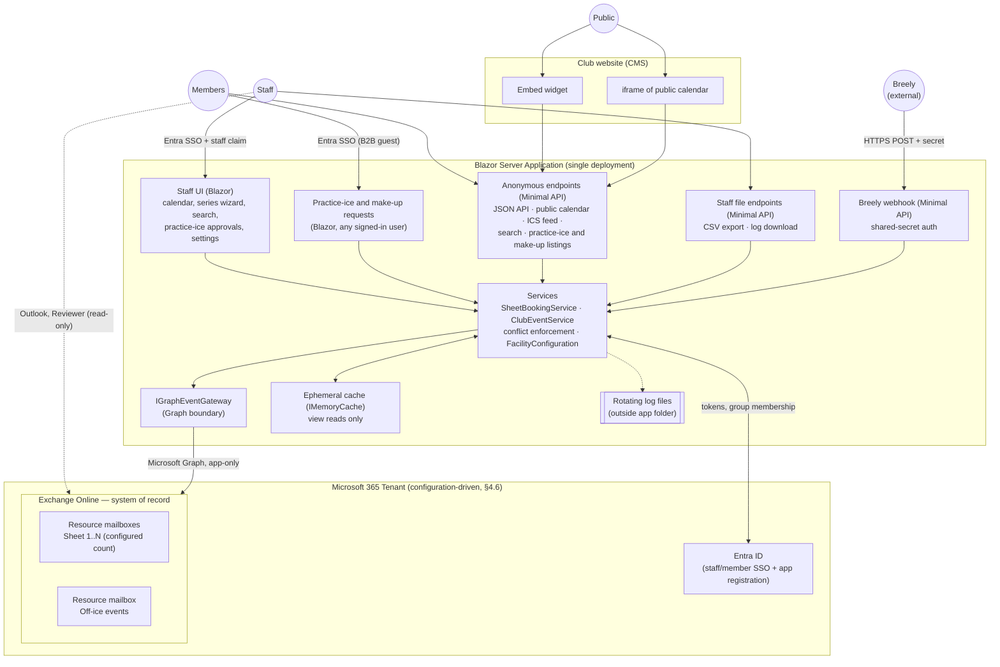

# Facility Scheduling System — Architecture

**Project:** Curling sheet scheduling and availability management on Exchange Online
**Status:** As-built and in production use. Describes the system as it exists, not as first designed.
**Stack:** .NET 10 / C#, Blazor Server (D14)

This document covers the architecture and the decisions and findings that shape it. The full history
— every numbered decision (`D1`–`D151`), every live-found bug and review finding, and the detailed
per-feature notes — is in [`decision-log.md`](decision-log.md). `D`-numbers cited here and in code
comments are defined there; the key ones are summarized in §9.

---

## 1. Executive Summary

Each curling sheet is an Exchange Online (EXO) resource mailbox, and every booking is a calendar
event on that mailbox. EXO is the system of record; there is no companion database (D7). A Blazor
Server application is the staff interface — Month/Week/Day calendars, one-off, multi-sheet, and
recurring bookings — and owns everything Exchange doesn't: conflict enforcement, booking states,
category discipline, and multi-sheet grouping. Outlook stays available as a read-only fallback.

Events that use no ice (closures, meetings, away bonspiels) live on a separate whole-club mailbox,
but staff see one "event" concept with an on-ice/off-ice toggle (§4.4).

Around that core:

- **Six anonymous read surfaces** (§5.4): a JSON availability API for a CMS embed, a public
  calendar, a calendar subscription feed, an availability search, a practice-ice listing, and a
  make-up game listing.
- **Three non-staff write paths**: an inbound webhook from Breely, the club's customer-facing
  booking platform (§4.8, a one-way stopgap); a member practice-ice hosting request that creates a
  pending hold for staff approval (§5.4.4); and a member make-up game request, booked immediately
  (§5.4.5). Members can cancel either themselves from the link in their booking email (§5.4.6).
- **A staff Settings page** with a rotating activity/debug log (§4.9) and the scheduling-window
  settings (§4.10).

Everything tenant-specific — tenant domain, which mailboxes are sheets, time zone — is
configuration, so one build can serve a different tenant or facility (§4.6). Nothing in the
architecture is curling-specific (§10).

---

## 2. Scope and Constraints

### 2.1 What the system does

- Each sheet is an independently bookable resource; the sheet count is configuration.
- Staff create, modify, and cancel all bookings through the custom UI; Outlook is read-only.
- Bookings have a state (**Hold** or **Confirmed**) and a category, consistent across sheets.
- Contact details and notes live on the booking itself.
- Native recurring series, and multi-sheet bookings treated as one unit.
- Application-enforced double-booking prevention.
- Whole-club off-ice events, with closures blocking sheet bookings.
- Anonymous public views, embeddable in the club website.
- One-way reflection of Breely bookings onto the calendar.
- Member-initiated practice-ice hosting, subject to staff approval.
- Member-scheduled league make-up games alongside ice already in use, auto-approved.
- Members cancelling their own practice ice and make-up games from their booking email.
- A calendar subscription feed (iCalendar), so members can see the public calendar in Google,
  Outlook, or Apple Calendar.
- A staff-visible record of what the app did in production.

### 2.2 Out of scope

- Payments, fees, deposits; membership rules, booking caps, priority tiers, waitlists.
- **General member self-service booking.** Members have exactly two narrow write paths: a
  practice-ice hosting request, which creates a pending hold (§5.4.4), and a single two-hour
  make-up game on a sheet free while other ice is in use (§5.4.5).
- Audit history of cancellations — cancellation is a hard delete (D9).
- Automatic expiry of holds, including unactioned practice-ice requests.
- A companion authoritative database (D7).
- **Real bidirectional sync with Breely** — the intended long-term answer. The webhook (§4.8) is an
  explicit stopgap; if sync is built, reassess §4.8 rather than run both.

### 2.3 Constraints

| Constraint | Detail |
|---|---|
| Source of truth | Exchange Online. The app holds no authoritative data. For what a Breely customer was promised, Breely is authoritative, not this calendar (§4.8). |
| Concurrency | Effectively one staff user at a time, two by rare coincidence. |
| Cache | Ephemeral, short-TTL, rebuildable from EXO at any moment; never on the conflict-check path (§4.3). |
| Public data | The JSON API is a hand-built minimized mapping, never a reuse of internal types (D11). The public calendar shows titles under three rules: a **staff-typed** title as-is (staff keep PII out of it); a **Breely-originated** title replaced with its category label, since it carries a customer's real name nobody reviewed (D52); a **member practice-ice** title names the volunteer host, an accepted exception since hosting is an outward-facing club role (D69, D145); a **member make-up game** is titled "Make-Up Game Requested by {name}" by the same reasoning (D149). Any new booking source needs its own explicit decision here. |
| CMS | A thin embed or iframe, with no credentials and no Graph logic in the CMS. |
| Tenant | Configuration-driven (§4.6). |
| Deployment | Azure App Service (Linux) is the primary target; see `docs/deployment-guide.md`. |

---

## 3. System Architecture

### 3.1 Component Overview

```mermaid
flowchart TB
    subgraph M365 ["Microsoft 365 Tenant (configuration-driven, §4.6)"]
        EID["Entra ID<br/>(staff/member SSO + app registration)"]
        subgraph EXO ["Exchange Online — system of record"]
            SN["Resource mailboxes<br/>Sheet 1..N (configured count)"]
            CE["Resource mailbox<br/>Off-ice events"]
        end
    end

    subgraph App ["Blazor Server Application (single deployment)"]
        UI["Staff UI (Blazor)<br/>calendar, series wizard, search,<br/>practice-ice approvals, settings"]
        API["Services<br/>SheetBookingService · ClubEventService<br/>conflict enforcement · FacilityConfiguration"]
        GW["IGraphEventGateway<br/>(Graph boundary)"]
        CACHE["Ephemeral cache (IMemoryCache)<br/>view reads only"]
        PUB["Anonymous endpoints (Minimal API)<br/>JSON API · public calendar · ICS feed ·<br/>search · practice-ice and make-up listings"]
        MEMBER_UI["Practice-ice and make-up requests<br/>(Blazor, any signed-in user)"]
        STAFFHTTP["Staff file endpoints (Minimal API)<br/>CSV export · log download"]
        WEBHOOK["Breely webhook (Minimal API)<br/>shared-secret auth"]
        LOG[["Rotating log files<br/>(outside app folder)"]]
    end

    subgraph Web ["Club website (CMS)"]
        EMBED["Embed widget"]
        IFRAME["iframe of public calendar"]
    end

    BREELY(("Breely<br/>(external)"))
    STAFF(("Staff")) -->|"Entra SSO + staff claim"| UI
    STAFF --> STAFFHTTP
    STAFF -.->|"Outlook, Reviewer (read-only)"| EXO
    MEMBER(("Members")) -->|"Entra SSO (B2B guest)"| MEMBER_UI
    MEMBER --> PUB
    ANON(("Public")) --> EMBED & IFRAME
    EMBED & IFRAME --> PUB
    BREELY -->|"HTTPS POST + secret"| WEBHOOK

    UI & MEMBER_UI & PUB & STAFFHTTP & WEBHOOK --> API
    API <--> CACHE
    API --> GW -->|"Microsoft Graph, app-only"| EXO
    API <-->|"tokens, group membership"| EID
    API -.-> LOG
```

Structural rules visible above:

- **One deployment.** The CMS integration is a thin embed/iframe with no credentials (D10).
- **Anonymous pages are plain Minimal API endpoints, never Blazor components** (D15). Sharing the
  staff app's `MapRazorComponents<App>()` registration either exposes every staff page or breaks
  anonymous visitors — established by a live incident (§5.4, §8). The same applies to the webhook
  and to the staff file-download endpoints (§5.6, §5.7).
- **Conflict checks never read the cache** (D16, §4.3).
- **Outlook is a read path only.** Staff hold Reviewer permission; the app is the sole writer (D2).
- **Graph calendar access goes through `IGraphEventGateway`** (D59), so services are testable against
  an in-memory fake (§11).
- **The activity log is a flat rotating file, not a database** (§4.9), consistent with D7.

### 3.2 What Exchange Provides vs. What the App Owns

| Concern | Owner |
|---|---|
| Durable storage of bookings and metadata | Exchange Online |
| Recurrence semantics (series, occurrences, exceptions) | Exchange Online |
| Fallback calendar UI | Exchange Online (Outlook/OWA) |
| Mailbox permissions, audit logging | Exchange Online |
| **Conflict / double-booking enforcement** | **Application** — direct writes bypass the Resource Booking Attendant (§6.1) |
| Multi-sheet grouping identity (`BookingGroupId`) | Application (§4.5) |
| State vocabulary and category integrity | Application — sole-writer discipline; Exchange validates nothing |
| Closure-vs-booking cross-check | Application (§4.4) |
| Public data minimization | Application |
| Tenant, mailbox, and time-zone configuration | Application, externalized to config (§4.6) |

---

## 4. Data Architecture

### 4.1 Anatomy of a Booking (one EXO calendar event)

- **subject** — `"{Category} - {RenterName}"`, or just the category, for the Outlook fallback.
- **start / end** — tagged with the facility's configured time zone (§4.6), never UTC.
- **showAs** — `tentative` = Hold, `busy` = Confirmed (D4).
- **categories** — the booking's category (D5). Sheets: Group Event, League, Event, Bonspiel,
  Maintenance, Practice Ice, Learn To Curl, Other. Off-ice: Out of Town Bonspiels, Activities,
  Closure, Other, Meetings, Competitions. The enum member name is the stored value (and the public
  API's wire value, D79); display labels are separate (D21). Renaming a member is therefore a data
  migration, not a rename.
- **Named extended properties** (server-side filterable): `BookedBy`, `BookingGroupId`,
  `ExternalBookingId`.
- **One JSON-blob extended property** (display-only): renter name, phone, email, notes.

**Design rule:** anything filterable gets its own named extended property; everything else goes in
the blob (D6).

**Graph gotchas that shape every read and write:**

- Extended properties are never returned by default; `$expand` must name the property IDs in a
  `$filter` sub-clause.
- A PATCH leaves an omitted extended property untouched rather than clearing it. Clearing needs an
  explicit empty value (D48).
- `BookingGroupId` doesn't reliably propagate from a series master to its occurrences. Grouping
  falls back to `(SheetMailbox, EventId)` when it reads back empty (§4.5).

### 4.2 State Model

| Business state | `showAs` | Categories that can hold it | Blocks other bookings? |
|---|---|---|---|
| Open | *(no event)* | — | No |
| Hold | `tentative` | Group Event (staff form); Practice Ice (member request, §5.4.4) | **Yes** |
| Confirmed | `busy` | Any | Yes |

Conflict enforcement doesn't distinguish Hold from Confirmed: any existing event on a sheet blocks a
new overlapping one (§6.1). "Hold" is a business label, not a weaker booking. Every category other
than Group Event is always Confirmed when staff create it. Cancellation is a hard delete (D9), except
that a Confirmed Group Event can be reopened as an open hold instead. Times are 15-minute
increments over the full 24-hour day.

### 4.3 Ephemeral Cache

| Layer | Covers | TTL | Invalidation |
|---|---|---|---|
| Staff view cache | `GetBookingsForAllSheetsAsync`, `ClubEventService.GetEventsAsync` — the "everything in this window, for display" reads | 30s | Full clear on every successful write and on scheduling-window changes |
| Public response cache | `PublicAvailabilityService`'s computed responses, on top of the staff layer | 60s | TTL only |

**The invariant this design can't compromise (D16):** the per-sheet reads every conflict check uses
are never cached. A cached snapshot there could hide a just-created booking and allow a double
booking within the TTL.

Cached lists are shared across concurrent callers, so they're exposed as `IReadOnlyList<T>` (D133).
Graph change-notification subscriptions were rejected (D8): with a sole-writer app and read-only
Outlook, there's nothing out-of-band for them to catch.

### 4.4 Off-Ice Events (`ClubEvent` in code)

Whole-club events (closures, meetings, away bonspiels) live on one dedicated resource mailbox, not
on every sheet. One event on one calendar is atomic; the same event written to N sheet calendars
would be N non-transactional writes (D13).

- **One "event" concept in the UI** (D95). Staff pick on-ice or off-ice in one form, and the page
  dispatches to `SheetBookingService` or `ClubEventService`. The mailbox split is an implementation
  detail staff never see. Code names (`ClubEvent`, `ClubEventService`, the public API's
  `clubEvents` array) deliberately stayed, since the category names are stored values (§4.1).
- **Closures block sheet bookings.** An off-ice event with `MarksSheetsUnavailable` is cross-checked
  against new sheet bookings, blocking for a single booking and informational in the series wizard.
  The check lives at the page level so the two services stay decoupled. No other cross-checks
  exist.
- **All-day events store an inclusive last day**, so every overlap and day-membership test goes
  through one shared exclusive-end definition (`ClubEvent.ExclusiveEnd`, `CalendarStyles.OccursOnDay`;
  D98, D107). Duplicated copies of these tests caused two separate live bugs.
- Off-ice events render inline with bookings on both calendars and have their own per-category
  filters. Day view shows them in a band above the per-sheet grid, since they belong to no sheet
  (D100).

### 4.5 Recurring Series and Multi-Sheet Bookings

- **Multi-sheet bookings** are one event per sheet, linked by a shared `BookingGroupId`. Every
  booking gets one, even single-sheet ones, so code never branches on single vs. multi. Writes are
  all-or-nothing: every sheet is conflict-checked under lock before anything is written.
- **Recurring series.** Graph has no series spanning mailboxes, so a 5-sheet league is five native
  recurring series sharing one `BookingGroupId`. Series conflicts are informational; staff choose
  which dates to skip.
- **Grouping key.** Siblings are identified by `BookingGroupId` plus `Start`/`End` (a group id alone
  spans every occurrence of a series), with a `(SheetMailbox, EventId)` fallback when the id reads
  back empty. One implementation (`CalendarStyles.BookingGroupKey`/`SiblingGroup`) is shared by
  every grid, the search page, and the public calendar.
- **Whole-series editing** (D82) edits title, notes, category, and sheets, but never time, per
  sheet: PATCH kept sheets' masters, delete removed ones, and conflict-check then replicate the
  recurrence onto added ones.

### 4.6 Configuration Model

- **`FacilityOptions`** (`Facility` section): `TenantDomain`, `SheetMailboxLocalParts` (an explicit
  list, not a count), `ClubEventsMailboxLocalPart`, `TimeZone`, `Name`, `LogoPath`.
- **`FacilityConfiguration`** validates these and derives mailbox addresses and `TimeZoneInfo`. It
  **fails fast at startup** if a required value is missing, because silent wrong time-zone defaults
  have caused real bugs here more than once.
- **Facility-local time is the only "now."** Every "today" anchor goes through
  `FacilityConfiguration.Today`/`.Now` (D47). `DateTime.UtcNow.Date` is a day ahead every evening
  in Pacific time, exactly when the ice is busiest.
- Other sections: `Graph` (app-only credential), `AzureAd` (sign-in), `StaffAccess`,
  `PracticeIce`, `AppLog`, `Webhook`. Secrets are never in `appsettings.json` (D137).

See `docs/deployment-guide.md` Appendix A for every key.

### 4.7 Week and Day Views

Week (one column per day) and Day (one column per sheet) are hourly grids over the full 24 hours,
sharing one set of positioning helpers. Concurrent items are laid out side by side by one generic
lane algorithm (`CalendarStyles.LayoutLanes`), which the public calendar reuses rather than copying.
A multi-sheet booking collapses to one item in Week view. Clicking an empty slot opens the event
form prefilled from the click.

### 4.8 Breely Webhook Integration

Breely, a third-party booking site, sells group events to the public. Breely is the source of truth
for what a customer was promised; this app keeps a **best-effort, one-way** copy so staff have one
working calendar (D28). It's a stopgap until real sync exists (§2.2).

**"Dumb webhook" philosophy.** When a notification arrives, the booking has already happened. The
job is to reflect it, never to reject or drop it:

- **Acknowledge immediately, process detached** on `CancellationToken.None` (D49), so an HTTP timeout
  on Breely's side can't abort a multi-step write halfway. Processing is tracked and awaited on
  shutdown for up to 25 seconds (D132). Failures surface through the log and triage markers, never
  through the HTTP response.
- **Claim, don't block** (D29). A Breely booking is meant to fill an existing Group Event hold, so
  `ClaimHoldAsync` walks sheets in configured order (D30), converts a covering hold to Confirmed,
  and trims the remainder instead of deleting it. Remainders shorter than the configured minimum
  interval are dropped.
- **Force-write when nothing matches** (D31). The booking is written anyway, bypassing the conflict
  check, alongside a "⚠ Web booking needs review" off-ice marker for staff to resolve.

**Identity without a database.** A Breely event id is stored as `ExternalBookingId` and looked up
live with a Graph `$filter` across every sheet. The id is allow-list-validated first, since `$filter`
has no parameterization. A per-id lock serializes lookup-then-act, because Breely re-sends
notifications (D57).

**Payload semantics (reverse-engineered; Breely's docs were insufficient):**

- Creation of a multi-sheet reservation is **one** call, with siblings only in
  `submission.events[]`. Reschedule and cancel are one call per event (D45).
- `submission.events[]` is a static snapshot from creation, so array data can create a never-seen
  sibling but never mutate an existing booking (D51).
- `submission_unique_id` differs per sibling, so it can't group them. Siblings share a
  `BookingGroupId` the app mints or reuses (D46).
- Some reservation types book one Breely resource for a group needing several sheets. The sheet
  count comes from an operator-maintained `event_type` label table (D119–D121).

A reschedule is cancel-then-reclaim. Cancellation reopens the slot as a hold and merges it with
adjacent holds.

**Re-checking the payload shape** uses the webhook's Debug-tier raw-body log (§4.9): turn Debug on,
capture a real notification, turn it off.

### 4.9 Activity/Debug Log and Settings Page

`ILogger` output isn't retained anywhere staff can see, so `AppLogService` writes a separate,
staff-readable log (D33). It's a daily-rotating flat file under `AppLog:LogDirectory`, which in
production must be outside the deployed app folder, since a redeploy replaces that folder.

- **Standard tier (always on):** every create/edit/cancel, with the signed-in Entra display name as
  the actor (D34), plus security events and webhook failures.
- **Debug tier (opt-in from Settings):** raw webhook payloads with customer name, email, and phone
  redacted (D35), lookup results, sign-ins, and app start/stop. The Settings page shows a standing
  PII warning while Debug is on (D56).
- Settings persist to small files in the log directory, so a change survives restarts without a
  redeploy. Retention is bounded (`AppLog:RetentionDays`).
- `MainLayout` wraps pages in an `ErrorBoundary` (D54), so an unhandled handler exception shows a
  recoverable message instead of killing the circuit.

### 4.10 Publish Cutoff and Booking Season

Two staff settings, owned by `SchedulingWindowService` and persisted together in one JSON file
(D83):

- **Publish cutoff** hides anything after a date from the public calendar and JSON feed, so staff
  can build a season before members see it.
- **Booking season** rejects new sheet bookings outside a start/end window and stops advertising
  off-season availability. Off-ice events are exempt.

The season gate lives in exactly one place, the top of `SheetBookingService.CreateAcrossSheetsAsync`
(D84). Which write paths it covers (staff form, practice-ice requests) and doesn't (Breely, edits,
series) follows from which method each calls, not from flags.

### 4.11 Multi-Day Bookings

`SheetBooking.Start`/`End` never had a same-day constraint, and conflict checks are span-agnostic,
so multi-day bookings needed only a start/end-date split in the form and one shared day-membership
function (`CalendarStyles.OccursOnDay`, a half-open interval) used by every renderer.

### 4.12 Staff Event Search

`/search` searches bookings and off-ice events over a date range with a small grammar
(`category:`, `day:`, `type:`, bare words match titles only) (D86).

- **Range width is the cost driver** (D90). `calendarView` expands every recurring occurrence
  across the whole requested window, so searches cap at 60 days. The deliberate exception is
  "Search entire season" (D111).
- **Fetch only on an explicit search**; refining the query against the same range costs no Graph
  calls.
- **Results are read-only**, with an "Open on calendar" handoff (D88), so the delicate
  group-editing logic exists once.
- **CSV export** (§5.7) shares the page's match/group/sort code (`SearchResultsBuilder`), so screen
  and file can't diverge (D103). It excludes phone and email and guards against formula injection.

---

## 5. API Interactions

### 5.1 Graph Operations

| Operation | Graph call | Notes |
|---|---|---|
| Read a window | `GET /users/{mailbox}/calendarView` | Expands recurrences. `$top=200`, and every read follows `@odata.nextLink` to exhaustion. |
| Create (single or multi-sheet) | `POST /users/{sheet}/calendar/events` | After the locked conflict check (§5.2). |
| Create series | same, with `Recurrence` | One native series per sheet (§4.5). |
| Confirm / edit | `PATCH /users/{sheet}/events/{id}` | On an occurrence, omit `Start`/`End` unless the time changed, or Graph rejects it. |
| Cancel | `DELETE` occurrence or series master | A 404 is treated as "already gone" (D37). |
| Group membership | `checkMemberGroups` | Staff check at sign-in (§6.5). |
| Mail | `sendMail` | Practice-ice notifications (§5.4.4). |

**Time zones.** Tag write bodies with the facility zone and send `Prefer: outlook.timezone` on reads.
`calendarView`'s `startDateTime`/`endDateTime` query parameters are UTC regardless of that header,
so they're converted first (`FacilityConfiguration.ToUtcQueryString`).

The `GraphServiceClient` has an explicit 30-second HTTP timeout (D139).

### 5.2 Booking Creation (write path)

Validate → acquire per-sheet locks in sorted order (no deadlock between overlapping multi-sheet
requests) → live `calendarView` conflict check on every sheet, plus the closure cross-check → write
only if every sheet is clear → invalidate the view cache → release. All-or-nothing across sheets.

### 5.3 Consolidated Availability

The "≥N sheets open at once" view ships as `/public/search` (§5.4.3), not as a calendar overlay.

### 5.4 Public Surfaces (anonymous)

Every anonymous page is a plain Minimal API endpoint with explicit `.AllowAnonymous()`, building
HTML with `StringBuilder` and `WebUtility.HtmlEncode` on every dynamic string (D15). This rule comes
from a live incident: adding `.AllowAnonymous()` to `MapRazorComponents<App>()` disabled
authorization for **every** staff page, because all routable components share one endpoint set.
Loading `blazor.web.js` for anonymous visitors also produced unremovable error banners. All public
surfaces are rate-limited (`public-api`, 60/min, one global bucket; the subscription feed has its
own, §5.4.7).

**5.4.1 JSON availability API and embed widget** (`/api/public/availability`,
`/embed/availability-widget.js`). "Available" means an open Group Event hold, not raw free time.
Each hold has every other overlapping booking on its sheet subtracted, so the feed never promises
occupied ice. CORS is `AllowAnyOrigin`, GET only, and safe because nothing credentialed flows. The
payload is minimized; notes never appear (D108).

**5.4.2 Public calendar** (`/public/calendar`) is the main way members see club activity:
Month/Week/Day with the staff grids' layout, category filters as a plain GET form, and dates clamped
to a bounded window. Unbounded dates would let anonymous traffic fan out Graph calls at will. Titles
follow §2.3's rules. A multi-sheet booking shows a sheet count, never which sheets. This is the one
route that may be framed; its header links use `target="_top"` so they escape the iframe (D112).

**5.4.3 Availability search** (`/public/search`) finds windows where at least N sheets have open
holds at once. It merges each sheet's open slots into blocks, then sweeps across sheets counting
concurrency, keyed by mailbox rather than display label (D130). It reuses the same open-slot
computation as §5.4.1.

**5.4.4 Practice-ice hosting.** Full rationale is in `docs/practice-ice-hosting-design.md`.

- `GET /public/practice-ice` (anonymous) lists 30-minute start times, within eligible hours, lead
  time, and horizon, where at least `PracticeIce:MinOpenSheets` (default 3) sheets are free for the
  shortest session (D147). A session runs on every sheet free for its whole length, so a longer one
  can cover fewer sheets; the listing and request page show how many.
- **"Free" for member-hosted ice** (`PublicAvailabilityService.MemberFreeTime`, shared with §5.4.5):
  nothing booked on the sheet, with one exception. An open Group Event hold counts as free inside
  `PracticeIce:GroupEventHoldReleaseDays` (default 7), because guests can no longer book that close
  in (D148). Every other booking, any category or state, blocks.
- `/practice-ice/request` is an authenticated Blazor page open to any signed-in user (§6.5). Members
  sign in as B2B guests in the staff tenant (D72). It re-validates server-side, then writes a
  `PracticeIce` Hold on the chosen sheets through `CreateTakingReleasedHoldsAsync`: the normal
  locked, all-or-nothing write path, except that a released hold is trimmed around the session
  instead of conflicting. A decline doesn't restore it. Pending requests are capped per member (D138).
- `/practice-ice/approvals` (staff) confirms or declines, emailing the volunteer. A failed email
  never turns a successful write into an apparent failure (D70).
- Mail uses `Mail.Send`, scoped by the same Application Access Policy group as the calendars (D73).

**5.4.5 Make-up games** (D149).

- `GET /public/make-up-game` (anonymous, linked from the calendar header) lists two-hour slots,
  starting on practice ice's grid, eligible hours, lead time, and horizon, where some sheet is free
  (§5.4.4's rule) for the whole two hours **and** another sheet has a confirmed booking for the
  whole two hours. Requesters may not be qualified to open the club, so tentative or open ice alone
  never qualifies.
- `/make-up-game/request` (any signed-in user, §6.5) shows the slot and sheet, requires the member to
  acknowledge the conditions, and books it immediately: a Confirmed League booking on the
  highest-numbered free sheet, through the same `CreateTakingReleasedHoldsAsync` path. There's no
  approval step and no per-member cap. The calendar team's distribution list and the requester are
  both emailed, and submission is refused until mail is configured, since that email is staff's only
  notice.

**5.4.6 Member self-cancel** (D150). The make-up game confirmation, the practice ice "request
received" email, and the practice ice approval email each carry a link to `/my-booking/cancel?id=
{BookingGroupId}` (any signed-in user, §6.5), built from `Facility:PublicBaseUrl`.

- **Opening the link never cancels.** Mail scanners (Safe Links and the like) open every link in a
  message, so the page only shows the booking; cancelling waits for its button.
- **Only the booker, only member-made bookings, only before the start.** The signed-in email must
  match the email stored on the booking (both read by `ClaimsPrincipal.MemberIdentity`, one shared
  rule). Only practice ice and League bookings carrying a member email qualify, so staff bookings are
  unreachable and read as not found. Everything is re-checked when the button is clicked.
- Cancelling is the same hard delete staff use (D9), on every sheet of the booking; group-event
  hold time it had taken isn't given back (D148). The calendar team's list and the member are
  emailed.

**5.4.7 Calendar subscription feed** (`/public/calendar.ics`, D151) - the public calendar as an
iCalendar feed that Google, Outlook, and Apple Calendar can subscribe to. Reached from "Subscribe to
this calendar" in the public calendar's Filters section, which builds the feed address from the
filters currently applied.

- **Same events as the page, by construction.** The feed is built from the public calendar's own
  data method and filter code, so titles, privacy rules, sheet counts, and the publish cutoff are
  identical. The one deliberate difference: holds are titled "Hold: ..." and marked tentative, since
  calendar apps can't show the dashed hold style.
- **Window:** one month back to three months ahead - kept modest because calendarView cost grows
  with range width (D90).
- **Built to stay correct in subscribers' apps:** stable event UIDs (hashed from public fields, no
  internal ids), so refreshes update rather than duplicate and cancellations drop out; times in UTC;
  all-day off-ice events stay all-day; RFC 5545 escaping and line folding.
- **Built to be fetched often:** cached 15 minutes (cleared on any booking write), and its own
  `calendar-feed` rate-limit bucket (300/min), so many calendar servers polling at once aren't
  refused.
- **What it can't fix:** each subscriber's app decides when to refresh (Google: up to a day) and may
  stop refreshing silently. The Subscribe section says so; the feed asks for hourly refresh, which
  only some apps honour. Google also tends to label a URL subscription with its address despite the
  feed naming itself.

### 5.5 Breely Webhook Endpoint

`POST /api/webhooks/breely` is the one anonymous endpoint that writes.

- **Auth:** static `X-Webhook-Secret` header, hashed and compared in constant time (D32, D128).
  Weaker than HMAC, but Breely supports nothing better (§6.4).
- **Response:** `401` on a bad secret, otherwise always `200` immediately, even for malformed JSON.
  Processing is detached (§4.8).
- **Rate limit:** its own `booking-webhook` bucket (30/min), so it can't starve the read surfaces or
  be starved by them. Rejections are `429` (D58).

### 5.6 Log Download Endpoint

`GET /settings/logs/download` zips every rotated log file. It's a Minimal API endpoint because a
file download doesn't belong on the Blazor circuit. It's bound explicitly to the `StaffOnly` policy,
rate-limited (`staff-export`, 10/min), and each download is logged (D127).

### 5.7 Search Export Endpoint

`GET /search/export.csv` takes the same inputs as the search page (`q`, `start`, `end`, `season=1`)
and re-parses and re-fetches statelessly, so the URL is shareable and served from the view cache.
It has the same `StaffOnly` binding and `staff-export` rate limit as §5.6.

---

## 6. Identity, Security, and Permissions

### 6.1 Conflict Enforcement — Why the App Owns It

The Resource Booking Attendant only processes meeting requests. This app writes events directly, so
the attendant never runs and Exchange accepts overlapping events — confirmed by spike (D3). The app
enforces conflicts itself: validate → lock per sheet → live check → write. That's trivially safe at
this concurrency, and the cache can never weaken it (D16). The mailboxes also **auto-decline** every
meeting invite, so nothing can book a sheet around the app (D78).

### 6.2 Identity Model

| Principal | Mechanism | Used for |
|---|---|---|
| Staff | Entra SSO + app-owned `facility:staff` claim (§6.5) | Everything in the staff UI. Also the actor recorded in the activity log. |
| Member | Entra SSO as a B2B guest, no staff claim | `/practice-ice/request`, `/make-up-game/request`, and `/my-booking/cancel` only. |
| App service identity | Client credentials, application permissions | **All** Graph calls. There is no delegated/on-behalf-of Graph access. |
| Staff via Outlook | Reviewer calendar permission | Read-only fallback viewing. |
| Anonymous public | None | The Minimal API read surfaces (§5.4), through the service layer. |
| Breely | Static shared secret (§5.5) | The webhook. |

### 6.3 Scoping the App Identity

Mandatory, not optional. The app registration is confined by an Application Access Policy to a
mail-enabled security group containing only the sheet, off-ice, and mailer mailboxes, and that's
**negatively tested**: the app must be denied a mailbox outside the group. Directory permissions
(`GroupMember.Read.All`, `User.Read.All`) aren't mailbox-scoped and aren't covered by it.

### 6.4 Other Security Requirements

- **Secrets** live in user-secrets locally and in App Service settings (or equivalent) in
  production. None in tracked config (D137).
- **Anonymous surfaces** are read-only, hand-encoded or minimized, and rate-limited. CORS applies
  to the JSON route only. The webhook is the one bounded write exception.
- **The webhook secret is the weakest credential, accepted deliberately.** A leaked secret is
  reusable indefinitely, but a forged request can at most create or release a booking. That's
  staff-visible and correctable, with no exfiltration or privilege escalation.
- **Framing and sniffing headers:** `X-Frame-Options: DENY` and `frame-ancestors 'none'` on every
  route except `/public/calendar`. `X-Content-Type-Options: nosniff` everywhere (D53).
- **Host filtering:** `AllowedHosts` defaults to `*.curlingseattle.org;curlingseattle.org` (D146). A
  wildcard entry doesn't match the apex domain, so the apex is listed separately. Filtering runs in
  every environment, so each deployment overrides it with its own hostnames through an App Service
  setting (a staging site's `*.azurewebsites.net` name, for example); Development allows `localhost`.
- **Forwarded headers** are processed first in the pipeline (D123), so logged client IPs are the real
  caller's, not App Service's front end.
- **The activity log is a security surface.** Its directory should be readable only by the app's
  process account; download requires staff.
- Mailbox audit logging is on for every resource mailbox.

### 6.5 Staff vs. Member Authorization

Practice ice brought non-staff sign-ins, so "authenticated" and "staff" stopped being the same set
(D74).

- **Strict default.** The `FallbackPolicy` requires authentication **and** the staff claim, so every
  page is staff-only unless it opts out. The only member-reachable pages are `/practice-ice/request`,
  `/make-up-game/request`, and `/my-booking/cancel` (`AnyAuthenticatedUser` policy). Staff-only Minimal API endpoints bind `StaffOnly` explicitly.
  Policies live in `StaffAuthorizationPolicies` so tests exercise the real objects (D75).
- **Staff membership is a live Entra group check at sign-in** (`StaffAccessService`,
  `checkMemberGroups`), not an App Role. Group-based app-role assignment needs Entra ID P1, and the
  tenant is on Free. It needs both `GroupMember.Read.All` and `User.Read.All`. Group ownership is
  delegated to non-admins, so staff changes need no Entra admin.
- **Fails closed.** If the check errors, the user signs in without the staff claim, and the failure
  is logged at Standard tier.
- **The claim is an app-owned type (`facility:staff`) matched with `RequireClaim`**, never
  `ClaimTypes.Role` + `RequireRole`. Microsoft.Identity.Web overrides `RoleClaimType` (and
  `NameClaimType`), which silently locked out every staff member on first deploy (D75, D71).
- **The claim is evaluated once, at sign-in, and lives in the cookie.** Membership changes need a
  sign-out/sign-in. The Microsoft.Identity.Web account pages are explicitly anonymous so a denied
  user can always reach sign-out.
- The staff menu hides staff-only links using the same policy objects. That's presentation only;
  each page enforces access on its own.
- **Open item:** the per-page carve-out overriding the strict fallback hasn't been confirmed with a
  real non-staff account. Verify before inviting members at volume.

---

## 7. Tenant Provisioning Checklist

A summary in dependency order. `docs/deployment-guide.md` is the actual walkthrough, and its step
numbers are given in brackets.

1. **Resource mailboxes:** one per sheet, plus the off-ice mailbox. [Step 1]
2. **Auto-decline every meeting invite** on each mailbox (D78). [Step 1a]
3. **Mailbox audit logging** on each mailbox. [Step 1b]
4. **Two security groups.** A mail-enabled *mailbox* group (sheets, off-ice, practice-ice mailer)
   exists only to scope the Application Access Policy. A *staff* group of people drives Reviewer
   access and the staff claim. Don't conflate them. [Step 2]
5. **Reviewer calendar permission** for the staff group (D2). [Step 3]
6. **Entra app registration**, single-tenant, with ID-token issuance on. [Steps 4, 12]
7. **Application permissions, admin-consented:** `Calendars.ReadWrite`, `Mail.Send`,
   `GroupMember.Read.All`, `User.Read.All`, plus `MailboxSettings.ReadWrite` for the category
   provisioning script only. [Step 5]
8. **Application Access Policy** scoped to the mailbox group, negatively tested (§6.3). [Step 6]
9. **Populate the staff group** and delegate its ownership. Its object id becomes
   `StaffAccess:StaffGroupId`. [Step 7]
10. **Master categories** on every mailbox via `docs/provision-categories.ps1`. Its colors mirror
    `CalendarStyles.CategoryColor`, so change both together. [Step 8]
11. **App configuration** (§4.6). [Step 10]

**Adding a sheet later:** repeat steps 1–3, 5, and 10 for it, add it to the mailbox group, and add a
`Facility:SheetMailboxLocalParts` entry. No code change, no redeploy, no Entra admin action.

---

## 8. Key Risks, Findings, and Lessons

The full record — every live-found bug, review finding, and spike — is Part B of
[`decision-log.md`](decision-log.md). These are the findings that shaped the architecture or that
anyone changing it should know.

**Platform facts established by spike or live incident**

- Direct writes bypass the Resource Booking Attendant; Exchange accepts overlapping events (§6.1).
- `calendarView` cost scales with the requested range's width when recurring series are involved;
  more round trips isn't the main cost (D90).
- `calendarView` query bounds are UTC regardless of `Prefer: outlook.timezone` (§5.1).
- Graph PATCH doesn't clear omitted extended properties (D48). `BookingGroupId` doesn't propagate to
  untouched recurring occurrences (§4.5).
- `checkMemberGroups` needs `User.Read.All` as well as `GroupMember.Read.All`.
- Application Access Policy *membership* changes propagate more slowly than
  `Test-ApplicationAccessPolicy` reports. "Granted" plus a failing send means wait, not re-diagnose.
- Breely's webhook shape was reverse-engineered and has already changed shape once for a new
  reservation type (D119). Re-check with the Debug raw-payload log (§4.8).

**ASP.NET Core and Blazor lessons**

- Never put `.AllowAnonymous()` on `MapRazorComponents<App>()`; anonymous pages are Minimal API
  endpoints (D15).
- A global fallback policy silently captures every framework route the app didn't write (`/Error`,
  not-found, the Microsoft.Identity.Web pages). Each needs an explicit decision.
- Never assume a claim-type constant is what the identity actually uses (D71, D75).
- A fire-and-forget `Task` in a Blazor event handler loses its final render (D92).
- An intermittent bug that fails to reproduce a few times hasn't been shown to be absent.

**Design lessons that recur in this codebase**

- Duplicated policy code drifts. Grouping keys, day membership, exclusive-end, sheet labels, and
  search results each caused a live bug from divergent copies before being consolidated into one
  shared implementation.
- Time-zone defaults are a recurring bug class. Anything "today"-shaped goes through
  `FacilityConfiguration` (§4.6).

**Accepted risks**

| Risk | Why accepted |
|---|---|
| Webhook auth is a static secret, not HMAC | Breely can't sign requests; blast radius is staff-visible and correctable (§6.4). |
| This calendar can drift from Breely | By design until real sync exists; manual reconciliation of occasional misses is acceptable (§4.8). |
| Public rate limit is one global bucket, not per-IP | Stronger Graph-quota protection; one abusive client can starve the widget. Revisit with real traffic. |
| `/public/calendar` has no `frame-ancestors` restriction | Simplicity over locking to a domain; a hardening candidate. |
| Member carve-out not live-verified with a non-staff account | Verify before real member volume (§6.5). |
| No automatic hold expiry, including practice-ice requests | Staff-supervised volume; per-member cap bounds abuse (D138). |
| Subscribed calendars can fall behind or silently stop refreshing | Controlled by each subscriber's calendar app, not the feed (D151); the Subscribe section tells members, and the live calendar is always current. |
| Make-up games are auto-approved with no per-member cap | Operator decision (D149); every booking emails the calendar team, and members acknowledge that existing events keep priority over the sheet. |
| Accidental deletion is recoverable only via Exchange's recoverable-items window | Acceptable at this scale. |

---

## 9. Key Design Decisions

The decisions that define the architecture. The complete, numbered record is Part A of
[`decision-log.md`](decision-log.md).

| # | Decision | Why |
|---|---|---|
| D1 | EXO resource mailboxes are the system of record | Zero infrastructure; native recurrence, free/busy, permissions, and audit; Outlook as fallback. |
| D2 | Custom web UI; Outlook read-only | Custom views and metadata Outlook can't serve; read-only access protects the sole-writer invariant. |
| D3 | Direct event writes with app-owned conflict enforcement | The booking attendant doesn't run on direct writes; invite-based booking is async and clunky. |
| D4 | `showAs` tentative/busy encodes Hold/Confirmed | Keeps free/busy and Outlook honest. |
| D6 | Metadata on the event: filterable extended properties plus one JSON blob | No adjacent datastore. |
| D7 | No companion database | Avoids a second authoritative store. |
| D8 | Short-TTL cache; no Graph change subscriptions | Sole writer, so nothing out-of-band to catch. |
| D9 | Cancellation is a hard delete | Audit and reporting are out of scope. |
| D10 | One Blazor Server deployment plus a thin CMS embed | Keeps booking operations out of the website's failure domain. |
| D11 | Hand-built minimized public payload | Prevents PII leakage by construction. |
| D12 | Microsoft Bookings and Power Apps rejected | Bookings targets customer self-service; Power Apps limits custom views. |
| D13 | Off-ice events on one dedicated mailbox | One atomic write instead of N non-transactional ones. |
| D14 | .NET / Blazor Server | Operator's choice for this project. |
| D15 | Anonymous pages are plain Minimal API endpoints | Live incident: sharing the Blazor endpoint set exposed staff pages (§5.4). |
| D16 | The cache never serves conflict checks | A stale read could allow a double booking. |
| D17 | Tenant, mailboxes, and time zone are configuration | Repoint or re-deploy without a recompile. |
| D28 | Breely integration is a one-way inbound webhook | Real sync wasn't feasible in time. |
| D29 | Breely bookings claim and trim holds rather than avoid them | A Breely sale is *of* an advertised hold. |
| D31 | Unmatched Breely bookings are force-written and flagged | The booking already happened; never drop it. |
| D32 | Webhook auth is a constant-time-compared static secret | The only mechanism Breely supports. |
| D33 | A separate, staff-readable activity log | `ILogger` output wasn't visible to staff. |
| D49 | Webhook acknowledges immediately and processes detached | An HTTP timeout must not abort a write halfway. |
| D52 | Breely-originated titles are replaced by category on public pages | They carry unreviewed customer names. |
| D53 | Anti-framing headers everywhere except the public calendar | That page is built to be iframed. |
| D59 | Graph access behind `IGraphEventGateway` | Makes the services testable. |
| D68 | Practice ice never takes group-event ice guests can still book | Group events take priority over practice ice. (Originally "every sheet completely free"; narrowed by D147/D148.) |
| D69 | Practice-ice titles publicly name the host | Hosting is an outward-facing club role. |
| D72 | Members sign in as B2B guests in the staff tenant | Reuses existing identity; no separate CIAM tenant yet. |
| D73 | `Mail.Send` scoped by the same access-policy group | One scoping mechanism. |
| D74 | Staff status from a live group-membership check at sign-in | App Role group assignment needs Entra P1. |
| D75 | App-owned `facility:staff` claim with `RequireClaim`; policies in one testable class | The library-overridden role claim type caused a full lockout. |
| D78 | Resource mailboxes auto-decline all invites | Nothing may book around the app's conflict check. |
| D84 | Season gate in one method | Coverage follows from which write path is called. |
| D90 | Searches cap at 60 days | `calendarView` cost scales with range width. |
| D95 | One event form with an on-ice/off-ice toggle; code names unchanged | Staff think "uses ice or not," not "which mailbox." |
| D146 | `AllowedHosts` restricted to the club's domain and its apex, overridden per environment | Host-header hardening; the apex is embedded from the club site. |
| D147 | Practice ice runs on partial sheets (minimum 3) | More usable practice time; a session covers every sheet free for its whole length. |
| D148 | Group-event holds inside the 7-day guest booking window count as free for member-hosted ice | Guests can't book them anymore; taking one trims it. |
| D149 | Make-up games: auto-approved, confirmed League booking beside a confirmed event | Someone qualified is already running the club; staff are emailed instead of approving. |
| D150 | Members cancel their own bookings from an emailed link to a signed-in page | Only the booker can cancel; opening the link never cancels, since mail scanners open links. |
| D151 | Public calendar subscription feed (ICS), matching the page exactly | Members subscribed to the old Google calendar; built from the page's own code so the two can't differ. |

---

## 10. Generalization Note

The resource-mailbox-per-unit model, state/category mechanism, conflict enforcement, and
public-endpoint pattern are facility-agnostic. Sheet count, mailbox naming, tenant, and time zone
are configuration. What changes per facility is vocabulary (categories, states) and slot rules,
which live in the domain layer (`Domain/BookingCategory.cs`, `Domain/ClubEventCategory.cs`).

---

## 11. Automated Testing

`FacilityScheduler.Tests` (xUnit, Moq, bUnit) runs in CI on every push and PR to `master`
(`.github/workflows/tests.yml`, `windows-latest`, with coverage collection).

- **Approach.** Services run against `FakeGraphEventGateway`, an in-memory stand-in for
  `IGraphEventGateway` (D59) that models the Graph behaviors the code depends on: PATCH merge
  semantics, 404 on missing events, UTC normalization, and an injectable delay so concurrency tests
  really interleave. Endpoint logic is tested directly via `internal` helpers (D60). Pages and
  components use bUnit against the app's real authorization policies.
- **Discipline.** A behavioral fix gets a test that fails against the pre-fix code, verified by
  reverting the fix. Prefer a new theory row or assertion on an existing test over a new test. Tests
  pin behavior, not markup, styling or copy; when copy changes, delete its test rather than
  rewriting it. Don't assert the absence of removed UI.
- **What automated tests can't cover:** the real tenant — permissions, Application Access Policy
  scoping, real token claim shapes. Those are verified live. The suite has never run against a real
  Azure AD/Graph tenant.
- **Known gaps:** recurring-instance expansion in the fake; full HTTP-pipeline integration tests
  (routing, rate limiting, auth handler — would need `WebApplicationFactory`); bUnit coverage of the
  Off-Ice Events list and the practice-ice pages.

The per-area coverage record through 2026-09-28 is Part D of [`decision-log.md`](decision-log.md),
kept as history and no longer maintained per test.
